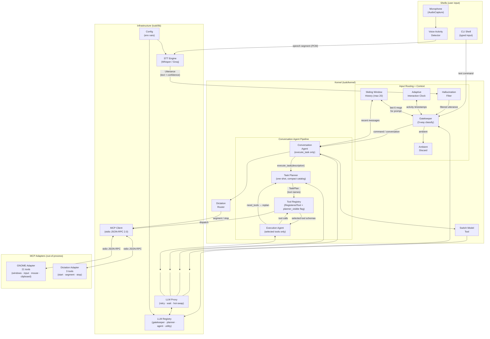
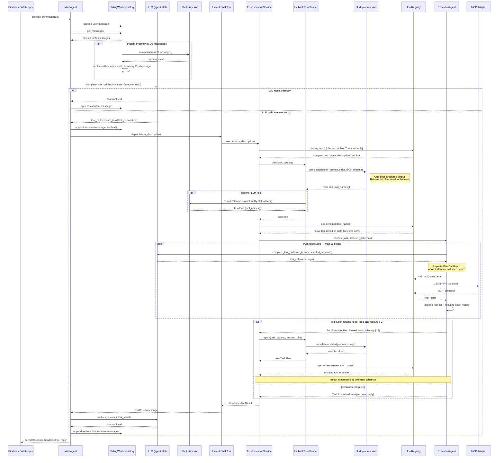

# TUSK — Architecture

## System Overview

TUSK is an always-listening desktop AI voice assistant for Linux/GNOME. It captures
microphone audio continuously, detects speech boundaries, transcribes speech to text,
filters ambient noise and hallucinations, passes confirmed commands to a conversation
agent, and executes desktop actions via hot-pluggable MCP adapters.

The system is split into four layers: infrastructure (`tusk/lib`), business logic
(`tusk/kernel`), user-facing entrypoints (`shells/`), and platform-specific MCP adapters
(`adapters/`). The agent pipeline uses a three-phase split: a conversation agent with
only one operational tool (`execute_task`), a one-shot planner that selects a tool subset,
and an execution agent that runs only the selected tools.

---

## System Block Diagram



---

## Agent Workflow Diagram

A sequence diagram of a single agent turn — from classified utterance to final reply — showing all LLM calls, history management, planning, and the execution tool loop.



---

## Directory Structure

```
tusk/
├── main.py                              # Startup wiring — builds and connects all layers
├── requirements.txt
├── .env.example
├── tusk/
│   ├── kernel/                          # Business logic layer
│   │   ├── interfaces/                  # Kernel ABCs (extension points)
│   │   │   ├── agent.py                 # Agent ABC — process_command
│   │   │   ├── conversation_history.py  # ConversationHistory ABC — message storage
│   │   │   ├── conversation_summarizer.py # ConversationSummarizer ABC
│   │   │   ├── gatekeeper.py            # Gatekeeper ABC — utterance classification
│   │   │   ├── interaction_clock.py     # InteractionClock ABC — follow-up window tracking
│   │   │   ├── pipeline_controller.py   # PipelineController ABC — mode switching
│   │   │   ├── pipeline_mode.py         # PipelineMode ABC — gatekeeper prompt + handler
│   │   │   ├── shell.py                 # Shell ABC — start/stop interface
│   │   │   ├── task_executor.py         # TaskExecutor ABC — execute a task plan
│   │   │   ├── task_planner.py          # TaskPlanner ABC — build a task plan
│   │   │   └── utterance_filter.py      # UtteranceFilter ABC — pre-gatekeeper rejection
│   │   ├── schemas/                     # Frozen dataclasses (all inter-component data)
│   │   │   ├── app_entry.py             # AppEntry — desktop application (name + exec_cmd)
│   │   │   ├── chat_message.py          # ChatMessage — role + content, summary detection
│   │   │   ├── desktop_context.py       # DesktopContext — active window + window list
│   │   │   ├── gate_result.py           # GateResult — gatekeeper output
│   │   │   ├── kernel_response.py       # KernelResponse — final handled + reply
│   │   │   ├── llm_slot_config.py       # LLMSlotConfig — parsed provider/model string
│   │   │   ├── mcp_tool_result.py       # MCPToolResult — adapter tool response
│   │   │   ├── mcp_tool_schema.py       # MCPToolSchema — adapter tool definition
│   │   │   ├── task_execution_result.py # TaskExecutionResult — executor output
│   │   │   ├── task_plan.py             # TaskPlan — planner output (steps + selected tools)
│   │   │   ├── tool_call.py             # ToolCall — tool name + parameters + call_id
│   │   │   ├── tool_result.py           # ToolResult — success + message + data
│   │   │   ├── utterance.py             # Utterance — transcribed text + audio + confidence
│   │   │   └── window_info.py           # WindowInfo — title + app + geometry + active flag
│   │   ├── agent.py                     # MainAgent — conversation agent (execute_task only)
│   │   ├── agent_tool_loop.py           # AgentToolLoop — iterative native tool calling
│   │   ├── adaptive_interaction_clock.py # AdaptiveInteractionClock — adaptive follow-up timeout
│   │   ├── adapter_manager.py           # AdapterManager — MCP adapter lifecycle
│   │   ├── command_mode.py              # CommandMode — gatekeeper prompt + command dispatch
│   │   ├── dictation_mode.py            # AdapterDictationMode — active dictation state
│   │   ├── dictation_router.py          # DictationRouter — routes segments and edits
│   │   ├── dictation_state.py           # DictationState — session + adapter + desktop source
│   │   ├── execute_task_tool.py         # ExecuteTaskTool — planner_visible=False kernel tool
│   │   ├── execution_agent.py           # ExecutionAgent — selected-tool executor
│   │   ├── fallback_task_planner.py     # FallbackTaskPlanner — primary/secondary fallback
│   │   ├── hallucination_filter.py      # HallucinationFilter — pre-gatekeeper STT rejection
│   │   ├── kernel_api.py                # KernelAPI — public submit_utterance / submit_text interface
│   │   ├── llm_gatekeeper.py            # LLMGatekeeper — structured-output classification
│   │   ├── llm_task_planner.py          # LLMTaskPlanner — structured-output planner
│   │   ├── model_failure_reply_builder.py # Human-readable LLM failure messages
│   │   ├── pipeline.py                  # Pipeline — STT → filter → gate → mode routing
│   │   ├── recent_context_formatter.py  # RecentContextFormatter — last 6 messages for gatekeeper
│   │   ├── registered_tool.py           # RegisteredTool — frozen entry in ToolRegistry
│   │   ├── repeated_tool_call_guard.py  # Detects repeated identical tool calls in executor
│   │   ├── sliding_window_history.py    # SlidingWindowHistory — max-20 with LLM compaction
│   │   ├── start_dictation_tool.py      # StartDictationTool — launches dictation session
│   │   ├── switch_model_tool.py         # SwitchModelTool — hot-swaps an LLM slot
│   │   ├── task_execution_service.py    # TaskExecutionService — plan → validate → execute → replan
│   │   ├── task_plan_parser.py          # Parses raw planner JSON into TaskPlan
│   │   ├── task_plan_validator.py       # Validates TaskPlan before execution
│   │   ├── task_planner_message_builder.py # Builds planner user message (task + catalog + replan)
│   │   ├── tool_call_executor.py        # Executes a ToolCall against the registry
│   │   ├── tool_call_parser.py          # Legacy parser (not used by native tool-calling runtime)
│   │   ├── tool_loop_recorder.py        # Records tool calls and results into message history
│   │   ├── tool_prompt_builder.py       # Builds compact name:description catalog text
│   │   ├── tool_registry.py             # ToolRegistry — central tool store with planner_visible
│   │   ├── tool_runtime.py              # ToolRuntime — wires planner, executor, internal tools
│   │   └── visible_tool_definition_builder.py # Builds native tool definition dicts for LLM
│   └── lib/                             # Infrastructure layer (swappable implementations)
│       ├── config/
│       │   ├── config.py                # Config — frozen dataclass, all runtime settings
│       │   ├── config_factory.py        # ConfigFactory — reads env vars, builds Config
│       │   └── startup_options.py       # StartupOptions — CLI args (verbosity, log groups)
│       ├── llm/
│       │   ├── interfaces/
│       │   │   ├── llm_provider.py      # LLMProvider ABC — complete, complete_tool_call, etc.
│       │   │   └── llm_provider_factory.py # LLMProviderFactory ABC — create(provider, model)
│       │   ├── providers/
│       │   │   ├── groq_llm.py          # GroqLLM — Groq cloud API with structured output
│       │   │   ├── open_router_llm.py   # OpenRouterLLM — OpenRouter via OpenAI client
│       │   │   └── configurable_llm_factory.py # Parses "provider/model" strings
│       │   ├── llm_payload_logger.py    # Logs prompts and tool schemas for debugging
│       │   ├── llm_proxy.py             # LLMProxy — retry + wait indicator + swap()
│       │   ├── llm_registry.py          # LLMRegistry — four named slots + runtime swap
│       │   ├── llm_retry_policy.py      # LLMRetryPolicy — retryable error classification
│       │   ├── llm_retry_runner.py      # LLMRetryRunner — exponential backoff loop
│       │   └── tool_use_failed_recovery.py # Graceful recovery for tool_use_failed errors
│       ├── logging/
│       │   ├── interfaces/
│       │   │   ├── log_printer.py       # LogPrinter ABC — log, show_wait, clear_wait
│       │   │   └── conversation_logger.py # ConversationLogger ABC — log_message
│       │   ├── color_log_printer.py     # ColorLogPrinter — colored console output by tag
│       │   └── daily_file_logger.py     # DailyFileLogger — daily-rotation conversation log
│       ├── mcp/
│       │   ├── adapter_env_builder.py   # AdapterEnvironmentBuilder — managed venv setup
│       │   ├── adapter_watcher.py       # AdapterWatcher — file-system hot-plug via watchdog
│       │   ├── mcp_client.py            # MCPClient — stdio JSON-RPC client
│       │   └── mcp_tool_proxy.py        # MCPToolProxy — adapts MCPToolSchema to RegisteredTool
│       └── stt/
│           ├── interfaces/
│           │   └── stt_engine.py        # STTEngine ABC — transcribe(audio_frames, sample_rate)
│           └── providers/
│               ├── groq_stt.py          # GroqSTT — Groq cloud Whisper-large-v3-turbo
│               └── whisper_stt.py       # WhisperSTT — local OpenAI Whisper model
├── shells/
│   ├── voice/
│   │   ├── shell.json                   # Shell manifest (entry_module, entry_class)
│   │   ├── voice_shell.py               # VoiceShell — audio capture + utterance loop
│   │   ├── audio_capture.py             # AudioCapture — sounddevice PulseAudio stream
│   │   └── utterance_detector.py        # UtteranceDetector — WebRTC VAD boundary detection
│   └── cli/
│       ├── shell.json                   # Shell manifest
│       └── cli_shell.py                 # CLIShell — stdin REPL, bypasses STT + gatekeeper
├── adapters/
│   ├── gnome/
│   │   ├── adapter.json                 # Adapter manifest (name, transport, entry, provides_context)
│   │   ├── server.py                    # GNOME MCP server entry point
│   │   ├── gnome_tool_router.py         # Routes tool calls to handler modules
│   │   ├── gnome_tool_schema_catalog.py # Builds all 21 tool schemas for MCP list_tools
│   │   ├── gnome_application_tools.py   # launch_application
│   │   ├── gnome_window_tools.py        # close/focus/maximize/minimize/move_resize/switch_workspace
│   │   ├── gnome_input_tools.py         # press_keys, type_text, replace_recent_text
│   │   ├── gnome_mouse_tools.py         # mouse_click, mouse_move, mouse_drag, mouse_scroll
│   │   ├── gnome_clipboard_tools.py     # read_clipboard, write_clipboard
│   │   ├── gnome_context_tools.py       # get_desktop_context, get_active_window, list_windows
│   │   ├── gnome_context_provider.py    # Queries desktop state (wmctrl, xdotool, xdg-open)
│   │   ├── gnome_input_simulator.py     # Low-level xdotool key/mouse/type
│   │   ├── gnome_clipboard_provider.py  # xclip read/write
│   │   ├── gnome_text_paster.py         # Paste + replace via xdotool type + BackSpace
│   │   ├── app_catalog.py               # search_applications — installed desktop app search
│   │   ├── open_uri_tool.py             # open_uri — xdg-open
│   │   └── desktop_context.py           # DesktopContext snapshot builder
│   └── dictation/
│       ├── adapter.json                 # Adapter manifest (provides_context=false)
│       ├── server.py                    # DictationServer — MCP server for dictation sessions
│       ├── dictation_refiner.py         # DictationRefiner — LLM-based segment cleanup
│       └── dictation_tool_schema_catalog.py # start_dictation, process_segment, stop_dictation
└── tests/
    ├── test_agent_tool_loop.py
    ├── test_task_planner.py
    ├── test_task_executor.py
    ├── test_pipeline.py
    └── ...                              # Full test suite for kernel + lib + adapters + shells
```

---

## Abstract Base Classes

TUSK defines 16 ABCs that form the extension boundary between components. No concrete
class may import another concrete class directly — only ABCs cross layer boundaries.

### LLMProvider — `tusk/lib/llm/interfaces/llm_provider.py`

```python
@property def label(self) -> str
def complete(self, system_prompt: str, user_message: str, max_tokens: int = 256) -> str
def complete_messages(self, system_prompt: str, messages: list[dict]) -> str
def complete_tool_call(self, system_prompt: str, messages: list[dict], tools: list[dict]) -> ToolCall
def complete_structured(self, system_prompt: str, user_message: str,
                        schema_name: str, schema: dict, max_tokens: int = 256) -> str
```

`complete_tool_call` returns a `ToolCall` directly. `complete_structured` requests a
JSON response conforming to a named schema — used by planner and gatekeeper. Providers
may fall back to `complete` if structured output is unavailable.

### LLMProviderFactory — `tusk/lib/llm/interfaces/llm_provider_factory.py`

```python
def create(self, provider_name: str, model: str) -> LLMProvider
```

### STTEngine — `tusk/lib/stt/interfaces/stt_engine.py`

```python
def transcribe(self, audio_frames: bytes, sample_rate: int) -> Utterance
```

### LogPrinter — `tusk/lib/logging/interfaces/log_printer.py`

```python
def log(self, tag: str, message: str, group: str | None = None) -> None
def show_wait(self, label: str, group: str = "wait") -> None
def clear_wait(self) -> None
```

`show_wait` / `clear_wait` display a spinner while waiting for an LLM response.

### ConversationLogger — `tusk/lib/logging/interfaces/conversation_logger.py`

```python
def log_message(self, message: ChatMessage) -> None
```

### Agent — `tusk/kernel/interfaces/agent.py`

```python
def process_command(self, command: str) -> str
```

### Gatekeeper — `tusk/kernel/interfaces/gatekeeper.py`

```python
def evaluate(self, utterance: Utterance, system_prompt: str) -> GateResult
```

The `system_prompt` is provided by the current pipeline mode. The gatekeeper has no
embedded prompt — it is fully stateless with respect to context and classification rules.

### TaskPlanner — `tusk/kernel/interfaces/task_planner.py`

```python
def plan(self, task: str, tool_catalog: str,
         previous_plan: TaskPlan | None = None,
         needed_capability: str = "") -> TaskPlan
```

### TaskExecutor — `tusk/kernel/interfaces/task_executor.py`

```python
def execute(self, task: str, plan: TaskPlan) -> TaskExecutionResult
```

### InteractionClock — `tusk/kernel/interfaces/interaction_clock.py`

```python
def record_interaction(self) -> None
def seconds_since_last_interaction(self) -> float
def is_within_follow_up_window(self) -> bool
```

### ConversationHistory — `tusk/kernel/interfaces/conversation_history.py`

```python
def get_messages(self) -> list[ChatMessage]
def append(self, message: ChatMessage) -> None
def clear(self) -> None
```

### ConversationSummarizer — `tusk/kernel/interfaces/conversation_summarizer.py`

```python
def summarize(self, messages: list[ChatMessage]) -> str
```

### UtteranceFilter — `tusk/kernel/interfaces/utterance_filter.py`

```python
def is_valid(self, utterance: Utterance) -> bool
```

Applied after STT, before the gatekeeper. Rejects hallucinations and noise artifacts.

### PipelineMode — `tusk/kernel/interfaces/pipeline_mode.py`

```python
@property def gatekeeper_prompt(self) -> str
def handle_utterance(self, gate_result: GateResult, utterance: Utterance,
                     controller: PipelineController) -> None
```

### PipelineController — `tusk/kernel/interfaces/pipeline_controller.py`

```python
def set_mode(self, mode: PipelineMode) -> None
```

Implemented by `Pipeline`. Passed to `handle_utterance` so modes can trigger transitions.

### Shell — `tusk/kernel/interfaces/shell.py`

```python
def start(self, api: object) -> None
def stop(self) -> None
```

---

## Schemas

All inter-component data is passed as immutable frozen dataclasses. No untyped dicts
cross component boundaries.

### Utterance — `tusk/kernel/schemas/utterance.py`

| Field | Type | Description |
|---|---|---|
| `text` | `str` | Transcribed text (empty until STT runs) |
| `audio_frames` | `bytes` | Raw PCM audio |
| `duration_seconds` | `float` | Duration of the audio segment |
| `confidence` | `float` | STT confidence score (0.0–1.0) |

### GateResult — `tusk/kernel/schemas/gate_result.py`

| Field | Type | Description |
|---|---|---|
| `is_directed_at_tusk` | `bool` | Whether to process this utterance |
| `cleaned_command` | `str` | Text after wake-word removal |
| `confidence` | `float` | Gatekeeper confidence |
| `metadata` | `dict[str, str]` | Mode-specific signals; includes `classification` key |

The `classification` key in `metadata` holds `"command"`, `"conversation"`, or `"ambient"`.

### TaskPlan — `tusk/kernel/schemas/task_plan.py`

| Field | Type | Description |
|---|---|---|
| `status` | `str` | `"execute"`, `"clarify"`, or `"unknown"` |
| `user_reply` | `str` | Reply for clarify/unknown; may be surfaced to user |
| `plan_steps` | `list[str]` | Ordered natural-language execution steps |
| `selected_tools` | `list[str]` | Tool names chosen from the registry |
| `reason` | `str` | Planner's reasoning (for logging) |

### TaskExecutionResult — `tusk/kernel/schemas/task_execution_result.py`

| Field | Type | Description |
|---|---|---|
| `status` | `str` | `"done"`, `"clarify"`, `"unknown"`, `"failed"`, or `"need_tools"` |
| `reply` | `str` | Human-readable result to surface to the user |
| `reason` | `str` | Internal reason (for logging and replan context) |
| `needed_capability` | `str` | Populated when `status="need_tools"` |

### ToolCall — `tusk/kernel/schemas/tool_call.py`

| Field | Type | Description |
|---|---|---|
| `tool_name` | `str` | Name of the tool to execute |
| `parameters` | `dict[str, object]` | Tool input parameters |
| `call_id` | `str` | Provider-assigned call ID (empty string if absent) |

### ToolResult — `tusk/kernel/schemas/tool_result.py`

| Field | Type | Description |
|---|---|---|
| `success` | `bool` | Whether execution succeeded |
| `message` | `str` | Human-readable result or error |
| `data` | `dict \| None` | Structured output (e.g. dictation session data) |

### ChatMessage — `tusk/kernel/schemas/chat_message.py`

| Field | Type | Description |
|---|---|---|
| `role` | `str` | `"user"` or `"assistant"` |
| `content` | `str` | Message text |

`is_summary` property: returns `True` if content starts with `"Previous context summary: "`.
`to_dict()` method: returns `{"role": ..., "content": ...}` for LLM API calls.

### KernelResponse — `tusk/kernel/schemas/kernel_response.py`

| Field | Type | Description |
|---|---|---|
| `handled` | `bool` | Whether the pipeline processed this input |
| `reply` | `str` | Text reply to surface to the user |

### MCPToolSchema — `tusk/kernel/schemas/mcp_tool_schema.py`

| Field | Type | Description |
|---|---|---|
| `name` | `str` | Tool name as reported by the adapter |
| `description` | `str` | One-line tool description |
| `input_schema` | `dict` | JSON Schema object describing parameters |

### MCPToolResult — `tusk/kernel/schemas/mcp_tool_result.py`

| Field | Type | Description |
|---|---|---|
| `content` | `str` | Text content from the adapter response |
| `is_error` | `bool` | Whether the adapter reported an error |
| `data` | `dict \| None` | Structured payload (e.g. dictation edit operations) |

### LLMSlotConfig — `tusk/kernel/schemas/llm_slot_config.py`

| Field | Type | Description |
|---|---|---|
| `provider_name` | `str` | First path segment of `provider/model` string |
| `model` | `str` | Remainder after the first `/` |

`LLMSlotConfig.parse("groq/llama-3.1-8b-instant")` → `LLMSlotConfig("groq", "llama-3.1-8b-instant")`

### DesktopContext — `tusk/kernel/schemas/desktop_context.py`

| Field | Type | Description |
|---|---|---|
| `active_window_title` | `str` | Title of the focused window |
| `active_application` | `str` | Application name of the focused window |
| `open_windows` | `list[WindowInfo]` | All open windows with geometry |
| `available_applications` | `list[AppEntry]` | Installed desktop applications |

### WindowInfo — `tusk/kernel/schemas/window_info.py`

| Field | Type | Description |
|---|---|---|
| `window_id` | `str` | Platform window ID |
| `title` | `str` | Window title |
| `application` | `str` | Application name |
| `is_active` | `bool` | Whether this is the focused window |
| `x`, `y`, `width`, `height` | `int` | Window geometry |

### AppEntry — `tusk/kernel/schemas/app_entry.py`

| Field | Type | Description |
|---|---|---|
| `name` | `str` | Human-readable application name |
| `exec_cmd` | `str` | Shell command to launch the application |

---

## Pipeline Data Flow

### Voice Shell Path

```
AudioCapture.stream_frames()
    → UtteranceDetector.stream_utterances()    # WebRTC VAD boundary detection
    → KernelAPI.submit_utterance(audio, rate)
    → Pipeline.process_audio(audio, rate)
        → STTEngine.transcribe()               # GroqSTT cloud Whisper-large-v3-turbo
        → HallucinationFilter.is_valid()       # Rejects ghost phrases, short noise
        → [confidence < 0.01 → discard]
        → [dictation active?]
            yes → LLMGatekeeper.evaluate(utterance, DICTATION_GATE_PROMPT)
                → [metadata_stop present?]
                    yes → AdapterDictationMode.stop()
                    no  → AdapterDictationMode.process_text(utterance.text)
                              → DictationRouter.process(state, text)
                                  → dictation.process_segment (MCP)
                                  → gnome.type_text or gnome.replace_recent_text (MCP)
            no  → LLMGatekeeper.evaluate(utterance, CommandMode.gatekeeper_prompt)
                → [is_directed_at_tusk=False → discard]
                → CommandMode.process_command(cleaned_command)
                    → MainAgent.process_command(command)
                        → LLMProvider.complete_tool_call()
                        → [tool=done/clarify/unknown → return reply]
                        → [tool=execute_task]
                            → TaskExecutionService.run(task)
                                → LLMTaskPlanner.plan(task, catalog)
                                → TaskPlanValidator.validate(plan)
                                → ExecutionAgent.execute(task, plan)
                                    → AgentToolLoop.run(...)
                                        → LLMProvider.complete_tool_call()
                                        → ToolCallExecutor.execute(tool_call)
                                            → MCPToolProxy → adapter (stdio JSON-RPC)
                                        → [need_tools → replan, max 2 replans]
    → KernelResponse(handled, reply)
```

### CLI Shell Path

```
stdin → CLIShell.start(api)
    → KernelAPI.submit_text(text)
    → Pipeline.process_text_command(text)
    → CommandMode.process_command(text)
    → [same from MainAgent onward]
    → KernelResponse(handled, reply)
    → print(reply)
```

`submit_text` bypasses STT, hallucination filtering, and gatekeeping entirely.

---

## Agent Structure

### Conversation Agent — `tusk/kernel/agent.py`

The conversation agent (`MainAgent`) maintains the user-facing history. It receives:

- Prior conversation history (`SlidingWindowHistory`)
- The new `Command: <text>` message
- Native tool definitions for: `done`, `clarify`, `unknown`, `execute_task`

It does **not** receive desktop tool schemas, planner catalogs, or desktop context.

**System prompt:**
```
You are TUSK, a desktop assistant.
Use execute_task for requests that require actions, tools, apps, desktop control,
  typing, clipboard, or model changes.
Requests to start or stop dictation, or to switch assistant modes, are actionable
  and must use execute_task.
Use done for conversational replies that need no task execution.
Use clarify when one short question is required before acting.
Use unknown when the request cannot be handled.
execute_task returns the final task result to the user.
Call exactly one tool.
```

**Tool dispatch:**
- `done` / `clarify` / `unknown` → return `parameters["reply"]` directly
- `execute_task` → call `TaskExecutionService.run(task)`, return the result
- Any other tool → return an error string

**History management:** After each command, both the command and the reply are appended
to `SlidingWindowHistory`. When history exceeds 20 messages, the oldest half is compacted
into a local summary message (last 6 messages of the evicted block, each truncated to
120 chars, joined with `" | "`).

### Planner — `tusk/kernel/llm_task_planner.py`

A single structured-output LLM request. Uses `complete_structured` with a strict JSON
schema. Falls back to `complete` with an explicit JSON format prompt if the provider
returns a schema validation error.

**Input (user message):**
```
Task: <task text>

Available tools:
<name>: <description>
...
[Replan context if replanning:]
Previous plan:
- <step>
...
Previous selected tools: <tool>, <tool>
Missing capability: <needed_capability>
```

**Output schema:**
```json
{
  "status": "execute|clarify|unknown",
  "user_reply": "string",
  "plan_steps": ["string"],
  "selected_tools": ["string"],
  "reason": "string"
}
```

**Validation rules (TaskPlanValidator):**
- `execute` requires non-empty `plan_steps` and `selected_tools`
- `clarify` and `unknown` require non-empty `user_reply`
- Every `selected_tools` entry must exist in `ToolRegistry.planner_tool_names()`
- Invalid output is converted to `TaskExecutionResult("failed", ...)` before execution

### Execution Agent — `tusk/kernel/execution_agent.py`

Receives the task, plan steps, and only the selected native tool schemas.

**System prompt:**
```
You execute TUSK task plans.
Use exactly one tool per response.
Use only the tools provided in this execution session.
Split long literal text into multiple gnome.type_text calls.
Keep each gnome.type_text text argument short, about 300 characters or less.
Use done when the task is complete.
Use clarify when the user must answer one short question.
Use unknown when the task cannot be handled.
Use need_tools when the provided tool subset is insufficient.
```

**User message:**
```
Task:
<task text>

Plan:
- <step 1>
- <step 2>
...
```

**Tool loop (`AgentToolLoop`):**
- Maximum 16 steps per execution
- Repeated identical tool call guard — stops with failure if the same call is seen twice
- Terminal tools: `done`, `clarify`, `unknown`, `need_tools`
- On `need_tools`: returns `TaskExecutionResult("need_tools", ...)` with `needed_capability`
- On max steps exceeded: returns `TaskExecutionResult("failed", ...)`

---

## Task Orchestration — `tusk/kernel/task_execution_service.py`

```
TaskExecutionService.run(task):
    for attempt in range(MAX_REPLANS + 1):   # MAX_REPLANS = 2
        plan = planner.plan(task, catalog, previous_plan, needed_capability)
        invalid = validator.validate(plan)
        if invalid:
            return TaskExecutionResult("failed", ...)
        if plan.status != "execute":
            return TaskExecutionResult(plan.status, plan.user_reply, ...)
        result = executor.execute(task, plan)
        if result.status != "need_tools":
            return result
        previous_plan, needed_capability = plan, result.needed_capability
    return TaskExecutionResult("failed", "I couldn't finish the task with the available tools.")
```

Final statuses: `done`, `clarify`, `unknown`, `failed`.

---

## Tool Registry — `tusk/kernel/tool_registry.py`

Central store for all executable tools. Every entry is a `RegisteredTool` frozen
dataclass:

| Field | Type | Description |
|---|---|---|
| `name` | `str` | Unique tool name |
| `description` | `str` | One-line description (used in planner catalog) |
| `input_schema` | `dict` | JSON Schema for parameters |
| `execute` | `Callable[[dict], ToolResult]` | Execution function |
| `source` | `str` | `"kernel"` or adapter name (e.g. `"gnome"`) |
| `planner_visible` | `bool` | Whether planner catalog includes this tool |

**Key methods:**

| Method | Returns | Description |
|---|---|---|
| `register(tool)` | — | Adds tool to registry by `tool.name` |
| `unregister_source(source)` | — | Removes all tools from a named source |
| `get(name)` | `RegisteredTool` | Retrieves tool by name (raises `KeyError` if absent) |
| `real_tools()` | `list[RegisteredTool]` | All tools, sorted by name |
| `planner_tools()` | `list[RegisteredTool]` | Only `planner_visible=True` tools |
| `planner_tool_names()` | `set[str]` | Names of planner-visible tools |
| `build_planner_catalog_text()` | `str` | `"name: description\n..."` for planner prompt |
| `definitions_for(names)` | `list[dict]` | Native tool defs for a named subset |

**Special case:** `execute_task` is registered with `planner_visible=False`. It is
callable by the conversation agent but invisible to the planner.

Adapter tools are registered as `adapter_name.tool_name` (e.g. `gnome.launch_application`).

---

## Pipeline Modes

### CommandMode — `tusk/kernel/command_mode.py`

Handles the normal voice command flow. The gatekeeper prompt is built dynamically:

**Outside the follow-up window:** Standard static prompt. Wake-word or obvious imperative
detection. Returns `{"classification": "command|conversation|ambient", "cleaned_text": ..., "reason": ...}`.

**Within the follow-up window:** Standard prompt extended with:
```
The user recently interacted with TUSK. Follow-up utterances may omit the wake word.
Recent context:
  User: Command: <truncated to 150 chars>
  User: Command: <truncated>
  ...
```
The last 6 non-summary user messages from `SlidingWindowHistory` are included.

`handle_gate_result`: discards `is_directed_at_tusk=False`; calls
`agent.process_command(cleaned_command)` and records the interaction in `InteractionClock`.

### AdapterDictationMode — `tusk/kernel/dictation_mode.py`

Active when `start_dictation` has been executed. Holds a `DictationState` (session ID,
adapter name, desktop source name).

**process_text(text):** Forwards the raw segment to `DictationRouter.process()`. The
router calls `dictation.process_segment` (MCP), receives an edit operation, and applies
it through the active desktop adapter (`gnome.type_text` or `gnome.replace_recent_text`).

**stop():** Calls `DictationRouter.stop()` which calls `dictation.stop_dictation` (MCP)
and clears the pipeline's dictation mode pointer.

---

## Adapter Model

Adapters are out-of-process MCP servers discovered from `adapter.json` manifests.

### Manifest Schema (`adapter.json`)

| Field | Type | Required | Description |
|---|---|---|---|
| `name` | `str` | yes | Unique adapter name; becomes tool name prefix |
| `transport` | `str` | yes | Must be `"stdio"` (HTTP not yet implemented) |
| `entry` | `str` | yes | Shell command to start the server (e.g. `"python server.py"`) |
| `provides_context` | `bool` | no | If true, this adapter becomes the primary desktop source |

### Startup Sequence (`AdapterManager`)

1. `start_all()` iterates `adapters/*/` directories
2. For each directory with a valid `adapter.json`:
   a. Reads manifest, checks `transport == "stdio"`
   b. Spawns the server process via `MCPClient.connect_stdio()`
   c. Sends MCP `initialize` handshake
   d. Calls `tools/list` to discover tools
   e. Registers each tool as an `MCPToolProxy` in `ToolRegistry`
3. First adapter with `provides_context=true` becomes `_context_adapter`
4. On failure, retries with a managed virtualenv (`AdapterEnvironmentBuilder`)
5. `start_watcher()` watches `adapters/` for hot-plug via `watchdog`

### MCPClient Protocol — `tusk/lib/mcp/mcp_client.py`

Communication is line-delimited JSON-RPC 2.0 over the subprocess's stdin/stdout:

```
→ {"jsonrpc": "2.0", "id": N, "method": "tools/call",
   "params": {"name": "launch_application", "arguments": {"application_name": "firefox"}}}
← {"jsonrpc": "2.0", "id": N, "result": {"content": [{"type": "text", "text": "..."}]}}
```

Tool names in `tools/call` use the unscoped name (the `adapter_name.` prefix is added by
`MCPToolProxy` during registration and stripped during dispatch).

### MCPToolProxy — `tusk/lib/mcp/mcp_tool_proxy.py`

Wraps an `MCPToolSchema` to present the `RegisteredTool` interface. On `execute()`:
1. Calls `MCPClient.call_tool(unscoped_name, parameters)` synchronously
2. Converts `MCPToolResult` to `ToolResult`
3. Returns `ToolResult(success=not is_error, message=content, data=data)`

---

## Shell Model

Shells are dynamically loaded from `shell.json` manifests by `main.py`.

### Manifest Schema (`shell.json`)

```json
{
  "name": "voice",
  "description": "Voice shell",
  "entry_module": "voice_shell",
  "entry_class": "VoiceShell"
}
```

### VoiceShell — `shells/voice/voice_shell.py`

```
AudioCapture → UtteranceDetector → KernelAPI.submit_utterance(audio, rate)
```

Runs until `stop()` is called. `submit_utterance` returns a `KernelResponse`; the shell
logs the reply if present. Constructed with `config` and `log_printer`.

### CLIShell — `shells/cli/cli_shell.py`

REPL loop: `input("tusk> ")` → `KernelAPI.submit_text(text)` → print reply. Exits on
`"exit"` or `"quit"`. Takes no constructor arguments.

### Threading

When multiple shells are configured, all but the last start in daemon threads. The last
shell runs on the main thread (blocking). This allows `voice` + `cli` simultaneously.

---

## LLM Provider Specification

### LLMProxy — `tusk/lib/llm/llm_proxy.py`

Wraps any `LLMProvider`. Adds:

- **Wait indicator:** Calls `log.show_wait(label)` before each LLM request, `log.clear_wait()` after
- **Retry:** All calls go through `LLMRetryRunner` (3 attempts, delay `0.5 * attempt` seconds)
- **Payload logging:** `LLMPayloadLogger` logs system prompts and messages to the debug group
- **Runtime swap:** `swap(provider)` replaces the inner provider without creating a new proxy

### LLMRegistry — `tusk/lib/llm/llm_registry.py`

Holds four named `LLMProxy` slots. `swap(slot_name, provider_name, model)` creates a new
provider via `ConfigurableLLMFactory` and calls `proxy.swap()`.

Slots: `gatekeeper`, `planner`, `agent`, `utility`.

In v1, the conversation agent and execution agent both use the `agent` slot.

### LLMRetryRunner — `tusk/lib/llm/llm_retry_runner.py`

Retries on network and rate-limit errors. Does **not** retry `invalid_request_error` or
`tool_use_failed` errors. Retried error classes: HTTP 429, 500, 502, 503, 504, connection
errors, rate limit, timeout.

### GroqLLM — `tusk/lib/llm/providers/groq_llm.py`

- **Client:** `groq.Groq`, timeout 30 seconds
- **Structured output:** Uses `response_format` with `json_schema` for models in
  `_STRICT_SCHEMA_MODELS` (`openai/gpt-oss-20b`, `openai/gpt-oss-120b`); falls back to
  `json_object` for other models
- **Tool calling:** `tool_choice="required"` first; on "did not call a tool" error, retries
  with `tool_choice="auto"`
- **label:** `"groq/<model>"`

### OpenRouterLLM — `tusk/lib/llm/providers/open_router_llm.py`

- **Client:** `openai.OpenAI` with base URL `https://openrouter.ai/api/v1`
- **Headers:** `HTTP-Referer: https://github.com/vovka/tusk`, `X-Title: TUSK`
- **Structured output:** Falls back to plain `complete()` (no schema enforcement)
- **label:** `"openrouter/<model>"`

---

## STT Provider Specification

### GroqSTT — `tusk/lib/stt/providers/groq_stt.py`

- **Model:** `whisper-large-v3-turbo`
- **Audio format:** PCM frames wrapped in a WAV container via `wave` stdlib module
- **Hallucination detection:** Regex `^\[.+\]$` — matches `[BLANK_AUDIO]`, `[Music]`,
  `[Applause]`, etc. → sets `confidence=0.0`
- **Normal result:** `confidence=1.0`

### WhisperSTT — `tusk/lib/stt/providers/whisper_stt.py`

- **Model loading:** `whisper.load_model(model_size)` at construction time
- **PCM decoding:** `numpy.frombuffer(audio_frames, dtype=numpy.int16) / 32768.0`
- **Inference:** `model.transcribe(audio, fp16=False, language="en")`
- **Confidence:** `min(1.0, max(0.0, (avg_logprob + 1.0))) * (1.0 - no_speech_prob)` per segment, averaged

### HallucinationFilter — `tusk/kernel/hallucination_filter.py`

Applied after STT, before the gatekeeper. Rejects:
- Duration < 0.4 seconds
- Punctuation-only text
- Text that normalizes (lowercase, strip trailing `.!?,`) to a known ghost phrase
  (`"thank you"`, `"thanks"`, `"okay"`, `"um"`, `"hmm"`, `"bye"`, `"hello"`, and ~25 others)
- Single words of 3 or fewer characters

---

## Gatekeeper Specification

**Source:** `tusk/kernel/llm_gatekeeper.py`

### Command Schema

Used when the system prompt does not contain `"metadata_stop"`:

```json
{
  "classification": "command|conversation|ambient",
  "cleaned_text": "string",
  "reason": "string"
}
```

### Dictation Schema

Used when the system prompt contains `"metadata_stop"` (dictation gate prompt):

```json
{
  "directed": true|false,
  "cleaned_command": "string",
  "metadata_stop": "true|null"
}
```

### Response Parsing

1. Strip markdown code fences if present
2. Parse JSON
3. If parsed value is a list, use `list[0]`
4. If parsed value has an `"arguments"` key, unwrap it
5. Extract `reason` and log it
6. Extract `classification` (or derive from `directed` boolean for dictation schema)
7. Extract `cleaned_text` or `cleaned_command` as `cleaned_command`
8. Extract all keys starting with `metadata_` into `GateResult.metadata`
9. `is_directed_at_tusk = classification in ("command", "conversation")`
10. On any failure: return `GateResult(False, "", 0.0)`

### Fallback Chain

1. Try `complete_structured` with appropriate schema
2. On failure, try plain `complete` (flexible JSON parsing handles non-schema output)
3. On second failure: return `GateResult(False, "", 0.0)` — silently discard the utterance

---

## Startup Wiring — `main.py`

```
main()
  → StartupOptions.from_sources(sys.argv)
  → Config.from_env()                          # reads all TUSK_* env vars
  → _build_log(options)                        # ColorLogPrinter with log groups
  → _build_kernel(config, log)
      → _build_llm_registry(config, log)       # 4 LLMProxy slots
      → ToolRegistry()
      → _build_adapter_manager(config, log, registry)
          → AdapterManager.start_all()         # discovers + connects adapters
          → AdapterManager.start_watcher()     # file-system hot-plug
      → SlidingWindowHistory(20, LLMConversationSummarizer(...))
      → ToolRuntime(registry, llm_registry, adapter_manager, log)
      → MainAgent(llm_registry.get("agent"), registry, history, log)
      → _build_pipeline(config, log, llm_registry, history, agent)
          → AdaptiveInteractionClock(follow_up_timeout, max_follow_up_timeout)
          → RecentContextFormatter(history)
          → CommandMode(agent, clock, formatter, log)
          → LLMGatekeeper(llm_registry.get("gatekeeper"), log)
          → Pipeline(GroqSTT(...), HallucinationFilter(), gatekeeper, command_mode, ...)
      → ToolRuntime.register_tools(pipeline)   # wires StartDictationTool, SwitchModelTool, ExecuteTaskTool
      → KernelAPI(pipeline, llm_registry, log)
  → _load_shells(config, kernel_api)           # loads shell modules from shell.json
  → run shells (all but last in daemon threads, last blocks)
```

---

## Data Flow Invariants

1. **All inter-component data is immutable.** Every schema type is a frozen dataclass.
   Components may not hold mutable references to schemas returned by other components.

2. **Text is always present before the gatekeeper.** `UtteranceDetector` yields
   utterances with `text=""`. The pipeline fills `text` via `STTEngine.transcribe()`
   before passing to any gatekeeper or mode handler.

3. **`tusk.kernel` never imports from `tusk.lib` concrete classes directly.** Kernel
   components depend only on interfaces from `tusk.lib.*.interfaces`. Concrete
   implementations are injected from `main.py`.

4. **`tusk.lib` never imports from `tusk.kernel` business logic.** The only shared types
   are schemas in `tusk.kernel.schemas`, which `tusk.lib` may import.

5. **Adapters are isolated processes.** The kernel has no import dependency on any adapter
   module. Adapter capabilities are discovered at runtime via MCP protocol.

6. **Gatekeeper prompt is always supplied by the caller.** The gatekeeper has no embedded
   prompt — it is stateless with respect to classification rules.

7. **Tools are the only place platform-specific execution logic lives.** `Pipeline`,
   `MainAgent`, and `CommandMode` are platform-agnostic.

---

## Error Handling

| Component | Exception | Behaviour |
|---|---|---|
| `AudioCapture` | `sounddevice.PortAudioError` | Propagates — crashes process |
| `GroqSTT` | Any | Propagates to `Pipeline.process_audio` — utterance dropped |
| `WhisperSTT` | Any | Propagates to `Pipeline.process_audio` — utterance dropped |
| `HallucinationFilter` | — | Returns `False` — utterance discarded silently |
| `LLMGatekeeper` | JSON parse error | Returns `GateResult(False, "", 0.0)` |
| `LLMGatekeeper` | Both LLM calls fail | Returns `GateResult(False, "", 0.0)` |
| `MainAgent` | LLM failure | Returns `ModelFailureReplyBuilder` message string |
| `LLMTaskPlanner` | Structured output fails | Falls back to plain `complete` |
| `LLMTaskPlanner` | Both calls fail | Raises — caught by `TaskExecutionService` |
| `TaskExecutionService` | Any | Returns `TaskExecutionResult("failed", ...)` |
| `AgentToolLoop` | LLM failure | Returns `ToolCall("unknown", ...)`, loop terminates |
| `AgentToolLoop` | Max steps | Returns `TaskExecutionResult("failed", ...)` |
| `AgentToolLoop` | Repeated tool call | Returns `TaskExecutionResult("failed", ...)` |
| `MCPToolProxy` | Adapter error | Returns `ToolResult(False, error_message)` |
| `AdapterManager` | Adapter startup fails | Logs error, continues without that adapter |
| `Pipeline.process_audio` | Any from above | Caught — returns `KernelResponse(False, "")` |
| `LLMRetryRunner` | Retryable error | Retries up to 3 times, delay `0.5 * attempt` s |
| `LLMRetryRunner` | Non-retryable | Re-raises immediately |

---

## Tool Catalog

### Kernel-Internal Tools

| Tool | Name | `planner_visible` | Parameters | Execution |
|---|---|---|---|---|
| `ExecuteTaskTool` | `execute_task` | `False` | `task: str` | Runs `TaskExecutionService.run(task)` |
| `StartDictationTool` | `start_dictation` | `True` | *(none)* | Starts MCP dictation session, sets pipeline mode |
| `SwitchModelTool` | `switch_model` | `True` | `slot`, `provider`, `model` | Calls `LLMRegistry.swap()` |

### GNOME Adapter Tools (prefix: `gnome.`)

**Application & Window Management:**

| Tool | Parameters | Execution |
|---|---|---|
| `launch_application` | `application_name` | Spawns application via host |
| `close_window` | `window_title` | `wmctrl -c` |
| `focus_window` | `window_title` | `wmctrl -a` |
| `maximize_window` | `window_title` | `wmctrl -b add,maximized_vert,maximized_horz` |
| `minimize_window` | `window_title` | `xdotool` windowminimize |
| `move_resize_window` | `window_title`, `geometry` | `wmctrl -e 0,x,y,w,h` |
| `switch_workspace` | `workspace_number` | `wmctrl -s` |

**Input Simulation:**

| Tool | Parameters | Execution |
|---|---|---|
| `press_keys` | `keys` | `xdotool key <keys>` |
| `type_text` | `text` | `xdotool type --delay 0 -- <text>` |
| `replace_recent_text` | `replace_chars`, `text` | BackSpace × N, then type_text |

**Mouse Control:**

| Tool | Parameters | Execution |
|---|---|---|
| `mouse_click` | `x`, `y`, `button`, `clicks` | `xdotool mousemove` + `click` |
| `mouse_move` | `x`, `y` | `xdotool mousemove` |
| `mouse_drag` | `from_x`, `from_y`, `to_x`, `to_y`, `button` | mousedown + move + mouseup |
| `mouse_scroll` | `direction`, `clicks` | `xdotool click 4/5` |

**Clipboard:**

| Tool | Parameters | Execution |
|---|---|---|
| `read_clipboard` | *(none)* | `xclip -selection clipboard -o` |
| `write_clipboard` | `text` | `xclip -selection clipboard` via stdin |

**Desktop Navigation:**

| Tool | Parameters | Execution |
|---|---|---|
| `open_uri` | `uri` | `xdg-open <uri>` |

**Desktop Inspection:**

| Tool | Parameters | Execution |
|---|---|---|
| `get_desktop_context` | *(none)* | Full desktop snapshot (windows + apps) |
| `get_active_window` | *(none)* | Active window title, app, geometry |
| `list_windows` | *(none)* | All open windows with app names + geometry |
| `search_applications` | `query` | Search installed desktop apps by name or exec |

### Dictation Adapter Tools (prefix: `dictation.`)

| Tool | Parameters | Execution |
|---|---|---|
| `start_dictation` | *(none)* | Creates session, returns `session_id` |
| `process_segment` | `session_id`, `text` | Refines text, returns edit operation |
| `stop_dictation` | `session_id` | Closes session |

---

## Notes

- `tusk/kernel/tool_call_parser.py` is present as a legacy helper but is not used by
  the active native tool-calling runtime.
- HTTP MCP transport is not implemented. `MCPClient.connect_http()` raises
  `NotImplementedError`.
- Dangerous-action confirmation and cross-session memory remain out of scope.
- The `AdaptiveInteractionClock` extends the follow-up window based on recent activity:
  1× base timeout for ≤1 recent interaction, 2× for ≤3, 3× for >3, capped at
  `max_follow_up_timeout_seconds`.
