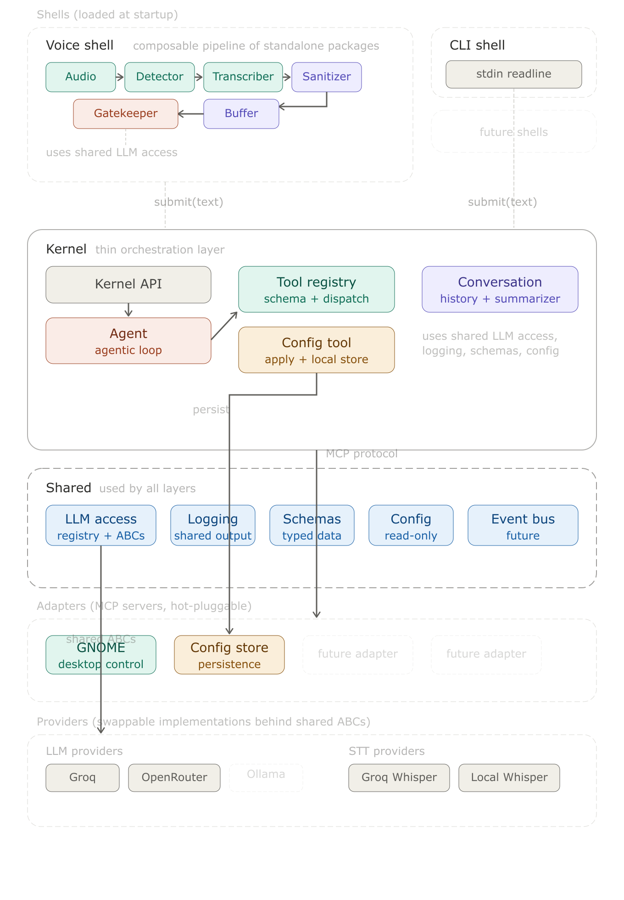
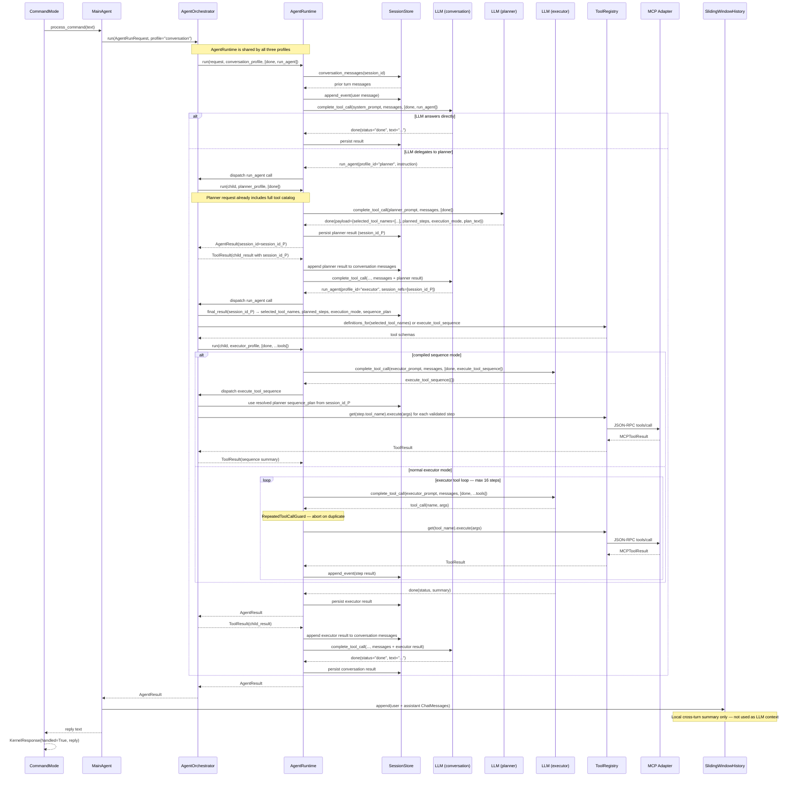

# TUSK — Architecture

## System Overview

TUSK is an always-listening desktop AI voice assistant for Linux/GNOME. It captures
microphone audio continuously, detects speech boundaries, transcribes speech to text,
filters ambient noise and hallucinations, passes confirmed commands to a conversation
agent, and executes desktop actions via hot-pluggable MCP adapters.

The system is split into five layers: **Shells** (voice, CLI, future), a thin **Kernel**
(agent loop + tool dispatch), a **Shared** layer (ABCs, schemas, LLM access — depended on
by all other layers), hot-pluggable **Adapters** (MCP servers), and swappable **Providers**
(LLM and STT implementations). The agent pipeline uses a three-profile delegation chain: a
conversation agent that delegates via `run_agent`, a planner agent that selects tool names and
returns them in `done`, and an executor agent that either calls runtime tools step-by-step or
invokes a compiled `execute_tool_sequence` meta tool for deterministic plans. All three profiles
share the same `AgentRuntime` loop.

Dependency direction is strict: Shells → Shared, Kernel → Shared, Adapters → Shared,
Providers → Shared. No layer imports from a peer layer. Shells and kernel communicate
only through `kernel.submit(text)` at runtime and shared ABCs at design time.

---

## System Block Diagram



> Source: [`docs/diagrams/architecture.svg`](diagrams/architecture.svg)

---

## Agent Workflow Diagram

A sequence diagram of a single agent turn — from submitted text to final reply — showing
the three-profile agent delegation chain (conversation → planner → executor), the shared
`AgentRuntime` loop, session-store history, and both executor paths: the normal tool loop and
the compiled sequence path.



---

## Directory Structure

```
tusk/
├── main.py                              # Startup wiring — builds and connects all layers
├── requirements.txt
├── .env.example
├── tusk/
│   ├── kernel/                          # Thin orchestration layer
│   │   ├── agent/                       # Agentic reasoning loop
│   │   │   ├── agent_child_runner.py    # Runs child agent turns
│   │   │   ├── agent_orchestrator.py    # Routes run_agent calls to child profiles
│   │   │   ├── agent_profile.py         # AgentProfile — prompt + tool config per role
│   │   │   ├── agent_result.py          # AgentResult — final output from a run
│   │   │   ├── agent_run_guard.py       # Guard: max turns, depth, recursion
│   │   │   ├── agent_run_request.py     # AgentRunRequest — frozen run parameters
│   │   │   ├── agent_runtime.py         # AgentRuntime — shared turn/tool loop
│   │   │   ├── agent_session_store.py   # AgentSessionStore ABC
│   │   │   ├── agent_tool_catalog.py    # Builds catalog text with sequence_callable flags
│   │   │   ├── agent_toolset_builder.py # Selects tool schemas per profile and mode
│   │   │   ├── child_result_message_builder.py  # Structured [child-result] messages
│   │   │   ├── clipboard_write_message_builder.py # [clipboard-written] context messages
│   │   │   ├── conversation_failure_budget_guard.py # Blocks after 2 failed executors
│   │   │   ├── conversation_run_agent_guard.py  # Blocks re-delegation after executor done
│   │   │   ├── executor_clipboard_guard.py      # Clipboard progress enforcement
│   │   │   ├── executor_tool_guard.py           # Validates tool calls before dispatch
│   │   │   ├── file_agent_session_store.py      # File-backed session event log
│   │   │   ├── orchestrator_tool_dispatcher.py  # Routes tool calls incl. execute_tool_sequence
│   │   │   ├── planner_request_enricher.py      # Injects tool catalog into planner request
│   │   │   ├── planner_result_validator.py      # Validates planner output + sequence promotion
│   │   │   ├── planner_runtime_tool_resolver.py # Resolves executor tools from planner refs
│   │   │   ├── planner_sequence_promoter.py     # Promotes normal → sequence mode
│   │   │   ├── planner_step_plan_validator.py   # Validates planned_steps structure
│   │   │   ├── runtime_message_history_builder.py # Builds message history for runtime
│   │   │   ├── runtime_result_factory.py        # Creates AgentResult instances
│   │   │   ├── runtime_step_recorder.py         # Records step results as messages
│   │   │   ├── runtime_turn_guards.py           # Composes profile-specific constraints
│   │   │   ├── session_event_formatter.py       # Formats session events
│   │   │   ├── session_event_reader.py          # Reads session events
│   │   │   ├── simple_schema_validator.py       # Lightweight JSON Schema validation
│   │   │   ├── static_tool_schemas.py           # Done, run_agent, execute_tool_sequence schemas
│   │   │   ├── tool_sequence_executor.py        # Executes compiled sequence plans
│   │   │   ├── tool_sequence_plan_validator.py  # Pre-execution sequence validation
│   │   │   └── tool_sequence_recorder.py        # Records sequence execution events
│   │   ├── interfaces/                  # Kernel ABCs
│   │   │   ├── conversation_history.py  # ConversationHistory ABC
│   │   │   ├── conversation_summarizer.py # ConversationSummarizer ABC
│   │   │   └── pipeline_mode.py         # PipelineMode ABC — gatekeeper prompt + handler
│   │   ├── adapter_manager.py           # AdapterManager — MCP adapter lifecycle
│   │   ├── agent_profiles.py            # build_agent_profiles() — 4 profiles
│   │   ├── api.py                       # KernelAPI — submit(text) public entry point
│   │   ├── command_mode.py              # CommandMode — routes submitted text to agent
│   │   ├── dictation_gate.py            # DictationGate — LLM-based stop classification
│   │   ├── dictation_gate_prompt.py     # Dictation-specific prompt for DictationGate
│   │   ├── dictation_mode.py            # AdapterDictationMode — active dictation state
│   │   ├── dictation_router.py          # DictationRouter — routes segments and edits
│   │   ├── dictation_state.py           # DictationState — session id + adapter names
│   │   ├── internal_tools.py            # Re-exports tool classes
│   │   ├── llm_conversation_summarizer.py # LLM-based history compaction
│   │   ├── main_agent.py                # MainAgent — entry point for a conversation turn
│   │   ├── model_failure_reply_builder.py # Human-readable failure messages
│   │   ├── registered_tool.py           # RegisteredTool — frozen entry in ToolRegistry
│   │   ├── repeated_tool_call_guard.py  # Detects repeated identical tool calls
│   │   ├── sliding_window_history.py    # SlidingWindowHistory — max-20 with LLM compaction
│   │   ├── start_dictation_tool.py      # StartDictationTool — launches dictation session
│   │   ├── switch_model_tool.py         # SwitchModelTool — hot-swaps an LLM slot
│   │   └── tool_runtime.py              # ToolRuntime — wires tools + DictationRouter
│   ├── shared/                          # Used by all layers; depends on nothing else
│   │   ├── config/
│   │   │   ├── config.py                # Config — frozen dataclass, all runtime settings
│   │   │   ├── config_factory.py        # ConfigFactory — reads env vars, builds Config
│   │   │   └── startup_options.py       # StartupOptions — CLI args (verbosity, log groups)
│   │   ├── llm/
│   │   │   ├── interfaces/
│   │   │   │   ├── llm_provider.py      # LLMProvider ABC — complete, complete_tool_call, etc.
│   │   │   │   └── llm_provider_factory.py # LLMProviderFactory ABC
│   │   │   ├── llm_payload_logger.py    # Logs prompts and tool schemas for debugging
│   │   │   ├── llm_proxy.py             # LLMProxy — retry + wait indicator + swap()
│   │   │   ├── llm_registry.py          # LLMRegistry — named slots + runtime swap
│   │   │   ├── llm_retry_policy.py      # LLMRetryPolicy — retryable error classification
│   │   │   ├── llm_retry_runner.py      # LLMRetryRunner — exponential backoff loop
│   │   │   └── tool_use_failed_recovery.py # Graceful recovery for tool_use_failed errors
│   │   ├── logging/
│   │   │   ├── interfaces/
│   │   │   │   ├── log_printer.py       # LogPrinter ABC — log, show_wait, clear_wait
│   │   │   │   └── conversation_logger.py # ConversationLogger ABC — log_message
│   │   │   ├── color_log_printer.py     # ColorLogPrinter — colored console output by tag
│   │   │   └── daily_file_logger.py     # DailyFileLogger — daily-rotation conversation log
│   │   ├── mcp/
│   │   │   ├── adapter_env_builder.py   # AdapterEnvironmentBuilder — managed venv setup
│   │   │   ├── adapter_watcher.py       # AdapterWatcher — file-system hot-plug via watchdog
│   │   │   ├── mcp_client.py            # MCPClient — stdio JSON-RPC client
│   │   │   └── mcp_tool_proxy.py        # MCPToolProxy — adapts MCPToolSchema to RegisteredTool
│   │   ├── schemas/                     # Frozen dataclasses (all inter-layer data)
│   │   │   ├── app_entry.py             # AppEntry — desktop application (name + exec_cmd)
│   │   │   ├── chat_message.py          # ChatMessage — role + content, summary detection
│   │   │   ├── desktop_context.py       # DesktopContext — active window + window list
│   │   │   ├── gate_result.py           # GateResult — gatekeeper output
│   │   │   ├── kernel_response.py       # KernelResponse — final handled + reply
│   │   │   ├── llm_slot_config.py       # LLMSlotConfig — parsed provider/model string
│   │   │   ├── mcp_tool_result.py       # MCPToolResult — adapter tool response
│   │   │   ├── mcp_tool_schema.py       # MCPToolSchema — adapter tool definition
│   │   │   ├── tool_call.py             # ToolCall — tool name + parameters + call_id
│   │   │   ├── tool_result.py           # ToolResult — success + message + data
│   │   │   ├── tool_sequence_plan.py    # ToolSequencePlan — ordered steps + goal
│   │   │   ├── tool_sequence_step.py    # ToolSequenceStep — step_id + tool_name + args
│   │   │   ├── utterance.py             # Utterance — transcribed text + audio + confidence
│   │   │   └── window_info.py           # WindowInfo — title + app + geometry + active flag
│   │   └── stt/
│   │       └── interfaces/
│   │           └── stt_engine.py        # STTEngine ABC — transcribe(audio_frames, sample_rate)
│   └── providers/                       # Swappable implementations behind shared ABCs
│       ├── llm/
│       │   ├── groq_llm.py              # GroqLLM — Groq cloud API with structured output
│       │   ├── open_router_llm.py       # OpenRouterLLM — OpenRouter via OpenAI client
│       │   └── configurable_llm_factory.py # Parses "provider/model" strings
│       └── stt/
│           ├── groq_stt.py              # GroqSTT — Groq cloud Whisper-large-v3-turbo
│           └── whisper_stt.py           # WhisperSTT — local OpenAI Whisper model
├── shells/
│   ├── voice/                           # Six-stage composable voice pipeline
│   │   ├── README.md                    # Voice shell architecture (see that file)
│   │   ├── pipeline.py                  # VoicePipeline — assembles stages, dispatches GateDispatch
│   │   ├── voice_shell.py               # VoiceShell — entry point, calls kernel.submit()
│   │   ├── buffered_utterance.py        # BufferedUtterance — Utterance + id + gate_state
│   │   ├── gate_dispatch.py             # GateDispatch — action + text + recovered_id
│   │   ├── recovery_decision.py         # RecoveryDecision — action + candidate_id + reason
│   │   ├── interfaces/
│   │   │   ├── gatekeeper.py            # Gatekeeper ABC
│   │   │   └── transcription_buffer.py  # TranscriptionBuffer ABC
│   │   └── stages/
│   │       ├── audio_capture.py         # AudioCapture — sounddevice PulseAudio stream
│   │       ├── utterance_detector.py    # UtteranceDetector — WebRTC VAD boundary detection
│   │       ├── transcriber.py           # Transcriber — wraps STTEngine
│   │       ├── sanitizer.py             # Sanitizer — hallucination / ghost-phrase filter
│   │       ├── transcription_buffer.py  # TranscriptionBuffer — rolling window + state tracking
│   │       ├── gatekeeper.py            # LLMGatekeeper — primary classify + recovery
│   │       ├── gatekeeper_parser.py     # JSON parsing for gate and recovery LLM responses
│   │       ├── gatekeeper_support.py    # Helpers: schemas, dispatch builders, wake-word check
│   │       ├── command_gate_prompt.py   # Prompt builder for the primary classification call
│   │       ├── recovery_gate_prompt.py  # Prompt builder for the recovery LLM call
│   │       └── recent_context_formatter.py # Formats recent utterances for context
│   └── cli/
│       ├── shell.json                   # Shell manifest
│       └── cli_shell.py                 # CLIShell — stdin REPL, bypasses voice pipeline
├── adapters/
│   ├── gnome/
│   │   ├── adapter.json                 # Adapter manifest (name, transport, entry, provides_context)
│   │   ├── server.py                    # GNOME MCP server entry point
│   │   ├── gnome_tool_router.py         # Routes tool calls to handler modules
│   │   ├── gnome_tool_schema_catalog.py # Builds all tool schemas for MCP list_tools
│   │   ├── gnome_application_tools.py   # launch_application
│   │   ├── gnome_window_tools.py        # close/focus/maximize/minimize/move_resize/switch_workspace
│   │   ├── gnome_input_tools.py         # press_keys, type_text, replace_recent_text
│   │   ├── gnome_mouse_tools.py         # mouse_click, mouse_move, mouse_drag, mouse_scroll
│   │   ├── gnome_clipboard_tools.py     # read_clipboard, write_clipboard
│   │   ├── gnome_context_tools.py       # get_desktop_context, get_active_window, list_windows
│   │   ├── gnome_context_provider.py    # Queries desktop state (wmctrl, xdotool, xdg-open)
│   │   ├── gnome_input_simulator.py     # Low-level xdotool key/mouse/type
│   │   ├── gnome_clipboard_provider.py  # xclip read/write
│   │   ├── gnome_text_paster.py         # Paste + replace via xdotool type + BackSpace
│   │   ├── app_catalog.py               # search_applications — installed desktop app search
│   │   ├── open_uri_tool.py             # open_uri — xdg-open
│   │   └── desktop_context.py           # DesktopContext snapshot builder
│   └── dictation/
│       ├── adapter.json                 # Adapter manifest (provides_context=false)
│       ├── server.py                    # DictationServer — MCP server for dictation sessions
│       ├── dictation_refiner.py         # DictationRefiner — LLM-based segment cleanup
│       └── dictation_tool_schema_catalog.py # start_dictation, process_segment, stop_dictation
└── tests/
    ├── test_pipeline.py
    ├── test_voice_shell.py
    ├── test_transcription_buffer.py
    ├── test_gatekeeper_follow_up.py
    └── ...                              # Full test suite for all layers
```

---

## Abstract Base Classes

TUSK defines ABCs at each layer boundary. No concrete class imports another concrete
class directly — only ABCs cross layer boundaries.

### LLMProvider — `tusk/shared/llm/interfaces/llm_provider.py`

```python
@property def label(self) -> str
def complete(self, system_prompt: str, user_message: str, max_tokens: int = 256) -> str
def complete_messages(self, system_prompt: str, messages: list[dict]) -> str
def complete_tool_call(self, system_prompt: str, messages: list[dict], tools: list[dict]) -> ToolCall
def complete_structured(self, system_prompt: str, user_message: str,
                        schema_name: str, schema: dict, max_tokens: int = 256) -> str
```

`complete_tool_call` returns a `ToolCall` directly. `complete_structured` requests a
JSON response conforming to a named schema — used by planner and gatekeeper. Providers
may fall back to `complete` if structured output is unavailable.

### LLMProviderFactory — `tusk/shared/llm/interfaces/llm_provider_factory.py`

```python
def create(self, provider_name: str, model: str) -> LLMProvider
```

### STTEngine — `tusk/shared/stt/interfaces/stt_engine.py`

```python
def transcribe(self, audio_frames: bytes, sample_rate: int) -> Utterance
```

### LogPrinter — `tusk/shared/logging/interfaces/log_printer.py`

```python
def log(self, tag: str, message: str, group: str | None = None) -> None
def show_wait(self, label: str, group: str = "wait") -> None
def clear_wait(self) -> None
```

`show_wait` / `clear_wait` display a spinner while waiting for an LLM response.

### ConversationLogger — `tusk/shared/logging/interfaces/conversation_logger.py`

```python
def log_message(self, message: ChatMessage) -> None
```

### Gatekeeper — `shells/voice/interfaces/gatekeeper.py`

```python
def evaluate(self, utterance: Utterance, recent: list[Utterance]) -> GateResult
def process(self, utterance: Utterance | BufferedUtterance,
            recent: list[Utterance],
            candidates: list[BufferedUtterance] | None = None) -> GateDispatch
```

`process` returns a `GateDispatch` (action + optional text + recovered_id). Actions:
`forward_current`, `forward_recovered`, `forward_clarification`, `drop`. The follow-up
window is tracked internally via `_last_forwarded_at`. Recovery is a second LLM call
triggered when the primary classification is not `command`.

### TranscriptionBuffer — `shells/voice/interfaces/transcription_buffer.py`

```python
def process(self, utterance: Utterance) -> BufferedUtterance | None
def recent(self, count: int) -> list[Utterance]
def recoverable(self, count: int, max_age_seconds: float) -> list[BufferedUtterance]
def mark_consumed(self, entry_id: str) -> None
def mark_dropped(self, entry_id: str) -> None
def mark_forwarded(self, entry_id: str) -> None
def mark_recovered(self, entry_id: str) -> None
```

`process` wraps the utterance in a `BufferedUtterance` (adds `id`, `received_at`,
`gate_state`). `recoverable` returns entries with `gate_state == "dropped"` within
`max_age_seconds`. The pipeline calls `mark_*` after the gatekeeper decides.

### ConversationHistory — `tusk/kernel/interfaces/conversation_history.py`

```python
def get_messages(self) -> list[ChatMessage]
def append(self, message: ChatMessage) -> None
def clear(self) -> None
```

### ConversationSummarizer — `tusk/kernel/interfaces/conversation_summarizer.py`

```python
def summarize(self, messages: list[ChatMessage]) -> str
```

### PipelineMode — `tusk/kernel/interfaces/pipeline_mode.py`

```python
@property def gatekeeper_prompt(self) -> str
def handle_command(self, text: str) -> KernelResponse
```

Used by `CommandMode` and `DictationMode` to route submitted text inside the kernel.

---

## Schemas

All inter-component data is passed as immutable frozen dataclasses. No untyped dicts
cross component boundaries.

### Utterance — `tusk/shared/schemas/utterance.py`

| Field | Type | Description |
|---|---|---|
| `text` | `str` | Transcribed text (empty until STT runs) |
| `audio_frames` | `bytes` | Raw PCM audio |
| `duration_seconds` | `float` | Duration of the audio segment |
| `confidence` | `float` | STT confidence score (0.0–1.0) |

### GateResult — `tusk/shared/schemas/gate_result.py`

| Field | Type | Description |
|---|---|---|
| `is_directed_at_tusk` | `bool` | Whether to process this utterance |
| `cleaned_command` | `str` | Text after wake-word removal |
| `confidence` | `float` | Gatekeeper confidence |
| `metadata` | `dict[str, str]` | Mode-specific signals; includes `classification` key |

The `classification` key in `metadata` holds `"command"`, `"conversation"`, or `"ambient"`.

### ToolCall — `tusk/shared/schemas/tool_call.py`

| Field | Type | Description |
|---|---|---|
| `tool_name` | `str` | Name of the tool to execute |
| `parameters` | `dict[str, object]` | Tool input parameters |
| `call_id` | `str` | Provider-assigned call ID (empty string if absent) |

### ToolResult — `tusk/shared/schemas/tool_result.py`

| Field | Type | Description |
|---|---|---|
| `success` | `bool` | Whether execution succeeded |
| `message` | `str` | Human-readable result or error |
| `data` | `dict \| None` | Structured output (e.g. dictation session data) |

### ChatMessage — `tusk/shared/schemas/chat_message.py`

| Field | Type | Description |
|---|---|---|
| `role` | `str` | `"user"` or `"assistant"` |
| `content` | `str` | Message text |

`is_summary` property: returns `True` if content starts with `"Previous context summary: "`.
`to_dict()` method: returns `{"role": ..., "content": ...}` for LLM API calls.

### KernelResponse — `tusk/shared/schemas/kernel_response.py`

| Field | Type | Description |
|---|---|---|
| `handled` | `bool` | Whether the pipeline processed this input |
| `reply` | `str` | Text reply to surface to the user |

### MCPToolSchema — `tusk/shared/schemas/mcp_tool_schema.py`

| Field | Type | Description |
|---|---|---|
| `name` | `str` | Tool name as reported by the adapter |
| `description` | `str` | One-line tool description |
| `input_schema` | `dict` | JSON Schema object describing parameters |

### MCPToolResult — `tusk/shared/schemas/mcp_tool_result.py`

| Field | Type | Description |
|---|---|---|
| `content` | `str` | Text content from the adapter response |
| `is_error` | `bool` | Whether the adapter reported an error |
| `data` | `dict \| None` | Structured payload (e.g. dictation edit operations) |

### LLMSlotConfig — `tusk/shared/schemas/llm_slot_config.py`

| Field | Type | Description |
|---|---|---|
| `provider_name` | `str` | First path segment of `provider/model` string |
| `model` | `str` | Remainder after the first `/` |

`LLMSlotConfig.parse("groq/llama-3.1-8b-instant")` → `LLMSlotConfig("groq", "llama-3.1-8b-instant")`

### DesktopContext — `tusk/shared/schemas/desktop_context.py`

| Field | Type | Description |
|---|---|---|
| `active_window_title` | `str` | Title of the focused window |
| `active_application` | `str` | Application name of the focused window |
| `open_windows` | `list[WindowInfo]` | All open windows with geometry |
| `available_applications` | `list[AppEntry]` | Installed desktop applications |

### WindowInfo — `tusk/shared/schemas/window_info.py`

| Field | Type | Description |
|---|---|---|
| `window_id` | `str` | Platform window ID |
| `title` | `str` | Window title |
| `application` | `str` | Application name |
| `is_active` | `bool` | Whether this is the focused window |
| `x`, `y`, `width`, `height` | `int` | Window geometry |

### AppEntry — `tusk/shared/schemas/app_entry.py`

| Field | Type | Description |
|---|---|---|
| `name` | `str` | Human-readable application name |
| `exec_cmd` | `str` | Shell command to launch the application |

### ToolSequenceStep — `tusk/shared/schemas/tool_sequence_step.py`

| Field | Type | Description |
|---|---|---|
| `step_id` | `str` | Unique step identifier |
| `tool_name` | `str` | Name of the tool to execute |
| `args` | `dict[str, object]` | Tool input parameters |

Class methods: `from_dict(data) -> ToolSequenceStep | None`, `to_dict() -> dict`.

### ToolSequencePlan — `tusk/shared/schemas/tool_sequence_plan.py`

| Field | Type | Description |
|---|---|---|
| `steps` | `tuple[ToolSequenceStep, ...]` | Ordered sequence of tool steps |
| `goal` | `str` | Natural-language goal description |

Class methods: `from_dict(data) -> ToolSequencePlan | None`, `to_dict() -> dict`,
`tool_names() -> set[str]`, `ordered_tool_names() -> tuple[str, ...]`.

---

## Pipeline Data Flow

### Voice Shell Path

```
AudioCapture.stream_frames()
    → UtteranceDetector.stream_utterances()    # WebRTC VAD + boundary buffering
    → Transcriber.process(utterance)           # STTEngine.transcribe() → text
    → Sanitizer.process(transcribed)           # hallucination / ghost-phrase filter → DROP
    → TranscriptionBuffer.process(sanitized)   # append to rolling window
    → LLMGatekeeper.process(buffered, recent)  # LLM 3-way classify → DROP (ambient)
    → KernelAPI.submit(command_text)
        → CommandMode.process_command(text)
            → MainAgent.process_command(command)
                → AgentOrchestrator.run(profile="conversation")
                    → AgentRuntime: LLM_C → run_agent(profile="planner")
                        → AgentRuntime: LLM_P → done(selected_tool_names=[...])
                    → AgentRuntime: LLM_C → run_agent(profile="executor", session_refs)
                        → AgentRuntime: LLM_E → ToolRegistry → MCPToolProxy
                            → adapter (stdio JSON-RPC)
                    → AgentRuntime: LLM_C → done(text)
    → KernelResponse(handled, reply)

# Recovery path (when gatekeeper returns forward_recovered):
    → GateDispatch(action="forward_recovered", text=prior_text, recovered_id)
    → buffer.mark_recovered(recovered_id); buffer.mark_consumed(current_id)
    → KernelAPI.submit(prior_text)
```

### CLI Shell Path

```
stdin → CLIShell.start(api)
    → KernelAPI.submit(text)             # bypasses entire voice pipeline
    → CommandMode.handle(text)
    → [same from MainAgent onward]
    → KernelResponse(handled, reply)
    → print(reply)
```

`submit(text)` bypasses STT, hallucination filtering, and gatekeeping entirely.

---

## Agent Structure

### Three Profiles — `tusk/kernel/agent_profiles.py`

All three profiles run through the same `AgentRuntime` loop. Each gets its own LLM slot,
system prompt, allowed tools, and `max_steps`.

| Profile | LLM slot | Static tools | Runtime tools | max_steps |
|---|---|---|---|---|
| `conversation` | `conversation_agent` | `done`, `run_agent` | — | 8 |
| `planner` | `planner_agent` | `done` | — | 8 |
| `executor` | `executor_agent` | `done` | resolved from planner session | 16 |

**Conversation prompt (key rules):**
- Answer directly with `done` for conversational replies.
- Delegate actionable work: call `run_agent(profile_id="planner")` first, then
  `run_agent(profile_id="executor", session_refs=[planner_session_id])`.
- After executor returns `status=done`, call `done` immediately.

**Planner prompt (key rules):**
- Plan but do not execute.
- Use the provided tool catalog (injected into prompt context) to inspect tool schemas,
  required arguments, and `sequence_callable` flags.
- Draft `payload.planned_steps` as concrete ordered tool steps with exact args.
- Return `payload.execution_mode` as `normal` or `sequence`.
- Try to promote to sequence mode when all steps are linear, deterministic, and every tool
  is `sequence_callable`.
- For large text insertion, prefer clipboard write + paste tools over `gnome.type_text`.
- Return `done(payload={selected_tool_names, execution_mode, plan_text, planned_steps})`.

**Executor prompt (key rules):**
- Execute using only the runtime tools provided.
- Every response must be a single tool call.
- When `execute_tool_sequence` is available, call it first with empty arguments `{}`.
- Do not rewrite or reconstruct the compiled sequence plan in tool arguments.
- After `execute_tool_sequence` returns success, call `done` immediately.
- Prefer clipboard + paste (`gnome.write_clipboard` + `gnome.press_keys`) for large text
  over `gnome.type_text`. After a clipboard write, move toward focus/paste.
- Use `gnome.press_keys` only for shortcuts, not for literal text or URLs.
- Call the tool named `done` (not a natural-language reply) after the final action.

### AgentRuntime — `tusk/kernel/agent/agent_runtime.py`

Shared across all profiles. Each run is independent:

1. `RuntimeMessageHistoryBuilder` loads prior messages from `SessionStore` for this session.
2. Appends the user instruction to messages and session store.
3. Loops up to `profile.max_steps`:
   - Calls `profile.llm_provider.complete_tool_call(system_prompt, messages, tools)`.
   - `RepeatedToolCallGuard` aborts on duplicate identical call.
   - `RuntimeTurnGuards` enforces profile-specific constraints.
   - Dispatches the tool call; appends call + result to messages and session store.
   - If tool is `done` → finish and persist result.
4. Returns `AgentResult` with `session_id`, `status`, `reply_text`.

**RuntimeTurnGuards** composes profile-specific constraints:
- `ConversationRunAgentGuard` — blocks the conversation profile from calling `run_agent`
  again after an executor or default child already returned `status=done`. Planner `done` is
  intermediate and does NOT trigger this guard.
- `ConversationFailureBudgetGuard` — blocks further delegation after two failed executor or
  default child runs in the same conversation turn.
- `ExecutorClipboardGuard` — blocks repeated `gnome.write_clipboard` calls and requires
  progress toward `gnome.focus_window` or a paste shortcut before allowing another write.
- `ClipboardWriteMessageBuilder` — surfaces clipboard text as a `[clipboard-written]`
  message so the executor sees the exact text already prepared.
- `RuntimeStepRecorder` / `ChildResultMessageBuilder` — formats child-agent results as
  structured `[child-result]` assistant messages instead of raw JSON user messages.

### History Management

`SlidingWindowHistory` is maintained by `MainAgent._remember()` after each turn (user
command + assistant reply). It is **not** used as LLM context by `AgentRuntime` —
the runtime reads from `SessionStore` per session. `SlidingWindowHistory` compaction
is local string formatting (no LLM call): the oldest half is summarised as the last 6
evicted messages truncated to 120 chars, joined with `" | "`.

### Tool Handoff — `tusk/kernel/agent/planner_runtime_tool_resolver.py`

When the executor profile receives `session_refs=[planner_session_id]`,
`PlannerRuntimeToolResolver` reads the planner's persisted `done` payload from
`SessionStore` and resolves three fields for the executor request:
- `runtime_tool_names` — validated against `ToolRegistry.real_tool_names()`. When a
  `sequence_plan` is present, names are derived from `plan.ordered_tool_names()` instead.
- `execution_mode` — `"normal"` or `"sequence"`, carried from the planner payload.
- `sequence_plan` — a `ToolSequencePlan` materialized from `planned_steps` or
  `sequence_plan` in the planner payload.

### Agent Delegation Model

Delegation is controlled solely by `AgentProfile.static_tool_names`. A profile that
includes `"run_agent"` can delegate; a profile that omits it cannot. The `run_agent` schema
is global: any profile that has the tool can request `planner`, `executor`, or `default` as
the child profile. `AgentRunGuard` blocks self-recursion and excessive depth but does NOT
enforce parent-specific child-profile allowlists.

Current delegation permissions:
- `conversation`: has `run_agent` — can delegate to any child profile.
- `planner`: no `run_agent` — cannot delegate.
- `executor`: no `run_agent` — cannot delegate.
- `default`: has `run_agent` — can delegate to any child profile.

---

## Tool Registry — `tusk/kernel/tool_registry.py`

Central store for all executable tools. Every entry is a `RegisteredTool` frozen
dataclass:

| Field | Type | Description |
|---|---|---|
| `name` | `str` | Unique tool name |
| `description` | `str` | One-line description (used in planner catalog) |
| `input_schema` | `dict` | JSON Schema for parameters |
| `execute` | `Callable[[dict], ToolResult]` | Execution function |
| `source` | `str` | `"kernel"` or adapter name (e.g. `"gnome"`) |
| `planner_visible` | `bool` | Whether planner catalog includes this tool |
| `sequence_callable` | `bool` | Whether the tool may appear in a compiled sequence plan (default `False`) |

**Key methods:**

| Method | Returns | Description |
|---|---|---|
| `register(tool)` | — | Adds tool to registry by `tool.name` |
| `unregister_source(source)` | — | Removes all tools from a named source |
| `get(name)` | `RegisteredTool` | Retrieves tool by name (raises `KeyError` if absent) |
| `real_tools()` | `list[RegisteredTool]` | All tools, sorted by name |
| `planner_tools()` | `list[RegisteredTool]` | Only `planner_visible=True` tools |
| `planner_tool_names()` | `set[str]` | Names of planner-visible tools |
| `build_planner_catalog_text()` | `str` | `"name: description\n..."` for planner prompt |
| `definitions_for(names)` | `list[dict]` | Native tool defs for a named subset |
| `sequence_tools()` | `list[RegisteredTool]` | Only `sequence_callable=True` tools |
| `sequence_tool_names()` | `set[str]` | Names of sequence-callable tools |

Adapter tools are registered as `adapter_name.tool_name` (e.g. `gnome.launch_application`).
The planner receives the full tool catalog as text in its system prompt context via
`AgentToolCatalog`, which exposes each tool's name, description, parameters, and
`sequence_callable` flag. The synthetic `list_available_tools` tool is retained in
`OrchestratorToolDispatcher` for backward compatibility but is no longer exposed to the
planner profile.

---

## Pipeline Modes

### CommandMode — `tusk/kernel/command_mode.py`

Handles the normal voice command flow. The gatekeeper prompt is built dynamically:

**Outside the follow-up window:** Standard static prompt. Wake-word or obvious imperative
detection. Returns `{"classification": "command|conversation|ambient", "cleaned_text": ..., "reason": ...}`.

**Within the follow-up window:** Standard prompt extended with:
```
The user recently interacted with TUSK. Follow-up utterances may omit the wake word.
Recent context:
  User: Command: <truncated to 150 chars>
  User: Command: <truncated>
  ...
```
The last 6 non-summary user messages from `SlidingWindowHistory` are included.

`handle_gate_result`: discards `is_directed_at_tusk=False`; calls `kernel.submit(text)`
which routes the command to the agent.

### AdapterDictationMode — `tusk/kernel/dictation_mode.py`

Active when `start_dictation` has been executed. Holds a `DictationState` (session ID,
adapter name, desktop source name).

**process_text(text):** Forwards the raw segment to `DictationRouter.process()`. The
router calls `dictation.process_segment` (MCP), receives an edit operation, and applies
it through the active desktop adapter (`gnome.type_text` or `gnome.replace_recent_text`).

**stop():** Calls `DictationRouter.stop()` which calls `dictation.stop_dictation` (MCP)
and clears the pipeline's dictation mode pointer.

**Stop detection — `tusk/kernel/dictation_gate.py`:** `KernelAPI` consults `DictationGate`
before forwarding text to `AdapterDictationMode`. `DictationGate` uses the gatekeeper LLM
with a dictation-specific prompt (`tusk/kernel/dictation_gate_prompt.py`) and a structured
output schema to classify whether a spoken segment is a stop request. Stop detection relies
on the model returning `metadata_stop` (a non-null string), not on hard-coded phrase
matching. When structured output fails, `DictationGate` falls back to a plain `complete()`
call with flexible JSON parsing. If both calls fail, the segment is treated as dictation
text (not a stop).

### Tool Sequence Execution

The executor can run a compiled deterministic plan through a single synthetic tool
`execute_tool_sequence` instead of making per-step LLM calls. This reduces latency and
token cost for short desktop workflows.

**Validation pipeline:**
1. `PlannerStepPlanValidator` validates `planned_steps` structure at planner output —
   rejects forbidden synthetic tools, checks step schema and args against tool input
   schemas. Does NOT check `sequence_callable`.
2. `PlannerSequencePromoter` promotes `execution_mode=normal` to `sequence` when all steps
   are linear and every tool is `sequence_callable`. Logs promotion under `SEQPROMOTE`.
3. `PlannerResultValidator` orchestrates step validation, promotion, and derives
   `sequence_plan` from validated `planned_steps`.
4. `ToolSequencePlanValidator` runs immediately before execution — re-checks
   `sequence_callable`, rejects forbidden tools, enforces max 8 steps.

**Forbidden tools in sequence plans:** `done`, `run_agent`, `list_available_tools`,
`execute_tool_sequence`.

**Execution:** `ToolSequenceExecutor` iterates the validated plan, calling
`ToolRegistry.get(step.tool_name).execute(args)` for each step. `ToolSequenceRecorder`
records `sequence_started`, `sequence_step_requested`, `sequence_step_result`, and
`sequence_finished` events to the session store. On any step failure, remaining steps are
aborted and a partial-result `ToolResult` is returned.

**Known limitations:** No wait/polling primitives, no step-output references, no retry
policies, no branching or loops. Sequence mode is limited to already-synchronous tools.

---

## Adapter Model

Adapters are out-of-process MCP servers discovered from `adapter.json` manifests.

### Manifest Schema (`adapter.json`)

| Field | Type | Required | Description |
|---|---|---|---|
| `name` | `str` | yes | Unique adapter name; becomes tool name prefix |
| `transport` | `str` | yes | Must be `"stdio"` (HTTP not yet implemented) |
| `entry` | `str` | yes | Shell command to start the server (e.g. `"python server.py"`) |
| `provides_context` | `bool` | no | If true, this adapter becomes the primary desktop source |

### Startup Sequence (`AdapterManager`)

1. `start_all()` iterates `adapters/*/` directories
2. For each directory with a valid `adapter.json`:
   a. Reads manifest, checks `transport == "stdio"`
   b. Spawns the server process via `MCPClient.connect_stdio()`
   c. Sends MCP `initialize` handshake
   d. Calls `tools/list` to discover tools
   e. Registers each tool as an `MCPToolProxy` in `ToolRegistry`
3. First adapter with `provides_context=true` becomes `_context_adapter`
4. On failure, retries with a managed virtualenv (`AdapterEnvironmentBuilder`)
5. `start_watcher()` watches `adapters/` for hot-plug via `watchdog`

### MCPClient Protocol — `tusk/shared/mcp/mcp_client.py`

Communication is line-delimited JSON-RPC 2.0 over the subprocess's stdin/stdout:

```
→ {"jsonrpc": "2.0", "id": N, "method": "tools/call",
   "params": {"name": "launch_application", "arguments": {"application_name": "firefox"}}}
← {"jsonrpc": "2.0", "id": N, "result": {"content": [{"type": "text", "text": "..."}]}}
```

Tool names in `tools/call` use the unscoped name (the `adapter_name.` prefix is added by
`MCPToolProxy` during registration and stripped during dispatch).

### MCPToolProxy — `tusk/shared/mcp/mcp_tool_proxy.py`

Wraps an `MCPToolSchema` to present the `RegisteredTool` interface. On `execute()`:
1. Calls `MCPClient.call_tool(unscoped_name, parameters)` synchronously
2. Converts `MCPToolResult` to `ToolResult`
3. Returns `ToolResult(success=not is_error, message=content, data=data)`

`MCPToolProxy` sets `sequence_callable` based on a scoped-name allowlist in
`mcp_tool_proxy.py`. The GNOME allowlist includes window management, input simulation,
mouse, and clipboard tools. `gnome.launch_application` and `gnome.open_uri` are excluded
because their success semantics do not guarantee that dependent UI state is ready for the
next step. Read-only inspection tools (`gnome.read_clipboard`, `gnome.get_desktop_context`,
`gnome.get_active_window`, `gnome.list_windows`, `gnome.search_applications`) are excluded
as they are not needed in sequence plans.

---

## Shell Model

Shells are dynamically loaded from `shell.json` manifests by `main.py`.

### Manifest Schema (`shell.json`)

```json
{
  "name": "voice",
  "description": "Voice shell",
  "entry_module": "voice_shell",
  "entry_class": "VoiceShell"
}
```

### VoiceShell — `shells/voice/voice_shell.py`

Builds a `VoicePipeline` from the six stages and drives it in a loop, passing
`kernel.submit` as the callback. Logs the reply if present. See
`shells/voice/README.md` for full pipeline details.

### CLIShell — `shells/cli/cli_shell.py`

REPL loop: `input("tusk> ")` → `KernelAPI.submit_text(text)` → print reply. Exits on
`"exit"` or `"quit"`. Takes no constructor arguments.

### Threading

When multiple shells are configured, all but the last start in daemon threads. The last
shell runs on the main thread (blocking). This allows `voice` + `cli` simultaneously.

---

## LLM Provider Specification

### LLMProxy — `tusk/shared/llm/llm_proxy.py`

Wraps any `LLMProvider`. Adds:

- **Wait indicator:** Calls `log.show_wait(label)` before each LLM request, `log.clear_wait()` after
- **Retry:** All calls go through `LLMRetryRunner` (3 attempts, delay `0.5 * attempt` seconds)
- **Payload logging:** `LLMPayloadLogger` logs system prompts and messages to the debug group
- **Runtime swap:** `swap(provider)` replaces the inner provider without creating a new proxy

### LLMRegistry — `tusk/shared/llm/llm_registry.py`

Holds six named `LLMProxy` slots. `swap(slot_name, provider_name, model)` creates a new
provider via `ConfigurableLLMFactory` and calls `proxy.swap()`.

Slots: `gatekeeper`, `conversation_agent`, `planner_agent`, `executor_agent`,
`default_agent`, `utility`.

### LLMRetryRunner — `tusk/shared/llm/llm_retry_runner.py`

Retries on network and rate-limit errors. Does **not** retry `invalid_request_error` or
`tool_use_failed` errors. Retried error classes: HTTP 429, 500, 502, 503, 504, connection
errors, rate limit, timeout.

### GroqLLM — `tusk/shared/llm/providers/groq_llm.py`

- **Client:** `groq.Groq`, timeout 30 seconds
- **Structured output:** Uses `response_format` with `json_schema` for models in
  `_STRICT_SCHEMA_MODELS` (`openai/gpt-oss-20b`, `openai/gpt-oss-120b`); falls back to
  `json_object` for other models
- **Tool calling:** `tool_choice="required"` first; on "did not call a tool" error, retries
  with `tool_choice="auto"`
- **label:** `"groq/<model>"`

### OpenRouterLLM — `tusk/shared/llm/providers/open_router_llm.py`

- **Client:** `openai.OpenAI` with base URL `https://openrouter.ai/api/v1`
- **Headers:** `HTTP-Referer: https://github.com/vovka/tusk`, `X-Title: TUSK`
- **Structured output:** Falls back to plain `complete()` (no schema enforcement)
- **label:** `"openrouter/<model>"`

---

## STT Provider Specification

### GroqSTT — `tusk/shared/stt/providers/groq_stt.py`

- **Model:** `whisper-large-v3-turbo`
- **Audio format:** PCM frames wrapped in a WAV container via `wave` stdlib module
- **Hallucination detection:** Regex `^\[.+\]$` — matches `[BLANK_AUDIO]`, `[Music]`,
  `[Applause]`, etc. → sets `confidence=0.0`
- **Normal result:** `confidence=1.0`

### WhisperSTT — `tusk/shared/stt/providers/whisper_stt.py`

- **Model loading:** `whisper.load_model(model_size)` at construction time
- **PCM decoding:** `numpy.frombuffer(audio_frames, dtype=numpy.int16) / 32768.0`
- **Inference:** `model.transcribe(audio, fp16=False, language="en")`
- **Confidence:** `min(1.0, max(0.0, (avg_logprob + 1.0))) * (1.0 - no_speech_prob)` per segment, averaged

### Sanitizer — `shells/voice/stages/sanitizer.py`

Applied after STT, before the buffer. Provider-agnostic hallucination and ghost-phrase
filter. Rejects:
- Duration < 0.4 seconds
- Punctuation-only text
- Text that normalizes (lowercase, strip trailing `.!?,`) to a known ghost phrase
  (`"thank you"`, `"thanks"`, `"okay"`, `"um"`, `"hmm"`, `"bye"`, `"hello"`, and ~25 others)
- Single words of 3 or fewer characters

---

## Gatekeeper Specification

**Source:** `shells/voice/stages/gatekeeper.py`

### Command Schema

Used when the system prompt does not contain `"metadata_stop"`:

```json
{
  "classification": "command|conversation|ambient",
  "cleaned_text": "string",
  "reason": "string"
}
```

### Dictation Schema

Used when the system prompt contains `"metadata_stop"` (dictation gate prompt):

```json
{
  "directed": true|false,
  "cleaned_command": "string",
  "metadata_stop": "true|null"
}
```

### Response Parsing

1. Strip markdown code fences if present
2. Parse JSON
3. If parsed value is a list, use `list[0]`
4. If parsed value has an `"arguments"` key, unwrap it
5. Extract `reason` and log it
6. Extract `classification` (or derive from `directed` boolean for dictation schema)
7. Extract `cleaned_text` or `cleaned_command` as `cleaned_command`
8. Extract all keys starting with `metadata_` into `GateResult.metadata`
9. `is_directed_at_tusk = classification in ("command", "conversation")`
10. On any failure: return `GateResult(False, "", 0.0)`

### Fallback Chain

1. Try `complete_structured` with appropriate schema
2. On failure, try plain `complete` (flexible JSON parsing handles non-schema output)
3. On second failure: return `GateResult(False, "", 0.0)` — silently discard the utterance

---

## Startup Wiring — `main.py`

```
main()
  → StartupOptions.from_sources(sys.argv)
  → Config.from_env()                          # reads all TUSK_* env vars
  → _build_log(options)                        # ColorLogPrinter with log groups
  → _build_kernel(config, log)
      → _build_llm_registry(config, log)       # 4 LLMProxy slots
      → ToolRegistry()
      → _build_adapter_manager(config, log, registry)
          → AdapterManager.start_all()         # discovers + connects adapters
          → AdapterManager.start_watcher()     # file-system hot-plug
      → SlidingWindowHistory(20, LLMConversationSummarizer(...))
      → ToolRuntime(registry, llm_registry, adapter_manager, log)
      → _build_agent(config, log, llm_registry, tool_registry, history)
      → KernelAPI(CommandMode(agent, log), llm_registry, log, DictationGate(...))
      → ToolRuntime(...).register_tools(kernel)    # attaches DictationRouter + tools
  → _load_shells(config, kernel_api)               # loads shell modules from shell.json
      # Voice shell builds its own six-stage pipeline:
      → LLMGatekeeper(llm_registry.get("gatekeeper"), log)
      → VoiceShell(config, log, stt_engine, gatekeeper)
          → VoicePipeline(detector, transcriber, sanitizer, buffer, gatekeeper)
  → run shells (all but last in daemon threads, last blocks)
```

---

## Data Flow Invariants

1. **All inter-component data is immutable.** Every schema type is a frozen dataclass.
   Components may not hold mutable references to schemas returned by other components.

2. **Text is always present before the gatekeeper.** `UtteranceDetector` yields
   utterances with `text=""`. The pipeline fills `text` via `STTEngine.transcribe()`
   before passing to any gatekeeper or mode handler.

3. **`tusk.kernel` never imports from `tusk.lib` concrete classes directly.** Kernel
   components depend only on interfaces from `tusk.lib.*.interfaces`. Concrete
   implementations are injected from `main.py`.

4. **`tusk.lib` never imports from `tusk.kernel` business logic.** The only shared types
   are schemas in `tusk.kernel.schemas`, which `tusk.lib` may import.

5. **Adapters are isolated processes.** The kernel has no import dependency on any adapter
   module. Adapter capabilities are discovered at runtime via MCP protocol.

6. **Gatekeeper prompt is always supplied by the caller.** The gatekeeper has no embedded
   prompt — it is stateless with respect to classification rules.

7. **Tools are the only place platform-specific execution logic lives.** `Pipeline`,
   `MainAgent`, and `CommandMode` are platform-agnostic.

---

## Error Handling

| Component | Exception | Behaviour |
|---|---|---|
| `AudioCapture` | `sounddevice.PortAudioError` | Propagates — crashes process |
| `GroqSTT` | Any | Propagates to `Transcriber` — utterance dropped |
| `WhisperSTT` | Any | Propagates to `Transcriber` — utterance dropped |
| `Sanitizer` | — | Returns `None` — utterance discarded silently |
| `LLMGatekeeper` | JSON parse error | Returns `GateResult(False, "", 0.0)` |
| `LLMGatekeeper` | Both LLM calls fail | Returns `GateResult(False, "", 0.0)` |
| `MainAgent` | LLM failure | Returns `ModelFailureReplyBuilder` message string |
| `AgentRuntime` | LLM failure | `ModelFailureReplyBuilder` → `done(status="failed")` |
| `AgentRuntime` | Max steps reached | Returns `AgentResult(status="failed")` |
| `AgentRuntime` | Repeated tool call | Returns `AgentResult(status="failed")` |
| `PlannerResultValidator` | Invalid planner output | Validates `planned_steps` against tool schemas; promotes to sequence when eligible; fails if no valid steps remain |
| `PlannerStepPlanValidator` | Malformed `planned_steps` | Rejects forbidden synthetic tools, validates step structure and args against schemas |
| `ToolSequencePlanValidator` | Invalid sequence plan | Pre-execution: rejects non-`sequence_callable` tools, forbidden tools, max 8 steps |
| `ToolSequenceExecutor` | Step failure | Aborts remaining steps; returns `ToolResult(False, ...)` with partial results |
| `MCPToolProxy` | Adapter error | Returns `ToolResult(False, error_message)` |
| `AdapterManager` | Adapter startup fails | Logs error, continues without that adapter |
| `VoicePipeline.run` | Any from above | Stage returns `None` — utterance silently dropped |
| `LLMRetryRunner` | Retryable error | Retries up to 3 times, delay `0.5 * attempt` s |
| `LLMRetryRunner` | Non-retryable | Re-raises immediately |

---

## Tool Catalog

### Kernel-Internal Tools

| Tool | Name | Parameters | Execution |
|---|---|---|---|
| `StartDictationTool` | `start_dictation` | *(none)* | Starts MCP dictation session, sets kernel dictation mode |
| `SwitchModelTool` | `switch_model` | `slot`, `provider`, `model` | Calls `LLMRegistry.swap()` |

Synthetic tools (`done`, `run_agent`, `execute_tool_sequence`) are built dynamically by
`AgentToolsetBuilder` per profile and are never stored in `ToolRegistry`.
`list_available_tools` is retained in `OrchestratorToolDispatcher` for backward
compatibility but is no longer exposed to any profile. `execute_tool_sequence` is exposed
only to the executor profile in sequence mode.

### GNOME Adapter Tools (prefix: `gnome.`)

**Application & Window Management:**

| Tool | Parameters | Execution |
|---|---|---|
| `launch_application` | `application_name` | Spawns application via host |
| `close_window` | `window_title` | `wmctrl -c` |
| `focus_window` | `window_title` | `wmctrl -a` |
| `maximize_window` | `window_title` | `wmctrl -b add,maximized_vert,maximized_horz` |
| `minimize_window` | `window_title` | `xdotool` windowminimize |
| `move_resize_window` | `window_title`, `geometry` | `wmctrl -e 0,x,y,w,h` |
| `switch_workspace` | `workspace_number` | `wmctrl -s` |

**Input Simulation:**

| Tool | Parameters | Execution |
|---|---|---|
| `press_keys` | `keys` | `xdotool key <keys>` |
| `type_text` | `text` | `xdotool type --delay 0 -- <text>` |
| `replace_recent_text` | `replace_chars`, `text` | BackSpace × N, then type_text |

**Mouse Control:**

| Tool | Parameters | Execution |
|---|---|---|
| `mouse_click` | `x`, `y`, `button`, `clicks` | `xdotool mousemove` + `click` |
| `mouse_move` | `x`, `y` | `xdotool mousemove` |
| `mouse_drag` | `from_x`, `from_y`, `to_x`, `to_y`, `button` | mousedown + move + mouseup |
| `mouse_scroll` | `direction`, `clicks` | `xdotool click 4/5` |

**Clipboard:**

| Tool | Parameters | Execution |
|---|---|---|
| `read_clipboard` | *(none)* | `xclip -selection clipboard -o` |
| `write_clipboard` | `text` | `xclip -selection clipboard` via stdin |

**Desktop Navigation:**

| Tool | Parameters | Execution |
|---|---|---|
| `open_uri` | `uri` | `xdg-open <uri>` |

**Desktop Inspection:**

| Tool | Parameters | Execution |
|---|---|---|
| `get_desktop_context` | *(none)* | Full desktop snapshot (windows + apps) |
| `get_active_window` | *(none)* | Active window title, app, geometry |
| `list_windows` | *(none)* | All open windows with app names + geometry |
| `search_applications` | `query` | Search installed desktop apps by name or exec |

### Dictation Adapter Tools (prefix: `dictation.`)

| Tool | Parameters | Execution |
|---|---|---|
| `start_dictation` | *(none)* | Creates session, returns `session_id` |
| `process_segment` | `session_id`, `text` | Refines text, returns edit operation |
| `stop_dictation` | `session_id` | Closes session |

---

## Notes

- `tusk/kernel/tool_call_parser.py` is present as a legacy helper but is not used by
  the active native tool-calling runtime.
- HTTP MCP transport is not implemented. `MCPClient.connect_http()` raises
  `NotImplementedError`.
- Dangerous-action confirmation and cross-session memory remain out of scope.
- The `LLMGatekeeper` tracks its own `_last_forwarded_at` timestamp. When it forwarded
  recently (within `follow_up_window_seconds`, default 30 s), it includes recent context
  in the classification prompt so conversational follow-ups work without a wake word.
  No external clock or side channel is needed.
