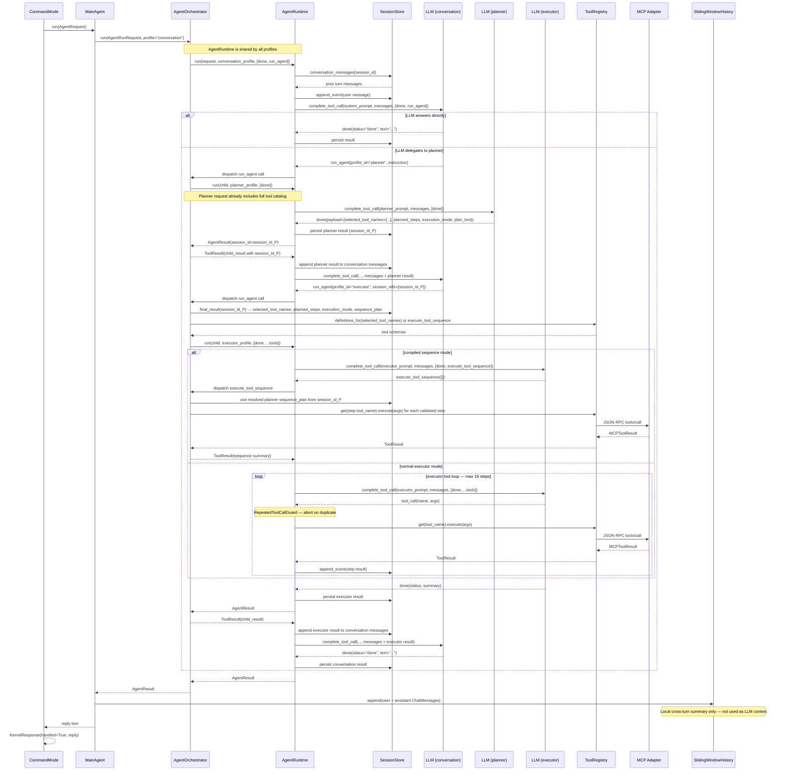
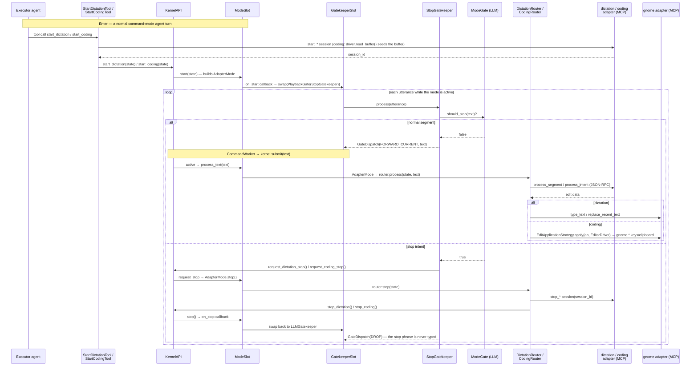
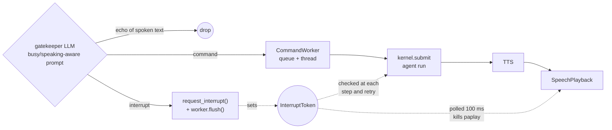
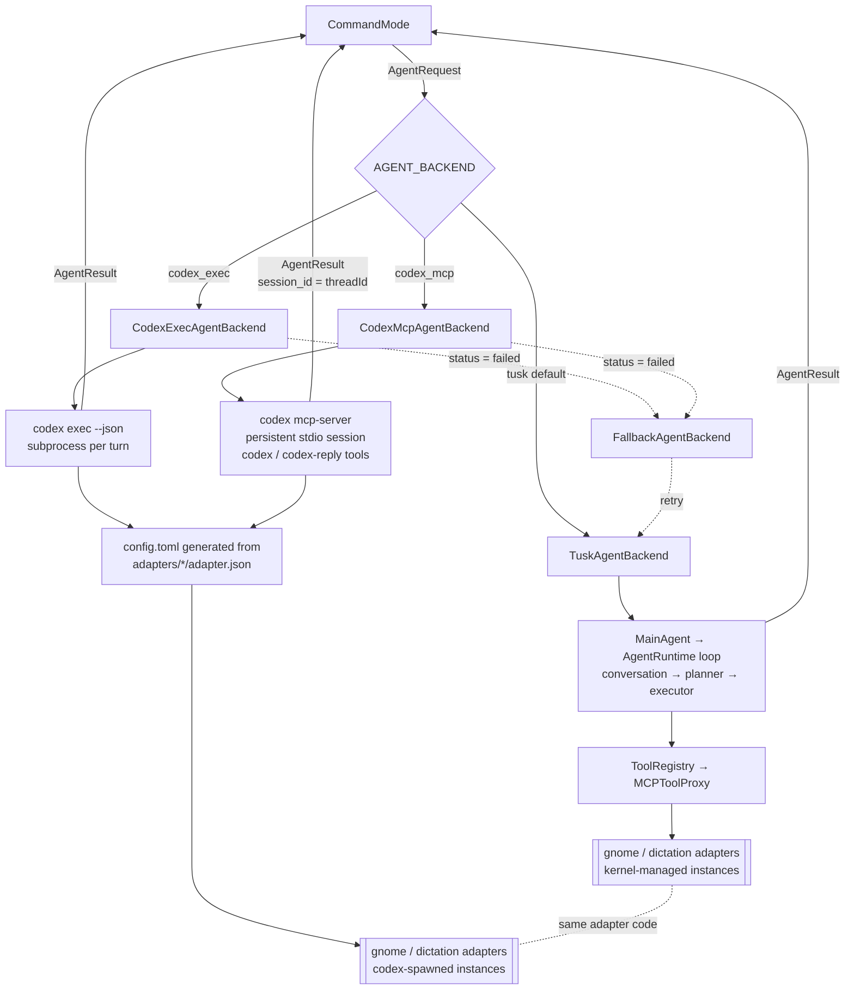

# TUSK — Architecture

## System Overview

TUSK is an always-listening desktop AI voice assistant with an OS-agnostic core: desktop
integration is adapter-based, and the first shipped desktop adapter targets GNOME on
Linux — further desktop environments and OSes are added as new adapters, never as core
changes (`docs/brief.md`, design principle 6). It captures
microphone audio continuously, detects speech boundaries, transcribes speech to text,
filters ambient noise and hallucinations, passes confirmed commands to a conversation
agent, and executes desktop actions via hot-pluggable MCP adapters. The agent step itself is
pluggable: an `AgentBackend` runs either TUSK's own planner/executor pipeline or an external
`codex` process (see [Agent Backends](#agent-backends)). Execution and speech
run on a background `CommandWorker` thread so listening never blocks; a shared
`InterruptToken` lets the user cancel any running task or spoken reply by voice, in any
wording (see Voice Interrupt Flow below).

The system is split into five layers: **Shells** (voice, CLI, emulator, tray), a thin
**Kernel** (agent loop + tool dispatch), a **Shared** layer (ABCs, schemas, LLM access —
depended on by all other layers), hot-pluggable **Adapters** (MCP servers), and swappable
**Providers** (LLM, STT, and TTS implementations). A small host-side **launcher** daemon
(outside the container) executes application-launch commands as the host user. The agent
pipeline uses a three-profile delegation chain: a conversation agent that delegates via
`run_agent`, a planner agent that selects tool names and returns them in `done`, and an
executor agent that either calls runtime tools step-by-step or invokes a compiled
`execute_tool_sequence` meta tool for deterministic plans. All profiles share the same
`AgentRuntime` loop.

Dependency direction is strict: Shells → Shared, Kernel → Shared, Adapters → Shared,
Providers → Shared. No layer imports from a peer layer. Shells and kernel communicate
only through `kernel.submit(text)` at runtime and shared ABCs at design time.

---

## System Block Diagram


> Source: [`docs/diagrams/architecture.svg`](diagrams/architecture.svg)
> Per-package class diagrams: [class-diagrams.md](class-diagrams.md)
> Whole-project class graph (zoomable SVG): [diagrams/full-class-graph.md](diagrams/full-class-graph.md)
> Interfaces and their implementations: [`docs/diagrams/interfaces.svg`](diagrams/interfaces.svg)

---

## Agent Workflow Diagram

A sequence diagram of a single agent turn — from submitted text to final reply — showing
the three-profile agent delegation chain (conversation → planner → executor), the shared
`AgentRuntime` loop, session-store history, and both executor paths: the normal tool loop and
the compiled sequence path.


```mermaid
sequenceDiagram
    participant CMD as CommandMode
    participant MA as MainAgent
    participant ORC as AgentOrchestrator
    participant RT as AgentRuntime
    participant SS as SessionStore
    participant LLM_C as LLM (conversation)
    participant LLM_P as LLM (planner)
    participant LLM_E as LLM (executor)
    participant TR as ToolRegistry
    participant MCP as MCP Adapter
    participant HX as SlidingWindowHistory

    CMD->>MA: run(AgentRequest)
    MA->>ORC: run(AgentRunRequest, profile="conversation")

    Note over ORC,RT: AgentRuntime is shared by all profiles
    ORC->>RT: run(request, conversation_profile, [done, run_agent])
    RT->>SS: conversation_messages(session_id)
    SS-->>RT: prior turn messages
    RT->>SS: append_event(user message)
    RT->>LLM_C: complete_tool_call(system_prompt, messages, [done, run_agent])

    alt LLM answers directly
        LLM_C-->>RT: done(status="done", text="...")
        RT->>SS: persist result
    else LLM delegates to planner
        LLM_C-->>RT: run_agent(profile_id="planner", instruction)
        RT->>ORC: dispatch run_agent call

        ORC->>RT: run(child, planner_profile, [done])
        Note over ORC,RT: Planner request already includes full tool catalog
        RT->>LLM_P: complete_tool_call(planner_prompt, messages, [done])

        LLM_P-->>RT: done(payload={selected_tool_names=[...], planned_steps, execution_mode, plan_text})
        RT->>SS: persist planner result (session_id_P)
        RT-->>ORC: AgentResult(session_id=session_id_P)
        ORC-->>RT: ToolResult(child_result with session_id_P)
        RT->>SS: append planner result to conversation messages
        RT->>LLM_C: complete_tool_call(..., messages + planner result)

        LLM_C-->>RT: run_agent(profile_id="executor", session_refs=[session_id_P])
        RT->>ORC: dispatch run_agent call
        ORC->>SS: final_result(session_id_P) → selected_tool_names, planned_steps, execution_mode, sequence_plan
        ORC->>TR: definitions_for(selected_tool_names) or execute_tool_sequence
        TR-->>ORC: tool schemas

        ORC->>RT: run(child, executor_profile, [done, ...tools])

        alt compiled sequence mode
            RT->>LLM_E: complete_tool_call(executor_prompt, messages, [done, execute_tool_sequence])
            LLM_E-->>RT: execute_tool_sequence({})
            RT->>ORC: dispatch execute_tool_sequence
            ORC->>SS: use resolved planner sequence_plan from session_id_P
            ORC->>TR: get(step.tool_name).execute(args) for each validated step
            TR->>MCP: JSON-RPC tools/call
            MCP-->>TR: MCPToolResult
            TR-->>ORC: ToolResult
            ORC-->>RT: ToolResult(sequence summary)
        else normal executor mode
            loop executor tool loop — max 16 steps
                RT->>LLM_E: complete_tool_call(executor_prompt, messages, [done, ...tools])
                LLM_E-->>RT: tool_call(name, args)
                Note over RT: RepeatedToolCallGuard — abort on duplicate
                RT->>TR: get(tool_name).execute(args)
                TR->>MCP: JSON-RPC tools/call
                MCP-->>TR: MCPToolResult
                TR-->>RT: ToolResult
                RT->>SS: append_event(step result)
            end
        end

        LLM_E-->>RT: done(status, summary)
        RT->>SS: persist executor result
        RT-->>ORC: AgentResult
        ORC-->>RT: ToolResult(child_result)
        RT->>SS: append executor result to conversation messages
        RT->>LLM_C: complete_tool_call(..., messages + executor result)
        LLM_C-->>RT: done(status="done", text="...")
        RT->>SS: persist conversation result
    end

    RT-->>ORC: AgentResult
    ORC-->>MA: AgentResult
    MA->>HX: append(user + assistant ChatMessages)
    Note over HX: Local cross-turn summary only — not used as LLM context
    MA-->>CMD: reply text
    CMD-->>CMD: KernelResponse(handled=True, reply)
```

---

## Adapter Mode Flow (dictation & coding)

Dictation and coding are the two "forward-all" modes. They share one set of classes —
the differences live entirely in the injected prompt, router, and adapter:

| Piece | Class | Per-mode difference |
|---|---|---|
| Kernel mode holder | `ModeSlot` (`tusk/kernel/modes/mode_slot.py`) | log tag + start reply |
| Active mode | `AdapterMode` | none — routes text to the injected router |
| Stop classifier | `ModeGate` (utility for the gatekeeper LLM) | prompt: `DICTATION_GATE_PROMPT` / `CODING_GATE_PROMPT` |
| Voice-side gatekeeper | `StopGatekeeper` (`shells/voice/stages/gate/`) | none — wraps the mode's `ModeGate` |
| Router | `DictationRouter` / `CodingRouter` | dictation types text; coding applies `EditOperation`s via `EditorDriver` |
| Adapter | `dictation` / `coding` MCP server | segment refinement vs. LLM edit planning over `BufferModel` |

`KernelAPI` owns two `ModeSlot`s and routes every `submit(text)` to the active one
(coding is checked first) before falling back to `CommandMode`. Entering a mode swaps the
voice shell's `GatekeeperSlot` from `LLMGatekeeper` to a `StopGatekeeper` wrapped in
`PlaybackGate` (so TUSK's own speech can only be interrupted or dropped, never typed).
Callbacks are wired in `ShellLoader._wire_modes`.


```mermaid
sequenceDiagram
    participant EX as Executor agent
    participant ST as StartDictationTool /<br/>StartCodingTool
    participant K as KernelAPI
    participant MS as ModeSlot
    participant GS as GatekeeperSlot
    participant SG as StopGatekeeper
    participant MG as ModeGate (LLM)
    participant R as DictationRouter /<br/>CodingRouter
    participant A as dictation / coding<br/>adapter (MCP)
    participant G as gnome adapter (MCP)

    Note over EX,MS: Enter — a normal command-mode agent turn
    EX->>ST: tool call start_dictation / start_coding
    ST->>A: start_* session (coding: driver.read_buffer() seeds the buffer)
    A-->>ST: session_id
    ST->>K: start_dictation(state) / start_coding(state)
    K->>MS: start(state) — builds AdapterMode
    MS->>GS: on_start callback → swap(PlaybackGate(StopGatekeeper))

    loop each utterance while the mode is active
        GS->>SG: process(utterance)
        SG->>MG: should_stop(text)?
        alt normal segment
            MG-->>SG: false
            SG-->>GS: GateDispatch(FORWARD_CURRENT, text)
            Note over GS,K: CommandWorker → kernel.submit(text)
            K->>MS: active → process_text(text)
            MS->>R: AdapterMode → router.process(state, text)
            R->>A: process_segment / process_intent (JSON-RPC)
            A-->>R: edit data
            alt dictation
                R->>G: type_text / replace_recent_text
            else coding
                R->>G: EditApplicationStrategy.apply(op, EditorDriver) → gnome.* keys/clipboard
            end
        else stop intent
            MG-->>SG: true
            SG->>K: request_dictation_stop() / request_coding_stop()
            K->>MS: request_stop → AdapterMode.stop()
            MS->>R: router.stop(state)
            R->>A: stop_* session(session_id)
            R->>K: stop_dictation() / stop_coding()
            K->>MS: stop() → on_stop callback
            MS->>GS: swap back to LLMGatekeeper
            SG-->>GS: GateDispatch(DROP) — the stop phrase is never typed
        end
    end
```

`ModeGate.should_stop` asks the gatekeeper LLM with the mode-specific prompt
(structured output, plain-`complete` fallback; on double failure the text is forwarded as
a literal segment). Stop detection relies on the model returning a non-null
`metadata_stop` string, not on hard-coded phrases.

Coding specifics: the `coding` adapter owns an authoritative, immutable `BufferModel`
seeded once from the editor at session start. `CodingEditPlanner` (adapter-side LLM)
turns each spoken intent + buffer into `EditOperation`s; the kernel-side `CodingRouter`
applies them through `FullReplaceEditStrategy` over `InputAutomationEditorDriver`, which
composes `gnome.*` key/clipboard primitives. `EditOperation.full_buffer` re-pastes the
authoritative buffer, making every edit drift-proof under fire-and-forget GUI automation.

---

## Voice Interrupt Flow

Semantic stop while TUSK is busy — no fixed phrases, one shared `InterruptToken`, checked
cooperatively at step boundaries and polled during playback. Details:
[`docs/features/voice-interrupt.md`](features/voice-interrupt.md).


```mermaid
flowchart LR
    GK{"gatekeeper LLM<br/>busy/speaking-aware prompt"}
    GK -- command --> Q["CommandWorker<br/>queue + thread"]
    GK -- "echo of spoken text" --> Drop((drop))
    GK -- interrupt --> INT["request_interrupt()<br/>+ worker.flush()"]
    Q --> Submit["kernel.submit<br/>agent run"] --> TTS[TTS] --> Play[SpeechPlayback]
    INT -. sets .-> Token((InterruptToken))
    Token -. "checked at each<br/>step and retry" .-> Submit
    Token -. "polled 100 ms<br/>kills paplay" .-> Play
```

Interrupt is honored only while the worker is busy (an idle "stop" is a normal command).
Cancellation is step-boundary: in-flight LLM/tool calls finish and their results are
discarded; the runtime replies "Stopped." Playback stop is near-instant. While TUSK
speaks in forward-all modes (dictation/coding), `PlaybackGate` restricts the mode gate to
interrupt-or-drop so TUSK's own voice is never typed into the editor.

---

## Directory Structure

Two levels of packages — file-level detail lives in
[class-diagrams.md](class-diagrams.md) and the
[full class graph](diagrams/full-class-graph.md), which are regenerated from source.

```
tusk/                        (repo root)
├── main.py                  # Entry point: config, log, LLM registry, kernel, ShellLoader
├── shell_loader.py          # ShellLoader — builds shells from TUSK_SHELLS, wires voice modes, orders tray last
├── launcher/                # Host-side launcher daemon (Unix socket) — runs GUI apps as the host user
├── tusk/
│   ├── kernel/              # Thin orchestration layer
│   │   ├── core/            # KernelAPI, CommandMode, MainAgent, AdapterManager,
│   │   │   │                #   agent profiles, SlidingWindowHistory, startup wiring
│   │   ├── interfaces/      # Agent, Shell, ConversationHistory, EditorDriver, EditApplicationStrategy
│   │   ├── agent/           # Agentic loop: AgentOrchestrator, AgentRuntime, tool catalog/toolset, dispatcher
│   │   │   ├── backends/    # AgentBackend ABC; tusk / codex_exec / codex_mcp / fallback backends
│   │   │   │   └── codex_mcp/ # Persistent codex mcp-server session (Client, CallBuilder, ResponseReader, ResultMapper)
│   │   │   ├── guards/      # AgentRunGuard + turn guards (delegation, failure budget, clipboard, executor tools)
│   │   │   ├── planner/     # Planner output validation, sequence promotion, runtime tool resolution
│   │   │   ├── runtime/     # Message history builder, result factory, step recorder, guard composition
│   │   │   ├── session/     # Store ABC, FileStore event log, event formatter
│   │   │   └── tool_sequence/ # Compiled sequences: PlanValidator, Executor, Recorder
│   │   ├── modes/           # Dictation/coding machinery: ModeSlot, AdapterMode, ModeGate, routers,
│   │   │                    #   states, gate prompts, InputAutomationEditorDriver, FullReplaceEditStrategy
│   │   └── tools/           # ToolRegistry, RegisteredTool, ToolRuntime, RepeatedToolCallGuard,
│   │                        #   kernel tools: start_dictation, start_coding, switch_model
│   ├── shared/              # Contracts + cross-layer plumbing; depends on nothing else
│   │   ├── config/          # Config (frozen), ConfigFactory (env), StartupOptions (CLI)
│   │   ├── interrupt/       # InterruptToken
│   │   ├── llm/             # LLMProxy, LLMRegistry, retry policy/runner, payload logging, JSON helpers
│   │   │   └── interfaces/  # LLMProvider, LLMProviderFactory
│   │   ├── logging/         # LogPrinter ABC, ColorLogPrinter, tag palette
│   │   ├── mcp/             # MCPClient, MCPToolProxy, MCPStdioServer/Transport, env builder, hot-plug watcher
│   │   ├── schemas/         # Frozen dataclasses for all inter-layer data
│   │   │   ├── desktop/     # DesktopContext, WindowInfo, AppEntry
│   │   │   └── tools/       # ToolCall/ToolResult, MCPToolSchema/Result, ToolSequencePlan/Step
│   │   ├── status/          # StatusReporter/StatusSink ABCs, StatusReporterHub, NullStatusSink
│   │   ├── stt/             # STTEngine ABC
│   │   └── tts/             # TTSEngine ABC
│   └── providers/           # Swappable implementations behind shared ABCs
│       ├── llm/             # GroqLLM, OpenRouterLLM, ConfigurableLLMFactory
│       ├── stt/             # GroqSTT, WhisperSTT, STTEngineFactory
│       └── tts/             # GroqTTS + text chunking / WAV concatenation
├── shells/
│   ├── voice/               # Voice pipeline shell (see shells/voice/README.md): VoiceShell, VoicePipeline,
│   │   │                    #   CommandWorker, GatekeeperSlot, PlaybackGate, buffer/dispatch schemas
│   │   ├── interfaces/      # Gatekeeper, TranscriptionBuffer ABCs
│   │   └── stages/          # AudioCapture, UtteranceDetector, Transcriber, Sanitizer, TranscriptionBuffer
│   │       └── gate/        # LLMGatekeeper, StopGatekeeper, SpeechStopGate, prompts, parsing
│   ├── cli/                 # CLIShell — stdin REPL
│   ├── emulator/            # EmulatorShell — replays a scripted transcript as kernel input
│   └── tray/                # TrayShell, TrayBackend ABC, AppIndicator backend, status sink, menu builder, icons
├── adapters/                # Out-of-process MCP servers, discovered from adapter.json manifests
│   ├── gnome/               # Desktop control: windows, input, mouse, clipboard, context (tools/ subpackage)
│   ├── dictation/           # Dictation sessions + segment processing
│   └── coding/              # Pair-coding: BufferModel + CodingEditPlanner (adapter-side LLM)
├── demos/                   # Scripted demo transcripts + emulated-editor adapter for demos
├── e2e/                     # Voice-interrupt e2e harness — real kernel, scripted audio edges
├── tests/                   # Full test suite (mirrors source layout)
├── tools/                   # codex_mcp_config_generator — adapter manifests → codex config.toml
└── docker/                  # codex-entrypoint.sh
```

### Placement map

| You are adding | Put it in |
|---|---|
| A new shell (user-facing I/O surface) | `shells/<name>/` |
| A new desktop/app capability (MCP server) | `adapters/<name>/` + `adapter.json` |
| Decision logic, routing, agent behavior | `tusk/kernel/` |
| A data shape crossing layers | `tusk/shared/schemas/` |
| Cross-layer plumbing (config, logging, MCP, status, interrupt) | `tusk/shared/<area>/` |
| An engine implementation behind a shared ABC (LLM/STT/TTS) | `tusk/providers/<kind>/` |
| Tests | `tests/<mirror of source package>`; cross-tree tests and shared helpers at `tests/` root |
| Composition/wiring | `main.py` / `shell_loader.py` — the only places allowed to import everything |
| Dev-only tooling | `tools/` |

Each source tree imports only itself plus `tusk.shared`; adapters may also import
`tusk.providers` because each adapter server is a standalone process entrypoint.
`tests/style_guardrails/import_guardrails.py` enforces these boundaries.

---

## Interfaces

Every layer boundary is an ABC; concrete classes never cross a boundary. The full
interface map — each ABC, its implementations, and its consumers — is drawn in
[`diagrams/interfaces.svg`](diagrams/interfaces.svg). Method signatures live in the
source files; this table is the index:

| ABC | Defined in | Implementations | Key consumers |
|---|---|---|---|
| `Agent` | `tusk/kernel/interfaces/agent.py` | `MainAgent` (structural) | `TuskAgentBackend`, `AgentBackendFactory` |
| `Shell` | `tusk/kernel/interfaces/shell.py` | `VoiceShell`, `CLIShell`, `EmulatorShell`, `TrayShell` (structural) | `ShellLoader` |
| `ConversationHistory` | `tusk/kernel/interfaces/conversation_history.py` | `SlidingWindowHistory` | `MainAgent` |
| `EditorDriver` | `tusk/kernel/interfaces/editor_driver.py` | `InputAutomationEditorDriver` | `CodingRouter`, `StartCodingTool`, strategies |
| `EditApplicationStrategy` | `tusk/kernel/interfaces/edit_application_strategy.py` | `FullReplaceEditStrategy` | `CodingRouter` |
| `AgentBackend` | `tusk/kernel/agent/backends/agent_backend.py` | `MainAgent`, `TuskAgentBackend`, `CodexExecAgentBackend`, `CodexMcpAgentBackend`, `FallbackAgentBackend` | `CommandMode` |
| `Store` (sessions) | `tusk/kernel/agent/session/store.py` | `FileStore` | `AgentRuntime`, `AgentOrchestrator`, recorders |
| `LLMProvider` | `tusk/shared/llm/interfaces/llm_provider.py` | `GroqLLM`, `OpenRouterLLM`, `LLMProxy` (wrapper) | agent profiles, gatekeepers, `ModeGate` |
| `LLMProviderFactory` | `tusk/shared/llm/interfaces/llm_provider_factory.py` | `ConfigurableLLMFactory` | `LLMRegistry` |
| `LogPrinter` | `tusk/shared/logging/interfaces/log_printer.py` | `ColorLogPrinter` | everything |
| `StatusReporter` | `tusk/shared/status/interfaces/status_reporter.py` | `StatusReporterHub` | `VoicePipeline`, `KernelAPI`, `ToolRuntime` |
| `StatusSink` | `tusk/shared/status/interfaces/status_sink.py` | `NullStatusSink`, `TrayStatusSink` | `StatusReporterHub` |
| `STTEngine` | `tusk/shared/stt/interfaces/stt_engine.py` | `GroqSTT`, `WhisperSTT` | `Transcriber` |
| `TTSEngine` | `tusk/shared/tts/interfaces/tts_engine.py` | `GroqTTS` | `CommandWorker` |
| `Gatekeeper` | `shells/voice/interfaces/gatekeeper.py` | `LLMGatekeeper`, `StopGatekeeper`, `GatekeeperSlot`, `PlaybackGate` | `VoicePipeline` |
| `TranscriptionBuffer` | `shells/voice/interfaces/transcription_buffer.py` | `TranscriptionBuffer` (stages) | `VoicePipeline` |
| `TrayBackend` | `shells/tray/interfaces/tray_backend.py` | `AppIndicatorTrayBackend` | `TrayShell` |

"Structural" means the concrete class satisfies the ABC's methods without inheriting it
(kept duck-typed to avoid a kernel import in the shells). The `Gatekeeper` chain is
compositional: `GatekeeperSlot` holds the active gatekeeper and is swapped at mode
start/stop; `PlaybackGate` wraps a `StopGatekeeper` while TUSK speaks.

There is no pause/resume ABC: `VoiceShell.pause()/resume()` are called directly by the
tray via an injected reference (wired in `ShellLoader`).

---

## Schemas

All inter-component data is passed as immutable frozen dataclasses (or enums). No untyped
dicts cross component boundaries. Fields are declared in the source files — one glance at
the dataclass is the authoritative schema. Index:

| Schema | Module (`tusk/shared/schemas/`) | Carries |
|---|---|---|
| `Utterance` | `utterance.py` | transcribed text + raw audio + duration + confidence |
| `GateResult` | `gate_result.py` | gatekeeper verdict + cleaned command + `metadata` (incl. `classification`) |
| `GateClassification` | `gate_classification.py` | enum: command / conversation / ambient / interrupt |
| `KernelResponse` | `kernel_response.py` | handled flag + reply text |
| `ChatMessage` | `chat_message.py` | role + content; summary detection + `to_dict()` |
| `EditOperation` | `edit_operation.py` | insert/replace/delete + target lines + text + authoritative `full_buffer` |
| `BufferSelection` | `buffer_selection.py` | inclusive 1-based line range |
| `AppStatus` / `AppMode` | `app_status.py` / `app_mode.py` | enums: operational state / interaction mode |
| `StatusSnapshot` | `status_snapshot.py` | status + mode + detail + mic + model labels |
| `LLMSlotConfig` | `llm_slot_config.py` | parsed `provider/model` string |
| `ToolCall` / `ToolResult` | `tools/` | tool invocation / execution outcome (+ optional `data`) |
| `MCPToolSchema` / `MCPToolResult` | `tools/` | adapter tool definition / adapter response |
| `ToolSequencePlan` / `ToolSequenceStep` | `tools/` | compiled deterministic plan + ordered steps |
| `DesktopContext` / `WindowInfo` / `AppEntry` | `desktop/` | desktop snapshot / window geometry / installed app |

Mode/session state that belongs to one component lives next to it, not in shared:
`DictationState` and `CodingState` in `tusk/kernel/modes/`, `BufferModel` in
`adapters/coding/`, `BufferedUtterance`/`GateDispatch`/`GateAction`/`GateState`/`RecoveryDecision`
in `shells/voice/`, `TrayMenuItem` in `shells/tray/`.

---

## Pipeline Data Flow

### Voice Shell Path

Audio capture + VAD run on a producer thread feeding a queue; STT and everything after run
on the consumer, so speech arriving during an agent run is processed afterwards, not lost.

```
AudioCapture.stream_frames()
    → UtteranceDetector.stream_utterances()    # WebRTC VAD + boundary buffering (producer thread)
    → Transcriber.process(utterance)           # STTEngine.transcribe() → text
    → Sanitizer.process(transcribed)           # hallucination / ghost-phrase filter → DROP
    → TranscriptionBuffer.process(sanitized)   # rolling window + gate-state tracking
    → GatekeeperSlot.process(buffered, recent, candidates)   # delegates to active gatekeeper
        # command mode:    LLMGatekeeper — LLM classify (busy/speaking-aware) → DROP / INTERRUPT
        # dictation/coding: StopGatekeeper — forward all; ModeGate LLM stop detection → DROP (stop phrase)
        # while TUSK speaks: mode gates wrapped in PlaybackGate → INTERRUPT or DROP only
    → GateDispatch(action, text, recovered_id) — GateAction enum
    → CommandWorker.enqueue(text)              # worker thread — listening never blocks
      → KernelAPI.submit(text)                 # serialized by one submit lock
        → active ModeSlot (coding, then dictation) or CommandMode.process_command(text)
            → AgentBackend.run(AgentRequest)   # tusk backend: MainAgent → AgentOrchestrator
    → KernelResponse(handled, reply) → TTS → SpeechPlayback

# Recovery path (gatekeeper returns FORWARD_RECOVERED):
    → buffer.mark(recovered_id, RECOVERED); buffer.mark(current_id, CONSUMED)
    → KernelAPI.submit(prior_text)

# Interrupt path (gatekeeper returns INTERRUPT while the worker is busy):
    → kernel.request_interrupt()      # sets the shared InterruptToken
    → worker.flush()                  # queued commands dropped
    → buffer.mark(current_id, CONSUMED)
    # AgentRuntime cancels at the next step boundary → reply "Stopped."
    # SpeechPlayback polls the token every 100 ms → paplay terminated mid-word
```

### CLI / Emulator Shell Path

```
stdin (CLI) or scripted transcript (emulator)
    → kernel.submit(text)      # bypasses STT, sanitizing, and gatekeeping entirely
    → KernelResponse → print/log reply
```

---

## Agent Backends

`CommandMode` never talks to the agent pipeline directly — it submits an `AgentRequest` to an
`AgentBackend` (`tusk/kernel/agent/backends/`). `AgentBackendFactory` picks the implementation
from `AGENT_BACKEND`. All backends return an `AgentResult` and drive the same
gnome/dictation MCP tools, so the choice is invisible to the shells.


```mermaid
flowchart TD
    CM[CommandMode] -->|AgentRequest| SEL{AGENT_BACKEND}
    SEL -->|tusk default| TUSK[TuskAgentBackend]
    SEL -->|codex_exec| CODEX[CodexExecAgentBackend]
    SEL -->|codex_mcp| MCPB[CodexMcpAgentBackend]

    TUSK --> ORC[MainAgent → AgentRuntime loop<br/>conversation → planner → executor]
    ORC --> REG[ToolRegistry → MCPToolProxy]

    CODEX --> PROC[codex exec --json<br/>subprocess per turn]
    MCPB --> SRV[codex mcp-server<br/>persistent stdio session<br/>codex / codex-reply tools]
    PROC --> CFG[config.toml generated from<br/>adapters/*/adapter.json]
    SRV --> CFG

    REG --> AK[[gnome / dictation adapters<br/>kernel-managed instances]]
    CFG --> AC[[gnome / dictation adapters<br/>codex-spawned instances]]
    AK -. same adapter code .- AC

    CODEX -. status = failed .-> FALL[FallbackAgentBackend]
    MCPB -. status = failed .-> FALL
    FALL -. retry .-> TUSK

    ORC -->|AgentResult| CM
    PROC -->|AgentResult| CM
    SRV -->|AgentResult<br/>session_id = threadId| CM
```

- **`tusk`** (default) — `TuskAgentBackend` wraps `MainAgent` (which itself implements
  `AgentBackend` and is used directly when no wrapper is needed), running the in-process
  conversation → planner → executor loop documented under [Agent Structure](#agent-structure).
- **`codex_exec`** — `CodexExecAgentBackend` shells out to `codex exec --json`
  (`CodexExecCommandBuilder` builds argv, `CodexPromptBuilder` adds the desktop-assistant
  context), then parses the final `agent_message` event (`CodexResultParser`) against
  `codex_agent_result.schema.json`. Codex reaches the desktop through its **own** adapter
  instances: `docker/codex-entrypoint.sh` runs `tools/codex_mcp_config_generator.py`, which
  emits `config.toml` `[mcp_servers.*]` sections from the same `adapters/*/adapter.json`
  manifests the kernel loads — so codex sees an identical tool set, not a hardcoded subset.
- **`codex_mcp`** — `CodexMcpAgentBackend` keeps one persistent `codex mcp-server` child
  (spawned lazily on the first turn, reused across turns; `codex_mcp.Client` over the shared
  `MCPStdioTransport`). Each turn calls the `codex` MCP tool — or `codex-reply` when the
  request carries a session — with `approval-policy: "never"` and the same prompt/config as
  `codex_exec`. The returned codex `threadId` becomes `AgentResult.session_id`, which
  `CommandMode` feeds back on the next turn, so the conversation stays on one codex thread.
  A failed `codex-reply` (stale thread, restarted server) recovers once on a fresh thread.
  `CODEX_EXEC_TIMEOUT_SECONDS` acts as an **inactivity** timeout here (codex's progress
  events reset it); `CODEX_EXEC_EXTRA_ARGS`, `..._OUTPUT_SCHEMA_PATH` and
  `..._LOG_RAW_EVENTS` do not apply.
- **Fallback** — with `AGENT_BACKEND_FALLBACK=tusk`, `FallbackAgentBackend` wraps either
  codex backend; a `status="failed"` result is retried through the tusk backend, and the
  codex failure is attached to the result metadata.

Only one backend handles a given turn. The conversation/planner/executor pipeline runs under
the codex backends **only** via the fallback path.

### Configuration

| Env Var | Default | Description |
|---|---|---|
| `AGENT_BACKEND` | `tusk` | Backend for every turn: `tusk`, `codex_exec`, or `codex_mcp` |
| `AGENT_BACKEND_FALLBACK` | `""` | If `tusk`, retry failed codex turns through the tusk backend |
| `CODEX_EXEC_BINARY` | `codex` | codex CLI binary (both codex backends) |
| `CODEX_EXEC_MODEL` | `""` | Model override (empty → codex default; both backends) |
| `CODEX_EXEC_SANDBOX_MODE` | `read-only` | Sandbox mode (both backends) |
| `CODEX_EXEC_TIMEOUT_SECONDS` | `60` | Subprocess timeout; inactivity timeout under `codex_mcp` |
| `CODEX_EXEC_WORKDIR` | `""` | Working directory for the codex process (both backends) |
| `CODEX_EXEC_EXTRA_ARGS` | `""` | Extra CLI args, shell-split (`codex_exec` only) |
| `CODEX_EXEC_OUTPUT_SCHEMA_PATH` | *(bundled)* | `--output-schema` JSON Schema path (`codex_exec` only) |
| `CODEX_EXEC_LOG_RAW_EVENTS` | `false` | Log full codex stdout/stderr (`codex_exec` only) |

---

## Agent Structure

### Profiles — `tusk/kernel/agent_profiles.py`

All profiles run through the same `AgentRuntime` loop. Each gets its own LLM slot,
system prompt, allowed tools, and `max_steps`. `done` is available to every profile;
`run_agent` only where listed.

| Profile | LLM slot | Static tools | Runtime tools | max_steps |
|---|---|---|---|---|
| `conversation` | `conversation_agent` | `done`, `run_agent` | — | 8 |
| `planner` | `planner_agent` | `done` | — | 8 |
| `executor` | `executor_agent` | `done` | resolved from planner session (`*`) | 16 |
| `default` | `default_agent` | `done`, `run_agent` | — | 8 |

**Conversation prompt (key rules):** answer conversation directly with `done`; treat
start/stop/switch of dictation, coding, or the model as actionable work; delegate
actionable work to `planner` then `executor` (passing the planner's `session_id` as
`session_refs`); after an executor/default child returns `done`, finish immediately; stop
delegating after two failed children in one turn.

**Planner prompt (key rules):** plan but do not execute; use the injected tool catalog to
pick real tool names and draft `payload.planned_steps` with exact args; return
`payload.execution_mode` (`normal`/`sequence`), promoting to sequence when steps are
linear, deterministic, and every tool is `sequence_callable`; prefer clipboard+paste tools
over character typing for large text.

**Executor prompt (key rules):** every response is a single tool call, using only the
provided runtime tools; when `execute_tool_sequence` is offered, call it first with `{}`
and never rewrite the compiled plan; prefer clipboard write + paste for large text; keys
tools are for shortcuts only; call `done` immediately after the final successful action.

### AgentRuntime — `tusk/kernel/agent/agent_runtime.py`

Shared across all profiles. Each run:

1. `runtime.MessageHistoryBuilder` loads prior messages from the session `Store`.
2. Appends the user instruction to messages and the session event log (`runtime.StepRecorder`).
3. Loops up to `profile.max_steps`:
   - If the `InterruptToken` is set → returns `AgentResult(status="cancelled")` immediately.
   - Calls `profile.llm_provider.complete_tool_call(system_prompt, messages, tools)`;
     an LLM failure becomes a synthetic `done(status="failed")` via `ModelFailureReplyBuilder`.
   - `done` → finish and persist the result (`runtime.ResultFactory`).
   - `runtime.TurnGuards` checks profile-specific violations; `RepeatedToolCallGuard`
     aborts on a duplicate identical call — both fail the run.
   - Dispatches the tool call; records call + result to messages and the session store.
4. Returns `AgentResult` with `session_id`, `status`, `reply_text()`.

**`runtime.TurnGuards` composes** (`tusk/kernel/agent/guards/`):
- `ConversationRunAgentGuard` — blocks the conversation profile from delegating again
  after an executor/default child already returned `done` (planner `done` is intermediate).
- `ConversationFailureBudgetGuard` — blocks delegation after two failed children in one turn.
- `ExecutorClipboardGuard` — blocks repeated `write_clipboard` calls without progress
  toward focus/paste in between.

`AgentOrchestrator` additionally applies `guards.AgentRunGuard` (recursion depth,
self-delegation, lineage) before a run and `guards.ExecutorToolGuard` (validates the
resolved runtime tool names) for executor requests.

### History

`SlidingWindowHistory` (max 20 messages) is maintained by `MainAgent` after each turn.
It is **not** used as LLM context — `AgentRuntime` reads per-session messages from the
session `Store`. On overflow the oldest half is compacted locally (no LLM call) into a
`"Previous context summary: ..."` message: the last 6 evicted messages truncated to 120
chars, joined with `" | "`. The gatekeeper's follow-up prompt reads recent user commands
from this history.

### Planner → Executor Handoff — `tusk/kernel/agent/planner/`

When the executor profile receives `session_refs=[planner_session_id]`,
`planner.RuntimeToolResolver` reads the planner's persisted `done` payload and resolves:
- `runtime_tool_names` — validated against `ToolRegistry.real_tool_names()`; with a
  `sequence_plan` present, derived from `plan.ordered_tool_names()` instead.
- `execution_mode` — `"normal"` or `"sequence"`.
- `sequence_plan` — a `ToolSequencePlan` materialized from the planner payload.

### Delegation Model

Delegation is controlled solely by `AgentProfile.static_tool_names`: a profile with
`"run_agent"` can delegate to any child profile (`planner`, `executor`, `default`);
`guards.AgentRunGuard` blocks self-recursion and excessive depth but does not enforce
parent-specific child allowlists. `conversation` and `default` can delegate; `planner`
and `executor` cannot.

### Tool Sequence Execution — `tusk/kernel/agent/tool_sequence/`

The executor can run a compiled deterministic plan through a single synthetic tool
`execute_tool_sequence` instead of per-step LLM calls — less latency and token cost for
short desktop workflows.

Validation pipeline:
1. `planner.StepPlanValidator` — validates `planned_steps` structure at planner output:
   step schema, args against tool input schemas, no forbidden synthetic tools.
2. `planner.SequencePromoter` — promotes `execution_mode=normal` to `sequence` when all
   steps are linear and every tool is `sequence_callable` (logged under `SEQPROMOTE`).
3. `planner.ResultValidator` — orchestrates both and derives `sequence_plan`.
4. `tool_sequence.PlanValidator` — re-checks immediately before execution:
   `sequence_callable`, forbidden tools, max 8 steps.

Forbidden in sequence plans: `done`, `run_agent`, `list_available_tools`,
`execute_tool_sequence`.

`tool_sequence.Executor` iterates the validated plan calling
`ToolRegistry.get(step.tool_name).execute(args)`; `tool_sequence.Recorder` writes
`sequence_started/step_requested/step_result/finished` events to the session store. Any
step failure (or a set `InterruptToken`) aborts the remaining steps and returns a
partial-result `ToolResult`. No wait/polling primitives, no step-output references, no
retries, no branching — sequence mode is limited to already-synchronous tools.

---

## Tool Registry — `tusk/kernel/tools/tool_registry.py`

Central store for all executable tools. Every entry is a `RegisteredTool` frozen dataclass:
`name`, `description`, `input_schema`, `execute` callable, `source` (`"kernel"` or the
adapter name), `planner_visible` (default `True`), `sequence_callable` (default `False`).
Adapter tools are registered as `adapter_name.tool_name` (e.g. `gnome.launch_application`);
per-tool flags come from the adapter's manifest (see Adapter Model). The registry exposes
lookups by name and filtered views (`real_tools`, `planner_tools`, `sequence_tools`,
`definitions_for(names)`) — see the class for the exact API.

The planner receives the full catalog as text in its request context via
`AgentToolCatalog` (name, description, parameters, `sequence_callable` flag per tool).
The synthetic `list_available_tools` tool is retained in `OrchestratorToolDispatcher` for
backward compatibility but is no longer exposed to any profile.

Kernel-internal tools (registered by `ToolRuntime`): `start_dictation`, `start_coding`,
`switch_model`. Synthetic tools (`done`, `run_agent`, `execute_tool_sequence`) are built
per profile by `AgentToolsetBuilder` and never stored in the registry.

---

## Adapter Model

Adapters are out-of-process MCP servers discovered from `adapter.json` manifests. Shipped
adapters: `gnome` (`provides_context=true`), `dictation`, and `coding`. The `coding`
adapter holds the authoritative buffer model and runs the coding LLM; it provides no
desktop context. All servers share `MCPStdioServer` (`tusk/shared/mcp/`) for their
JSON-RPC request loop.

### Manifest Schema (`adapter.json`)

| Field | Type | Required | Description |
|---|---|---|---|
| `name` | `str` | yes | Unique adapter name; becomes the tool-name prefix |
| `version` | `str` | no | Adapter version string |
| `transport` | `str` | yes | Must be `"stdio"` (HTTP not implemented) |
| `entry` | `str` | yes | Shell command to start the server (e.g. `"python server.py"`) |
| `provides_context` | `bool` | no | If true, this adapter becomes the primary desktop source |
| `tools` | `object` | no | Per-tool flags: `planner_visible`, `sequence_callable`, `settle_ms` |

Per-tool flags are declared in the manifest, not in kernel code. The gnome manifest marks
window/input/mouse/`write_clipboard` tools `sequence_callable`, plus `launch_application`
and `open_uri` with `settle_ms: 2000` — their success only means the launch was dispatched,
so the sequence `Executor` pauses that long after them (skipped on the last step) before
running dependent steps; read-only inspection tools are excluded as pointless in a compiled
plan. The
dictation/coding manifests hide their session tools from the planner
(`planner_visible=false`) — they are driven by kernel tools and routers instead.

### Startup Sequence (`AdapterManager` — `tusk/kernel/adapter_manager.py`)

1. `start_all()` iterates `adapters/*/` directories with a valid `adapter.json`.
2. For each: spawn the server via `MCPClient.connect_stdio()` (retrying once with a
   managed virtualenv from `AdapterEnvironmentBuilder` on failure), send the MCP
   `initialize` handshake, call `tools/list`.
3. Register each discovered tool as an `MCPToolProxy` in `ToolRegistry`, applying the
   manifest's per-tool flags.
4. The first adapter with `provides_context=true` becomes the primary desktop source
   (`primary_desktop_source()`, falls back to `"gnome"`).
5. `start_watcher()` watches `adapters/` for hot-plug via `watchdog` (skipped if
   watchdog is not installed).

### MCP Protocol — `tusk/shared/mcp/mcp_client.py`

Line-delimited JSON-RPC 2.0 over the subprocess's stdin/stdout:

```
→ {"jsonrpc": "2.0", "id": N, "method": "tools/call",
   "params": {"name": "launch_application", "arguments": {"application_name": "firefox"}}}
← {"jsonrpc": "2.0", "id": N, "result": {"content": [{"type": "text", "text": "..."}]}}
```

`MCPToolProxy` presents the `RegisteredTool` interface: prefixes the tool name with the
adapter name at registration, strips it on dispatch, and converts `MCPToolResult` →
`ToolResult(success=not is_error, message=content, data=data)`.

---

## Host Launcher — `launcher/tusk_host_launcher.py`

TUSK runs inside Docker, so `gnome.launch_application` cannot spawn GUI apps directly.
A small host-side daemon listens on a Unix socket (`/tmp/tusk/launch.sock`, mode `0700`,
shared with the container via the compose `1000:1000` user) and executes received
commands as the host user via `subprocess.Popen`. It strips snap-injected environment
variables (`LD_LIBRARY_PATH`, `GTK_PATH`, …) so host GUI apps don't crash loading snap
libraries built against a different glibc. The gnome adapter's `ApplicationTools` writes
the exec command to the socket and reads back `ok` / `error: ...`.

---

## Shell Model

Shells are plain classes satisfying the `Shell` contract (`start(submit)` / `stop()`),
selected by name from `TUSK_SHELLS` (default `voice`). There are no shell manifests —
`ShellLoader` maps names to classes directly (`_SHELL_CLASSES`: `voice`, `cli`,
`emulator`, `tray`).

- **`VoiceShell`** — builds the `VoicePipeline` from the stage classes and drives it in a
  loop. The forward target is `CommandWorker.enqueue`: the worker thread runs
  `kernel.submit`, logs the reply, and — when TTS is enabled (`TUSK_TTS=on`, default) —
  speaks it via `SpeechPlayback`. When `TUSK_ACK=on` (default) it first speaks a brief
  refrain of the request (produced by the gatekeeper) so the user hears TUSK engage before
  the work runs. Listening continues while the worker executes, which is what makes voice
  interrupts possible. Also exposes `pause()`/`resume()` for the tray.
  See `shells/voice/README.md`.
- **`CLIShell`** — stdin REPL: `input("tusk> ")` → `submit(text)` → print reply.
- **`EmulatorShell`** — replays a scripted transcript into the kernel, standing in for
  voice input (used by demos).
- **`TrayShell`** — optional status-and-control indicator. Registers a `TrayStatusSink`
  into the `StatusReporterHub`, renders the icon from `AppStatus` (`StatusIconResolver`),
  and builds the menu (`TrayMenuBuilder`) wired to injected actions — pause/resume call the
  `VoiceShell` reference injected by the loader; open logs; restart; exit via a shutdown
  event. It holds no business logic and the kernel never imports it. The `TrayBackend`
  ABC isolates the tray library (v1: `pystray`/AppIndicator) so other platforms are new
  backends, not shell changes.

### Threading

All but the last shell start in daemon threads; the last blocks on the main thread.
Because GTK/AppIndicator main loops must own the main thread, the loader **reorders
`tray` to the end** of the shell list regardless of its position in `TUSK_SHELLS`. If the
tray's GUI loop crashes, `TrayShell.start()` keeps blocking on the shutdown event, so a
tray crash degrades to headless instead of killing the daemon voice shell.

---

## LLM Provider Specification

### LLMProxy — `tusk/shared/llm/llm_proxy.py`

Wraps any `LLMProvider`. Adds:

- **Wait indicator:** `log.show_wait(label)` before each request, `log.clear_wait()` after.
- **Retry:** all calls go through `LLMRetryRunner` (3 attempts, delay `0.5 * attempt` s).
  Retries network/rate-limit/5xx errors; never retries `invalid_request_error` or
  `tool_use_failed`. When the injected `InterruptToken` is set, pending retries are
  abandoned immediately — an interrupt must not wait out backoff.
- **Payload logging:** `LLMPayloadLogger` logs prompts and tool schemas to debug groups.
- **Runtime swap:** `swap(provider)` replaces the inner provider in place.

### LLMRegistry — `tusk/shared/llm/llm_registry.py`

Named `LLMProxy` slots; `swap(slot, provider, model)` builds a new provider via the
factory and swaps it into the proxy (used by the `switch_model` tool). The agent slots
get the `InterruptToken`; **`gatekeeper` and `utility` do not** — they must stay usable
while an interrupt is pending.

| Slot | Env var | Default |
|---|---|---|
| `gatekeeper` | `GATEKEEPER_LLM` | `groq/llama-3.1-8b-instant` |
| `conversation_agent` | `CONVERSATION_AGENT_LLM` (falls back to `AGENT_LLM`) | `groq/openai/gpt-oss-120b` |
| `planner_agent` | `PLANNER_AGENT_LLM` (falls back to `PLANNER_LLM`) | `groq/openai/gpt-oss-20b` |
| `executor_agent` | `EXECUTOR_AGENT_LLM` (falls back to `AGENT_LLM`) | `groq/openai/gpt-oss-120b` |
| `default_agent` | `DEFAULT_AGENT_LLM` (falls back to `AGENT_LLM`) | `groq/openai/gpt-oss-120b` |
| `utility` | `UTILITY_LLM` | `groq/llama-3.3-70b-versatile` |

### Providers — `tusk/providers/llm/`

- **`GroqLLM`** — `groq.Groq` client, 30 s timeout. Structured output via
  `response_format json_schema` for strict-schema models (`openai/gpt-oss-20b/120b`),
  `json_object` otherwise. Tool calling: `tool_choice="required"` first, retrying with
  `"auto"` on "did not call a tool". Label `"groq/<model>"`.
- **`OpenRouterLLM`** — `openai.OpenAI` client against `https://openrouter.ai/api/v1`;
  structured output falls back to plain `complete()`. Label `"openrouter/<model>"`.
- **`ConfigurableLLMFactory`** — parses `"provider/model"` strings (`LLMSlotConfig`) and
  instantiates the matching provider.

---

## STT / TTS Providers

### STT — `tusk/providers/stt/`

`STTEngineFactory` selects by `STT_ENGINE` (`groq` default, or `whisper`).

- **`GroqSTT`** — `whisper-large-v3-turbo` over the Groq API; PCM wrapped into WAV via
  the `wave` stdlib. Bracket-only transcripts (`[BLANK_AUDIO]`, `[Music]`, …) get
  `confidence=0.0`, everything else `1.0`.
- **`WhisperSTT`** — local `whisper.load_model(model_size)` (`WHISPER_MODEL_SIZE`,
  default `base`); confidence derived from `avg_logprob` and `no_speech_prob`.

### Sanitizer — `shells/voice/stages/sanitizer.py`

Provider-agnostic hallucination/ghost-phrase filter applied after STT: drops segments
under 0.4 s, punctuation-only text, known ghost phrases ("thank you", "okay", …), and
single words of ≤ 3 characters.

### TTS — `tusk/providers/tts/`

Spoken replies are controlled by `TUSK_TTS` (`on` default). **`GroqTTS`** synthesizes WAV
via `canopylabs/orpheus-v1-english` (voice `daniel`); `TextChunker` splits replies at the
200-char Orpheus cap and `WavConcatenator` merges the clips (copying channel/width/rate
individually because Orpheus streams a placeholder frame count in headers).
`SpeechPlayback` plays via `paplay`, polling the `InterruptToken` every 100 ms and
terminating the process on interrupt. TTS + playback run on the `CommandWorker` thread —
off the STT → gatekeeper hot path entirely. The acknowledgment refrain (`TUSK_ACK`) rides
this same path: it is spoken before the reply and is likewise silent when `TUSK_TTS` is off.

---

## Gatekeeper Specification

**Source:** `shells/voice/stages/gate/` — `LLMGatekeeper` orchestrates; `LLMClient` runs
the LLM calls; `gatekeeper_parser`/`gatekeeper_support` handle schemas and parsing;
prompts live in `command_gate_prompt.py` / `recovery_gate_prompt.py`.

### Command Classification

Primary call returns `{"classification": "command|conversation|ambient", "cleaned_text",
"reason"}`. `interrupt` is honored only while the `CommandWorker` is busy. Within the
follow-up window (default 30 s since the last forward, `FOLLOW_UP_TIMEOUT_SECONDS`) the
prompt is extended with recent user commands from `SlidingWindowHistory` so follow-ups
work without a wake word; `LLMGatekeeper` tracks its own `_last_forwarded_at`. Recovery
is a second LLM call, triggered when the primary classification is not `command`, that
may resurrect a recently dropped utterance (`forward_recovered`).

### Mode Stop Classification

`ModeGate` (`tusk/kernel/modes/mode_gate.py`) uses the same gatekeeper LLM slot with a
mode-specific prompt and schema `{"directed", "cleaned_command", "metadata_stop"}` —
stop is detected when `directed` is true and `metadata_stop` is a non-empty string.
`SpeechStopGate` is the third variant: a yes/no classifier asking whether an utterance
heard during playback requests TUSK to stop (used by `PlaybackGate`).

### Fallback Chain

1. `complete_structured` with the appropriate schema.
2. On failure, plain `complete` (flexible JSON extraction via `llm_json`).
3. On second failure: command gate returns `GateResult(False, "", 0.0)` (utterance
   silently discarded); mode gates forward the text as a literal segment.

---

## Startup Wiring

`main.py` builds the platform pieces; `tusk/kernel/startup.py` builds the kernel;
`shell_loader.py` builds the shells.

```
main()
  → StartupOptions.from_sources(argv)          # verbosity + log groups
  → Config.from_env()                          # all env settings
  → ColorLogPrinter(options)
  → StatusReporterHub(NullStatusSink(), log)   # real sink attached later by the tray
  → build_kernel(config, log, llm_registry, reporter, InterruptToken())   # startup.py
      → ToolRegistry()
      → AdapterManager("adapters", ...).start_all() + start_watcher()
      → SlidingWindowHistory(20)
      → MainAgent(AgentOrchestrator(build_agent_profiles(llm_registry),
                                    tool_registry, FileStore(session_log_dir), log, token),
                  history)
      → KernelAPI(CommandMode(AgentBackendFactory(agent, config, log).create(), log),
                  llm_registry, log, reporter, token)     # owns dictation/coding ModeSlots
      → ToolRuntime(...).register_tools(kernel)  # start_dictation/start_coding/switch_model,
                                                 # routers + editor driver + strategy attached
  → reporter.set_models(registry.model_labels())
  → ShellLoader(config, kernel, log, reporter).start()
      → per TUSK_SHELLS: build each shell ("tray" forced last)
      → voice: STTEngineFactory → CommandWorker(kernel.submit, GroqTTS?, SpeechPlayback(token), token)
               → LLMGatekeeper(gatekeeper slot, busy/speaking probes from the worker)
               → GatekeeperSlot(llm_gk); mode callbacks wired:
                   on_start → slot.swap(PlaybackGate(StopGatekeeper(ModeGate(prompt), request_stop)))
                   on_stop  → slot.swap(llm_gk)
               → VoiceShell(..., on_interrupt = kernel.request_interrupt + worker.flush)
      → tray: TrayShell(reporter, voice_shell_ref, shutdown_event, config)
      → run: all but last in daemon threads; last blocks the main thread
```

The kernel and pipeline depend only on the `StatusReporter` abstraction and never import
`shells.tray`; with no tray, the `NullStatusSink` stays and status reporting is a no-op.
LLM slot proxies for agents carry the `InterruptToken`; gatekeeper/utility do not.

---

## Data Flow Invariants

1. **All inter-component data is immutable.** Every schema type is a frozen dataclass.
   Components may not hold mutable references to schemas returned by other components.

2. **Text is always present before the gatekeeper.** `UtteranceDetector` yields
   utterances with `text=""`; the pipeline fills `text` via `STTEngine.transcribe()`
   before any gatekeeper or mode handler sees it.

3. **Only `tusk.shared` crosses layers.** Kernel, shells, adapters, and providers import
   ABCs and schemas from `tusk.shared.*`; no layer imports a peer layer's concrete
   classes. Concrete implementations meet only in the wiring layer (`main.py`,
   `startup.py`, `shell_loader.py`).

4. **Adapters are isolated processes.** The kernel has no import dependency on any
   adapter module; capabilities are discovered at runtime via MCP.

5. **Gatekeeper prompts are supplied by the caller.** Gate classes are stateless with
   respect to classification rules — `ModeGate` receives its prompt at construction.

6. **Tools are the only place platform-specific execution logic lives.** The pipeline,
   `MainAgent`, and `CommandMode` are platform-agnostic.

7. **Status notifications never block producers.** `StatusSink.publish` returns
   immediately; the tray marshals onto its GUI thread; `StatusReporterHub` swallows sink
   exceptions so a broken UI can never propagate into audio or kernel threads.

8. **`AppStatus` is the single source of truth for the tray icon** — the icon is a pure
   function of it (`StatusIconResolver`); modes surface via `AppMode.set_mode` without
   tray changes.

---

## Error Handling

| Component | Exception | Behaviour |
|---|---|---|
| `AudioCapture` | `sounddevice.PortAudioError` | Propagates — crashes process |
| `GroqSTT` / `WhisperSTT` | Any | Propagates to `Transcriber` — utterance dropped |
| `Sanitizer` | — | Returns `None` — utterance discarded silently |
| `LLMGatekeeper` | JSON parse error / both LLM calls fail | Returns `GateResult(False, "", 0.0)` |
| `ModeGate` | Both LLM calls fail | Text forwarded as a literal mode segment |
| `AgentRuntime` | LLM failure | `ModelFailureReplyBuilder` → synthetic `done(status="failed")` |
| `AgentRuntime` | Max steps / repeated tool call / guard violation | Returns `AgentResult(status="failed")` |
| `AgentRuntime` | `InterruptToken` set | `AgentResult(status="cancelled")` at the next step boundary → "Stopped." |
| `planner.ResultValidator` | Invalid planner output | Validates steps, promotes to sequence when eligible; fails if no valid steps remain |
| `tool_sequence.PlanValidator` | Invalid sequence plan | Pre-execution rejection: non-`sequence_callable`, forbidden tools, > 8 steps |
| `tool_sequence.Executor` | Step failure or `InterruptToken` set | Aborts remaining steps; `ToolResult(False, ...)` with partial results |
| `CommandWorker` | Any from `kernel.submit` or TTS | Logged under `ERROR`; worker thread keeps processing |
| `MCPToolProxy` | Adapter error | Returns `ToolResult(False, error_message)` |
| `AdapterManager` | Adapter startup fails | Retries once with a managed venv; then logs and continues without that adapter |
| `VoicePipeline` | Stage returns `None` | Utterance silently dropped |
| `LLMRetryRunner` | Retryable error | Up to 3 attempts, delay `0.5 * attempt` s; non-retryable re-raises |
| `TrayShell` | Tray library `ImportError` / GUI-loop crash | Logs; blocks on the shutdown event so daemon shells keep running headless |
| `StatusReporterHub` | `StatusSink.publish` raises | Caught + logged; never propagates to the producer |
| Host launcher | Launch command fails | Replies `error: ...` on the socket; adapter returns a failed `ToolResult` |

---

## Tool Catalog

### Kernel-Internal Tools

| Tool | Name | Parameters | Execution |
|---|---|---|---|
| `StartDictationTool` | `start_dictation` | *(none)* | Starts an MCP dictation session, activates the dictation `ModeSlot` |
| `StartCodingTool` | `start_coding` | *(none)* | Reads the editor buffer once, starts an MCP coding session, activates the coding `ModeSlot` |
| `SwitchModelTool` | `switch_model` | `slot`, `provider`, `model` | Calls `LLMRegistry.swap()` |

### GNOME Adapter Tools (prefix: `gnome.`)

| Group | Tools |
|---|---|
| Applications | `launch_application` (via the host launcher socket), `search_applications`, `open_uri` |
| Windows | `close_window`, `focus_window`, `maximize_window`, `minimize_window`, `move_resize_window`, `switch_workspace` |
| Input | `press_keys`, `type_text`, `replace_recent_text` |
| Mouse | `mouse_click`, `mouse_move`, `mouse_drag`, `mouse_scroll` |
| Clipboard | `read_clipboard`, `write_clipboard` |
| Inspection | `get_desktop_context`, `get_active_window`, `list_windows` |

Implementation: `wmctrl`/`xdotool`/`xclip` via the handler classes in
`adapters/gnome/tools/`; `launch_application` delegates to the host launcher.

### Dictation Adapter Tools (prefix: `dictation.`)

| Tool | Parameters | Execution |
|---|---|---|
| `start_dictation` | *(none)* | Creates a session, returns `session_id` |
| `process_segment` | `session_id`, `text` | Returns an edit operation (insert / replace) |
| `stop_dictation` | `session_id` | Closes the session |

### Coding Adapter Tools (prefix: `coding.`)

| Tool | Parameters | Execution |
|---|---|---|
| `start_coding_session` | `initial_buffer` | Creates a session, seeds `BufferModel`, returns `session_id` |
| `process_intent` | `session_id`, `intent` | Coding LLM turns intent + buffer into `EditOperation`(s); updates the model; returns ops |
| `stop_coding_session` | `session_id` | Closes the session |

The coding driver reuses the existing `gnome.*` primitives — coding mode adds no new
GNOME tools.

---

## Notes

- HTTP MCP transport is not implemented (`MCPClient.connect_http()` raises
  `NotImplementedError`).
- Dangerous-action confirmation and cross-session memory remain out of scope.
- The tray indicator uses the StatusNotifierItem/AppIndicator D-Bus protocol; on
  GNOME/Wayland the icon appears only with the "AppIndicator and KStatusNotifierItem
  Support" shell extension enabled — a host prerequisite TUSK cannot satisfy from inside
  the container.
- Coding mode reads the editor buffer exactly once at session start and then owns the
  authoritative in-memory `BufferModel`; it never writes files. Manual edits made by the
  user during a session are **not detected** and would drift the model; the full-replace
  strategy (re-pasting `EditOperation.full_buffer`) is the resync path. Feedback-capable
  editor drivers (e.g. a future VS Code extension implementing `EditorDriver`) could
  detect drift automatically.
- The input-automation driver uses the system clipboard for `Ctrl+C`/`Ctrl+V`, so
  `ClipboardGuard` saves and restores the user's clipboard around every operation.
