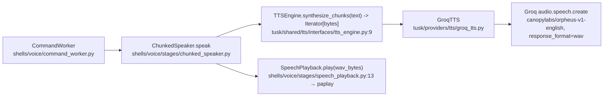

# Issue #73 — Configurable TTS playback speed

**Goal:** one session-wide setting that makes spoken replies play faster (`1.0` default,
`1.5`, `2.0`, …), configured the way everything else in TUSK is configured, with `1.0`
leaving today's behaviour byte-for-byte unchanged.

---

## 1. How spoken output works today

Spoken output is a four-link chain. Nothing in it has any notion of rate.



| Component | File | Role today |
|---|---|---|
| `TTSEngine` | `tusk/shared/tts/interfaces/tts_engine.py` | ABC, one method: `synthesize_chunks(text) -> Iterator[bytes]` |
| `GroqTTS` | `tusk/providers/tts/groq_tts.py` | Splits at the 200-char Orpheus cap (`TextChunker`), one API call per chunk, yields one WAV clip per chunk |
| `ChunkedSpeaker` | `shells/voice/stages/chunked_speaker.py` | Prefetches the next clip on a worker thread (`_prefetched`, queue of 2) while the current one plays; owns `current_text` and `recent_speech` |
| `SpeechPlayback` | `shells/voice/stages/speech_playback.py` | `paplay` subprocess fed from a writer thread; polls the interrupt token every 100 ms; hard 30 s cap per clip |
| `ShellLoader._build_worker` | `shell_loader.py:72-76` | The only place `GroqTTS` is constructed: `GroqTTS(self._config.groq_api_key)` when `config.tts_enabled` |

The whole chain runs on the `CommandWorker` thread, off the STT → gatekeeper hot path.
The acknowledgment refrain (`TUSK_ACK`) rides the same `ChunkedSpeaker`, so anything done
here applies to acks for free — which matches the issue's "one setting for the whole
session".

Configuration is environment-only: `ConfigFactory` (`tusk/shared/config/config_factory.py`)
reads `os.environ` into the frozen `Config` dataclass; `main.py` calls `Config.from_env()`
and hands the object to `ShellLoader`. `tts_enabled` lives in `_audio_values()`
(`config_factory.py:69-78`) beside `ack_enabled`. There is no config file, no CLI flag and
no tray control for any audio setting.

---

## 2. Where speed can enter

There are exactly three seams, and they differ in what they cost and what they can promise.

1. **Synthesis (provider)** — pass `speed` to `audio.speech.create`. The model speaks
   faster; pitch and timbre are preserved because nothing is resampled. Zero added
   latency, zero added process. Depends on the Groq endpoint accepting the parameter for
   `canopylabs/orpheus-v1-english`.
2. **Between synthesis and playback (client)** — time-stretch each WAV clip
   (`ffmpeg -filter:a atempo=…`). Provider-independent and pitch-preserving, but adds a
   subprocess and some milliseconds per clip.
3. **Playback (client, naive)** — rewrite the WAV header's sample rate so `paplay` reads
   the same samples faster. Free, ten lines, and it raises the pitch — a chipmunk voice.

Note that `paplay` itself cannot help: it takes its sample spec from the WAV header when
reading a sound file, so its `--rate` flag is not a lever here.

---

## 3. Chosen approach

**Take seam 1: `GroqTTS` sends `speed` to the Groq speech API, sourced from a new
`tts_speed` config field, and omits the parameter entirely when the value is `1.0`.**

Configuration contract:

| | |
|---|---|
| Env var | `TUSK_TTS_SPEED` |
| `Config` field | `tts_speed: float`, added next to `tts_enabled` |
| Read in | `ConfigFactory._audio_values()`, via the existing `self._float(...)` helper |
| Default | `"1.0"` |
| Validation | none — same as every other numeric setting in `ConfigFactory` |

Shape of the change in `GroqTTS` (illustrative, not final):

```python
def __init__(self, api_key: str, model: str = _MODEL, voice: str = "daniel",
             speed: float = 1.0) -> None:
    ...
    self._speed = speed

def _synthesize_chunk(self, text: str) -> bytes:
    return self._client.audio.speech.create(**self._request(text)).read()

def _request(self, text: str) -> dict:
    base = {"model": self._model, "voice": self._voice,
            "input": text, "response_format": "wav"}
    return base if self._speed == 1.0 else {**base, "speed": self._speed}
```

`ShellLoader._build_worker` becomes
`GroqTTS(self._config.groq_api_key, speed=self._config.tts_speed)`.

Why this one:

- **Quality.** Orpheus generating faster speech sounds like a person talking quickly.
  Every client-side option either shifts pitch (seam 3) or introduces time-stretch
  artefacts that get audible past ~1.75x (seam 2).
- **Latency is a first-class concern here** (CLAUDE.md, and the `ChunkedSpeaker` design
  exists precisely to shave a round trip off time-to-first-audio). Seam 1 adds nothing at
  all to the reply path; seam 2 adds an ffmpeg start-up per clip, the first of which is on
  the critical path.
- **"Default 1.0 unchanged" is provable, not argued.** At `1.0` the request dict is
  literally the dict built today, so the outgoing request is identical whether or not the
  API supports the parameter. This is why `speed` is omitted rather than sent as `1.0`.
- **Smallest change that fits the existing structure.** No new class, no new file, the
  `TTSEngine` ABC untouched, and speed stays a property of the engine that produces the
  audio rather than leaking into the playback stage.

`ChunkedSpeaker`, `SpeechPlayback`, `CommandWorker`, the interrupt path and the
`TTSEngine` ABC are all unmodified.

### Contingency, pre-approved

The one thing this design bets on is unverified (see §5.1). If verification fails, switch
to seam 2 without redesigning: **`SpeedAdjustedTTS(TTSEngine)`** in
`tusk/providers/tts/speed_adjusted_tts.py`, composed around the inner engine in
`ShellLoader._build_worker`, piping each clip through
`ffmpeg -i pipe:0 -filter:a atempo=<speed> -f wav pipe:1`. ffmpeg is already installed in
the image (`Dockerfile`, needed by openai-whisper), so no new dependency.

The bet is cheap because the two options share everything that matters: the env var, the
`Config` field, the `1.0` short-circuit (the decorator is simply not applied at `1.0`),
the docs, and the config tests. Only the mechanism differs — a constructor argument versus
a wrapper object in the loader. The stretch also runs inside `synthesize_chunks`, i.e. on
`ChunkedSpeaker`'s prefetch thread, so even in the fallback only the *first* clip's stretch
lands on the critical path.

---

## 4. Integration points and contracts crossed

Every one of these is a place the change is visible to something else.

| Point | What crosses it | Consequence |
|---|---|---|
| `Config` dataclass (`tusk/shared/config/config.py`) | frozen dataclass, constructed only via `ConfigFactory` with `Config(**values)` | a new field **must** be produced by `_audio_values()` or `build()` raises `TypeError` |
| `.env.example` | the de facto documentation of every setting | `TUSK_TTS_SPEED` belongs in the block next to `TUSK_TTS` / `TUSK_ACK` |
| `shell_loader.py:73` | the sole `GroqTTS` construction site | reads a new `config` attribute — see the two test consequences below |
| `tests/test_shell_loader.py:49` | stubs the class as `lambda key: sentinel` | **breaks** on a second constructor argument; must accept the new one |
| `tests/test_shell_loader.py:10-13` | builds `config` as a `types.SimpleNamespace` with a hand-listed set of attributes | **breaks** with `AttributeError` as soon as `_build_worker` reads `config.tts_speed`; needs the attribute added |
| `tests/providers/test_groq_tts.py` | asserts the exact kwargs passed to `audio.speech.create` via `_recording_client` | the natural home for both new assertions: `speed` present when set, **absent** at `1.0` |
| `tests/shared/test_config_factory.py` | one test per setting, default and override | add the matching pair |
| `e2e/voice_e2e_harness.py:52` | fakes TTS as `SimpleNamespace(synthesize_chunks=…)`, bypassing `ShellLoader` | unaffected by either approach; no change needed |
| `tests/style_guardrails` | ≤100 code lines/file, ≤10 lines/function, ≤12 files/dir, 1 class/file | `groq_tts.py` (38 lines) and `tusk/providers/tts/` (2 files) have ample headroom either way; the `__init__` signature will exceed the 120-char line target and needs wrapping |
| `docs/architecture.md` (TTS section, ~line 830), `docs/specification.md` §22, `docs/class-diagrams.md` | prose descriptions of the TTS chain | should gain the setting |

Two documentation files are already stale about this area — `docs/architecture.md:834` and
`docs/specification.md:1129` still describe `WavConcatenator` and a `synthesize(text) -> bytes`
interface, both of which were replaced by `ChunkedSpeaker` and `synthesize_chunks`. Worth
knowing so the implementer is not misled by them; **fixing them is out of scope** for this
issue.

---

## 5. Risks and unknowns

### 5.1 The load-bearing unknown: does Orpheus honour `speed`?

Groq's speech endpoint is OpenAI-compatible and documents a `speed` parameter, but that
documentation is written against the PlayAI TTS models. `canopylabs/orpheus-v1-english` is
an LLM-based speech model, and whether it accepts `speed`, rejects it with a 400, or
accepts and silently ignores it **could not be determined from this repository** — the
`groq` SDK is not readable from this stage, and calling the live API is out of scope here.

Three outcomes:

- **Accepted and honoured** — done, ship it.
- **Rejected with an error** — loud and confined: `ChunkedSpeaker.speak` catches the
  exception and logs `tts failed: …` (`chunked_speaker.py:46-47`), so replies go silent
  for anyone who set a non-default speed while `1.0` users are untouched. Switch to the
  contingency.
- **Accepted and silently ignored** — the dangerous one, because the suite stays green and
  nothing logs. Only listening catches it.

**This must be verified against the live API before the change is called done.** A green
unit suite proves only that we sent the parameter, never that it did anything. If the
implementation stage has no Groq credentials or no network, that is a blocker to report,
not a step to skip — a green suite here is close to meaningless.

### 5.2 Sped-up speech is harder for the echo filter to catch

`EchoFilter` (`shells/voice/stages/echo_filter.py`) drops utterances whose *transcribed
text* resembles what TUSK recently spoke (`difflib` ratio ≥ 0.75, 12 s window). It is the
backstop behind the PipeWire echo canceller. Faster speech transcribes less accurately, so
an echo that leaks past the canceller may come back mangled enough to fall under the
threshold and be treated as a real command. The 12 s window itself is safe — it is keyed
off clip *end* timestamps, which simply arrive earlier.

Not a reason to block the change: it only affects users who opt into a faster speed, and
the primary defence (`echo-cancel-source`, see `docs/features/mic-echo-cancellation.md`) is
unaffected. Worth listening for at high speeds during the §5.1 verification.

### 5.3 Smaller ones

- **Nonsense values.** `TUSK_TTS_SPEED=abc` raises `ValueError` at startup, exactly like
  `AUDIO_SAMPLE_RATE=abc` does today. `0` or `-1` reaches the provider and is rejected
  there. No clamping is proposed: no other numeric setting in `ConfigFactory` validates a
  range, and adding a bespoke check for one setting is the kind of unrequested error
  handling CLAUDE.md rules out.
- **The 30 s per-clip cap** in `SpeechPlayback._await` only becomes less likely to fire as
  speed increases. No interaction.
- **Contingency-only risk.** Orpheus streams a placeholder frame count in its WAV headers
  (the reason the old `WavConcatenator` copied parameters individually,
  `docs/architecture.md:836`). `paplay` copes; whether `ffmpeg` reads such a clip to EOF or
  truncates on the bogus data-chunk size is unverified. If the contingency is taken, that
  needs checking on real audio before anything else.

---

## 6. Alternatives rejected

**A. Client-side time-stretch with `ffmpeg atempo` (seam 2), as the primary.** Rejected as
primary, kept as the pre-approved contingency in §3. It is guaranteed to work regardless of
provider support, but it spawns a process per clip on the reply path, adds artefacts past
~1.75x, adds a new file and class for something the provider may do for free, and carries
its own unverified risk with Orpheus's WAV headers (§5.3). Choosing it up front would mean
paying a certain cost to avoid an uncertain one.

**B. Rewriting the WAV header's sample rate (seam 3).** Ten lines, no dependency, no
subprocess, and it genuinely works — `paplay` reads the rate from the header. Rejected
because it raises pitch along with rate. At 1.5x the voice is visibly altered and at 2.0x
it is a chipmunk. Shipping a quality regression as the headline feature is not what the
issue asks for.

**C. Putting speed on `SpeechPlayback`.** Rejected: playback's job is to push bytes at
`paplay` and honour the interrupt token, and it is the narrowest, most load-bearing piece
of the interrupt path (`docs/features/voice-interrupt.md`). Rate belongs to how audio is
produced, not to how it is pushed to the sink.

**D. Adding `speed` to the `TTSEngine` ABC**, e.g. `synthesize_chunks(text, speed)`.
Rejected: the issue explicitly excludes per-utterance overrides, so a per-call parameter
buys nothing, and it would force every future engine and every fake in the tests to carry
it. A session-wide setting belongs in the engine's constructor.

**E. Exposing speed in the tray menu or as a runtime tool.** Rejected as out of scope. The
issue asks for it to be "configured the same way the rest of TUSK is configured", and no
audio setting today has a runtime control.

---

## 7. Verification

1. `docker compose exec tusk pytest tests/` — unit level: default omits `speed`, a
   configured value is passed through, `ConfigFactory` default and override.
2. **Run it for real** against the live Groq API at `TUSK_TTS_SPEED=1.0`, `1.5` and `2.0`
   and *listen*. This is the step that decides §5.1, and it is the only one that can. While
   listening at 2.0, check that a reply is still recognised as an echo and not taken as a
   command.

## 8. Out of scope

Voice and model selection; per-utterance speed overrides; anything touching STT, VAD or
microphone capture; a runtime/tray control for speed; and repairing the pre-existing
staleness in `docs/architecture.md` and `docs/specification.md` noted in §4.
