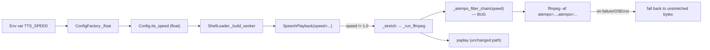

# Architecture Analysis — Issue #77: `TTS_SPEED=inf` hangs the voice shell

## Issue Summary
`SpeechPlayback._atempo_filter_chain` builds an `ffmpeg atempo` filter chain by repeatedly
halving/doubling `speed` until it lands in ffmpeg's native `[0.5, 2.0]` per-filter range. The
first (`> 2.0`) loop has no bound for non-finite input: `inf / 2.0 == inf`, so
`TTS_SPEED=inf` spins forever, growing `factors` without limit until the process is OOM-killed.
The second (`0.0 < remaining < 0.5`) loop already carries a deliberate guard against
non-terminating input (zero/negative speeds); the first loop was never given the equivalent
guard. `TTS_SPEED=nan` also parses and reaches `ffmpeg` as `atempo=nan`, which is not a hang.

## Base-Branch Note — Read This Before Planning

**The playback-speed feature this issue describes does not exist on this branch.**
`factory/issue-77/architecture` branches from `main` at `0e8f2d7` (PR #69), which predates
the `TTS_SPEED` feature entirely: `shells/voice/stages/speech_playback.py` here has no
`_atempo_filter_chain`, no `speed` parameter, and `ConfigFactory` has no `tts_speed` field.

The feature — and the exact buggy code quoted in the issue — exists only on
`origin/factory/issue-47/implementation` (commits `3990ff7`..`77f8a65`, "Implement issue 47"
plus two "Repair issue 47" follow-ups). That branch's merge-base with this one is this
branch's own HEAD, i.e. it is `main` + the issue-47 commits, not yet merged back.
The issue text itself confirms this lineage: *"Found by an automated review of the #47 diff."*

**Consequence for the next stage:** the plan/implementation stages cannot fix this bug in
place on the current file, because the buggy code isn't here yet. Whoever picks this up needs
the issue-47 changes as a prerequisite — either issue-47 lands on `main` first and this work
rebases onto it, or this fix is authored directly against
`origin/factory/issue-47/implementation` and merged together with it. The remainder of this
document describes the architecture **as it exists on `factory/issue-47/implementation`**,
since that is the actual code the fix must change.

## Components Affected And How They Fit Together (on top of issue-47)

- **`ConfigFactory._float`** (`tusk/shared/config/config_factory.py`): generic env-var
  float parser used by `tts_speed` and several unrelated timeout/window settings
  (`FOLLOW_UP_TIMEOUT_SECONDS`, `GATE_RECOVERY_WINDOW_SECONDS`, etc). `float("inf")` and
  `float("nan")` both parse without error — Python's `float()` accepts them by design.
- **`Config.tts_speed`** (`tusk/shared/config/config.py`): a plain `float` field on the
  frozen config dataclass. No validation at construction.
- **`ShellLoader._build_worker`** (`shell_loader.py:72-76`): the sole construction site,
  passes `self._config.tts_speed` straight into `SpeechPlayback(token, speed=...)`.
- **`SpeechPlayback`** (`shells/voice/stages/speech_playback.py`): `play()` skips stretching
  entirely when `speed == 1.0`. Otherwise `_stretch` → `_run_ffmpeg` → `_spawn_ffmpeg`, which
  calls `_atempo_filter_chain(speed)` to build the `-af` argument before ever spawning the
  `ffmpeg` subprocess. **The hang happens before any subprocess exists** — it is a pure
  Python `while` loop, not a stuck external process, so `SpeechPlayback._await`'s 30s
  poll/kill cap (which only supervises the already-spawned process) cannot help.
- **`CommandWorker`** (`shells/voice/command_worker.py`): runs `ChunkedSpeaker.speak` →
  `SpeechPlayback.play` on its own dedicated daemon thread (`_run`, started once in
  `start()`). The hang freezes that one thread forever: the command queue keeps accepting
  new items (`enqueue` just does `queue.put`) but nothing is ever dequeued or spoken again,
  and the growing `factors` list drives the process toward an OOM kill — taking the whole
  process down, not just the thread.

## Integration Points And Contracts Crossed

1. **Env var → `ConfigFactory._float` → `Config.tts_speed`.** The only boundary where
   external, untrusted input (an arbitrary string in the process environment) becomes a
   `float` used downstream. Nothing here rejects non-finite values today.
2. **`Config.tts_speed` → `SpeechPlayback.__init__(speed=...)`.** Construction-time only;
   `speed` is fixed for the process lifetime, consistent with how `model`/`voice` are
   configured on the `GroqTTS` provider.
3. **`SpeechPlayback._atempo_filter_chain`.** A `@staticmethod`, already called directly (not
   just through `play()`) by the existing unit tests
   (`test_atempo_filter_chain_within_native_range`,
   `test_atempo_filter_chain_terminates_for_non_positive_speed`,
   `test_atempo_filter_chain_above_native_range` in
   `tests/shells/voice/test_speech_playback_speed.py` on the issue-47 branch). It is
   effectively a tested, standalone contract, not just a private implementation detail — a
   fix that only guards the config boundary would leave this contract unsound.
4. **`_atempo_filter_chain` → `ffmpeg -af` string.** Downstream, ffmpeg itself rejects
   filter values it doesn't like (already relied on for zero/negative speeds, which reach
   ffmpeg unchanged and cause a non-zero exit, caught by `_run_ffmpeg` and turned into a
   fallback to unstretched playback via `_stretch`'s `except`).

## Risks, Unknowns, Things That Could Break

- **The hang is a pure CPU loop with no I/O and no check of `InterruptToken`.** Unlike
  `_await`'s process-supervision loop, nothing polls for interruption inside
  `_atempo_filter_chain`, so a user cannot voice-interrupt their way out once it starts.
- **Failure mode is OOM, not a clean crash.** `factors` grows without bound; behavior under
  memory pressure (OS OOM killer vs. Python `MemoryError`) is host-dependent and not something
  a unit test should rely on — the issue itself notes any regression test needs a timeout
  instead, following `test_atempo_filter_chain_terminates_for_non_positive_speed`'s pattern.
- **This is thread-local but process-fatal.** Because `CommandWorker` runs on a daemon
  thread, nothing else in the process crashes *first* — the process keeps running (STT,
  gatekeeper, etc. still work) right up until the OOM kill takes it all down at once. A fix
  must not assume "just that thread hangs" is an acceptable degraded state.
- **`ConfigFactory._float` is shared.** Any fix applied at that layer affects every caller
  (`FOLLOW_UP_TIMEOUT_SECONDS`, `MAX_FOLLOW_UP_TIMEOUT_SECONDS`,
  `GATE_RECOVERY_WINDOW_SECONDS`, `CODEX_EXEC_TIMEOUT_SECONDS` is actually `_int`, but the
  float ones are), which is broader than this issue's scope and was not requested.
- **`nan` is explicitly out of scope per the issue** ("not a hang... not a sensible filter
  either") — it already terminates and already falls through to ffmpeg's own rejection path.
  Treat it as a pre-existing, accepted rough edge unless the next stage decides otherwise.
- **Base-branch mismatch (see note above) is the biggest process risk**, not a code risk:
  if the next stage edits this repository's current `speech_playback.py`, it will silently
  no-op because that file doesn't have `_atempo_filter_chain` yet.

## Approach Chosen, And Alternatives Rejected

**Chosen: bound the first loop the same way the second loop is already bounded**, i.e. add
a finiteness guard to the first `while remaining > 2.0` condition so it cannot spin on `inf`
(mirroring the existing comment's reasoning, extended to cover the loop it doesn't currently
cover). This is the minimal, surgical fix: it changes one loop condition in the one function
that owns the non-termination hazard, matches the pattern already established one loop down,
and closes the hole regardless of which caller reaches `_atempo_filter_chain` — including the
direct unit-test callers noted above, not just the config → `play()` path.

**Rejected: reject non-finite values in `ConfigFactory._float`.** This was the issue's other
suggested option. Rejected because `_float` is a shared helper used by several unrelated
settings (follow-up timeouts, recovery windows) — broadening its validation is a larger,
un-requested change, and it still leaves `_atempo_filter_chain` itself non-terminating for
any other current or future caller (it is already called directly by tests, i.e. it is part
of the class's real interface, not a hidden implementation detail).

**Rejected: reject non-finite values only at the `tts_speed` call site** (e.g. in
`SpeechPlayback.__init__` or `ShellLoader._build_worker`). Narrower than guarding `_float`
globally, but still only protects the one call path that goes through configuration — it
does not fix the loop itself, so `_atempo_filter_chain(float("inf"))` remains a live footgun
for the tested static-method contract. The loop-level fix subsumes this without the extra
validation code.

**Rejected: cap iteration count instead of checking finiteness.** E.g. `for _ in
range(64): ...`. Rejected because it changes the loop's shape (bounded-count loop instead of
a condition-bounded `while`, unlike its sibling loop just below it), and an arbitrary
iteration cap is a magic number requiring justification, whereas a finiteness check states
the actual hazard directly and reads as the natural counterpart to the second loop's
existing `0.0 <` guard.
