# TUSK — Class Diagrams

Auto-generated Mermaid class diagrams, one per package (kernel and shared split
by subpackage — 183 classes don't fit one readable diagram). For the
whole-system view see the [block diagram](diagrams/architecture.svg) in
[architecture.md](architecture.md).

Regenerate (public members only) inside the dev container:

```bash
docker compose exec tusk pip install pylint  # provides pyreverse
docker compose exec tusk bash  # then, from the repo root:
pyreverse -o mmd --filter-mode=PUB_ONLY -d /tmp/dg -p kernel_core tusk/kernel/*.py tusk/kernel/interfaces tusk/kernel/modes
pyreverse -o mmd --filter-mode=PUB_ONLY -d /tmp/dg -p kernel_agent tusk/kernel/agent
pyreverse -o mmd --filter-mode=PUB_ONLY -d /tmp/dg -p kernel_backends tusk/kernel/agent_backends
pyreverse -o mmd --filter-mode=PUB_ONLY -d /tmp/dg -p shared_contracts tusk/shared/{llm,stt,tts,mcp,config,interrupt,logging,status}
pyreverse -o mmd --filter-mode=PUB_ONLY -d /tmp/dg -p shared_schemas tusk/shared/schemas
pyreverse -o mmd --filter-mode=PUB_ONLY -d /tmp/dg -p providers tusk/providers
pyreverse -o mmd --filter-mode=PUB_ONLY -d /tmp/dg -p shells shells
pyreverse -o mmd --filter-mode=PUB_ONLY -d /tmp/dg -p adapters adapters
```

then paste the `classes_*.mmd` contents into the sections below.

## Kernel — core

`tusk/kernel` top level plus `interfaces` and `modes`: `KernelAPI`, mode slots/routers, `ToolRegistry`, `AdapterManager`.

```mermaid
classDiagram
  class AdapterManager {
    adapters_dir : Path
    tool_registry : ToolRegistry
    primary_desktop_source() str
    start_adapter(adapter_dir: str) None
    start_all() None
    start_watcher() None
    stop_adapter(name: str) None
    stop_all() None
  }
  class AdapterMode {
    state : object
    process_text(text: str) KernelResponse
    stop() KernelResponse
  }
  class Agent {
    process_command(command: str)* str
  }
  class ClipboardGuard {
  }
  class CodingRouter {
    process(state: object, text: str) KernelResponse
    stop(state: object) KernelResponse
  }
  class CodingState {
    adapter_name : str
    desktop_source : str
    session_id : str
  }
  class CommandMode {
    process_command(command: str) KernelResponse
  }
  class ConversationHistory {
    append(message: ChatMessage)* None
    clear()* None
    get_messages()* list[ChatMessage]
  }
  class DictationRouter {
    process(state: object, text: str) KernelResponse
    stop(state: object) KernelResponse
  }
  class DictationState {
    adapter_name : str
    desktop_source : str
    session_id : str
  }
  class EditApplicationStrategy {
    apply(edit: EditOperation, driver: EditorDriver)* None
  }
  class EditorDriver {
    goto_line(line_number: int)* None
    paste(text: str)* None
    press_keys(keys: str)* None
    read_buffer()* str
    replace_buffer(text: str)* None
    select_range(selection: BufferSelection)* None
    type_text(text: str)* None
  }
  class FullReplaceEditStrategy {
    apply(edit: EditOperation, driver: EditorDriver) None
  }
  class InputAutomationEditorDriver {
    goto_line(line_number: int) None
    paste(text: str) None
    press_keys(keys: str) None
    read_buffer() str
    replace_buffer(text: str) None
    select_range(selection: BufferSelection) None
    type_text(text: str) None
  }
  class KernelAPI {
    coding_active : bool
    interrupt_token : object | None
    attach_coding_router(router: object) None
    attach_dictation_router(router: object) None
    get_llm_registry() LLMRegistry | None
    request_coding_stop() KernelResponse
    request_dictation_stop() KernelResponse
    request_interrupt() None
    set_coding_callbacks(on_start: Callable[[], None], on_stop: Callable[[], None]) None
    set_dictation_callbacks(on_start: Callable[[], None], on_stop: Callable[[], None]) None
    start_coding(state: object) KernelResponse
    start_dictation(state: object) KernelResponse
    stop_coding() None
    stop_dictation() None
    submit(text: str) KernelResponse
  }
  class MainAgent {
    process_command(command: str) str
    run(request: AgentRequest) BackendAgentResult
  }
  class ModeGate {
    should_stop(text: str) bool
  }
  class ModeSlot {
    active : bool
    attach_router(router: object) None
    process_text(text: str) KernelResponse
    request_stop() KernelResponse
    set_callbacks(on_start: Callable[[], None], on_stop: Callable[[], None]) None
    start(state: object, log: object) KernelResponse
    stop() None
  }
  class ModelFailureReplyBuilder {
    build(exc: Exception) str
  }
  class Shell {
    start(api: object)* None
    stop()* None
  }
  class SlidingWindowHistory {
    append(message: ChatMessage) None
    clear() None
    get_messages() list[ChatMessage]
  }
  class SubmitStatusReporter {
    run(text: str, route: Callable[[str], object]) object
  }
  FullReplaceEditStrategy --|> EditApplicationStrategy
  InputAutomationEditorDriver --|> EditorDriver
  SlidingWindowHistory --|> ConversationHistory
```



## Kernel — agent

`tusk/kernel/agent`: orchestrator, runtime, profiles, guards, session store.


## Kernel — agent backends

`tusk/kernel/agent_backends`: `AgentBackend` implementations (TUSK, codex exec, codex MCP, fallback).

```mermaid
classDiagram
  class AgentBackend {
    run(request: AgentRequest)* AgentResult
  }
  class AgentBackendFactory {
    create() AgentBackend
  }
  class AgentRequest {
    context : dict[str, object]
    environment : dict[str, str]
    metadata : dict[str, object]
    mode : str
    session_id : str
    timeout_seconds : float | None
    user_text : str
    working_directory : str
  }
  class AgentResult {
    final_text : str
    handled : bool
    metadata : dict[str, object]
    raw_output : Optional[object]
    reply : str
    session_id : str
    status : str
  }
  class BackendRunLogger {
    end(request: AgentRequest, started_at: float, result: AgentResult) None
    failure(request: AgentRequest, started_at: float, status: str, error: str) None
    schema(request: AgentRequest, success: bool, detail: str) None
    start(request: AgentRequest) float
  }
  class CallBuilder {
    build(prompt: str, working_directory: str, thread_id: str) tuple[str, dict]
  }
  class Client {
    call_tool(name: str, arguments: dict) dict
    is_running() bool
    stop() None
  }
  class CodexExecAgentBackend {
    name : str
    supports_streaming : bool
    run(request: AgentRequest) AgentResult
  }
  class CodexExecCommandBuilder {
    build(prompt: str) list[str]
  }
  class CodexMcpAgentBackend {
    name : str
    supports_streaming : bool
    run(request: AgentRequest) AgentResult
  }
  class CodexPromptBuilder {
    build(request: AgentRequest) str
  }
  class CodexResultParser {
    parse(output: str) dict | None
  }
  class FallbackAgentBackend {
    name : str
    supports_streaming : bool
    run(request: AgentRequest) AgentResult
  }
  class ResponseReader {
    read(request_id: int, method: str) dict
  }
  class ResultMapper {
    failure(request: AgentRequest, message: str, status: str) AgentResult
    success(request: AgentRequest, payload: dict) AgentResult
  }
  class TuskAgentBackend {
    name : str
    supports_streaming : bool
    run(request: AgentRequest) AgentResult
  }
  CodexExecAgentBackend --|> AgentBackend
  CodexMcpAgentBackend --|> AgentBackend
  FallbackAgentBackend --|> AgentBackend
  TuskAgentBackend --|> AgentBackend
```



## Shared — contracts

`tusk/shared` ABCs and infrastructure: LLM/STT/TTS/MCP, config, interrupt, logging, status.

```mermaid
classDiagram
  class AdapterEnvironmentBuilder {
    base_env() dict
    build(path: Path, manifest: dict) dict
  }
  class AdapterWatcher {
    on_created(event) None
  }
  class ColorLogPrinter {
    clear_wait()* None
    log(tag: str, message: str, group: str | None) None
    show_wait(label: str, group: str) None
  }
  class Config {
    adapter_env_cache_dir : str
    agent_backend : str
    agent_backend_fallback : str
    agent_session_log_dir : str
    audio_frame_duration_ms : int
    audio_sample_rate : int
    codex_exec_binary : str
    codex_exec_extra_args : tuple[str, ...]
    codex_exec_log_raw_events : bool
    codex_exec_model : str
    codex_exec_output_schema_path : str
    codex_exec_sandbox_mode : str
    codex_exec_timeout_seconds : int
    codex_exec_workdir : str
    conversation_agent_llm : LLMSlotConfig
    default_agent_llm : LLMSlotConfig
    executor_agent_llm : LLMSlotConfig
    follow_up_timeout_seconds : float
    gate_recovery_candidate_limit : int
    gate_recovery_window_seconds : float
    gatekeeper_llm : LLMSlotConfig
    groq_api_key : str
    max_follow_up_timeout_seconds : float
    openrouter_api_key : str
    planner_agent_llm : LLMSlotConfig
    shells : list[str]
    stt_engine : str
    tray_icon_theme : str
    tray_show_last_activity : bool
    tts_enabled : bool
    utility_llm : LLMSlotConfig
    vad_aggressiveness : int
    whisper_model_size : str
    from_env() 'Config'
  }
  class ConfigFactory {
    build() Config
  }
  class InterruptToken {
    is_interrupted : bool
    clear() None
    interrupt() None
  }
  class LLMPayloadLogger {
    before_request(provider: str, payload: dict[str, object]) None
    log_response(response: str | ToolCall) None
  }
  class LLMProvider {
    label : str
    complete(system_prompt: str, user_message: str, max_tokens: int)* str
    complete_messages(system_prompt: str, messages: list[dict])* str
    complete_structured(system_prompt: str, user_message: str, schema_name: str, schema: dict, max_tokens: int)* str
    complete_tool_call(system_prompt: str, messages: list[dict], tools: list[dict[str, object]])* ToolCall
  }
  class LLMProviderFactory {
    create(provider_name: str, model: str)* LLMProvider
  }
  class LLMProxy {
    label : str
    complete(system_prompt: str, user_message: str, max_tokens: int) str
    complete_messages(system_prompt: str, messages: list[dict]) str
    complete_structured(system_prompt: str, user_message: str, schema_name: str, schema: dict, max_tokens: int) str
    complete_tool_call(system_prompt: str, messages: list[dict], tools: list[dict[str, object]]) ToolCall
    swap(provider: LLMProvider) None
  }
  class LLMRegistry {
    slot_names : list[str]
    get(name: str) LLMProvider
    model_labels() tuple[tuple[str, str], ...]
    register_slot(name: str, proxy: LLMProxy) None
    swap(slot_name: str, provider_name: str, model: str) str
  }
  class LLMRetryPolicy {
    should_retry(exc: Exception) bool
  }
  class LLMRetryRunner {
    run(operation: object, on_retry: object | None) str
  }
  class LogPrinter {
    clear_wait()* None
    log(tag: str, message: str, group: str | None)* None
    show_wait(label: str, group: str)* None
  }
  class MCPClient {
    call_tool(name: str, arguments: dict) MCPToolResult
    connect_http(url: str)* None
    connect_stdio(command: list[str], cwd: str, env: dict | None) None
    is_running() bool
    list_tools() list[MCPToolSchema]
    shutdown() None
  }
  class MCPStdioServer {
    serve() None
  }
  class MCPStdioTransport {
    is_running() bool
    read_line() str | None
    stderr_text() str
    stop() None
    write_line(line: str) None
  }
  class MCPToolProxy {
    description
    input_schema
    name : str
    planner_visible : bool
    sequence_callable : bool
    source : str
    execute(parameters: dict) ToolResult
  }
  class NullStatusSink {
    publish(snapshot: StatusSnapshot) None
  }
  class STTEngine {
    transcribe(audio_frames: bytes, sample_rate: int)* Utterance
  }
  class StartupOptions {
    hidden_groups : frozenset[str]
    llm_log_preview_chars : int
    log_groups : frozenset[str]
    from_sources(argv: list[str] | None, environ: dict[str, str] | None) 'StartupOptions'
  }
  class StatusReporter {
    status : AppStatus
    set_mic_device(device: str)* None
    set_mode(mode: AppMode)* None
    set_models(models: tuple[tuple[str, str], ...])* None
    set_status(status: AppStatus, detail: str)* None
  }
  class StatusReporterHub {
    status : AppStatus
    attach_sink(sink: StatusSink) None
    set_mic_device(device: str) None
    set_mode(mode: AppMode) None
    set_models(models: tuple[tuple[str, str], ...]) None
    set_status(status: AppStatus, detail: str) None
  }
  class StatusSink {
    publish(snapshot: StatusSnapshot)* None
  }
  class TTSEngine {
    synthesize(text: str)* bytes
  }
  class ToolUseFailedRecovery {
    recover(exc: Exception) ToolCall | None
  }
  LLMProxy --|> LLMProvider
  ColorLogPrinter --|> LogPrinter
  NullStatusSink --|> StatusSink
  StatusReporterHub --|> StatusReporter
```



## Shared — schemas

`tusk/shared/schemas`: dataclasses passed between layers.

```mermaid
classDiagram
  class AppEntry {
    exec_cmd : str
    name : str
  }
  class AppMode {
    name
  }
  class AppStatus {
    name
  }
  class BufferSelection {
    end_line : int
    start_line : int
  }
  class ChatMessage {
    content : str
    is_summary : bool
    role : str
    to_dict() dict[str, str]
  }
  class DesktopContext {
    active_application : str
    active_window_title : str
    available_applications : list[object]
    open_windows : list[WindowInfo]
  }
  class EditOperation {
    full_buffer : str
    kind : str
    new_text : str
    target_end : int
    target_start : int
  }
  class GateClassification {
    name
  }
  class GateResult {
    classification
    cleaned_command : str
    confidence : float
    is_directed_at_tusk : bool
  }
  class KernelResponse {
    handled : bool
    reply : str
  }
  class LLMSlotConfig {
    model : str
    provider_name : str
    parse(value: str) 'LLMSlotConfig'
  }
  class MCPToolResult {
    content : str
    data : dict | None
    is_error : bool
  }
  class MCPToolSchema {
    description : str
    input_schema : dict
    name : str
  }
  class StatusSnapshot {
    detail : str
    mic_device : str
    mode
    models : tuple[tuple[str, str], ...]
    status
  }
  class ToolCall {
    call_id : str
    parameters : dict[str, object]
    tool_name : str
  }
  class ToolResult {
    data : dict | None
    message : str
    success : bool
  }
  class ToolSequencePlan {
    goal : str
    steps : tuple[ToolSequenceStep, ...]
    from_dict(data: object) 'ToolSequencePlan | None'
    ordered_tool_names() tuple[str, ...]
    to_dict() dict[str, object]
    tool_names() set[str]
  }
  class ToolSequenceStep {
    args : dict[str, object]
    step_id : str
    tool_name : str
    from_dict(data: object) 'ToolSequenceStep | None'
    to_dict() dict[str, object]
  }
  class Utterance {
    audio_frames : bytes
    confidence : float
    duration_seconds : float
    text : str
  }
  class WindowInfo {
    application : str
    height : int
    is_active : bool
    title : str
    width : int
    window_id : str
    x : int
    y : int
  }
  StatusSnapshot --> AppMode : mode
  StatusSnapshot --> AppStatus : status
  GateResult --> GateClassification : classification
```



## Providers

`tusk/providers`: swappable LLM/STT/TTS implementations.

```mermaid
classDiagram
  class ConfigurableLLMFactory {
    create(provider_name: str, model: str) LLMProvider
  }
  class GroqLLM {
    label : str
    complete(system_prompt: str, user_message: str, max_tokens: int) str
    complete_messages(system_prompt: str, messages: list[dict]) str
    complete_structured(system_prompt: str, user_message: str, schema_name: str, schema: dict, max_tokens: int) str
    complete_tool_call(system_prompt: str, messages: list[dict], tools: list[dict[str, object]]) ToolCall
    set_payload_logger(logger: object) None
  }
  class GroqSTT {
    transcribe(audio_frames: bytes, sample_rate: int) Utterance
  }
  class GroqTTS {
    synthesize(text: str) bytes
  }
  class OpenRouterLLM {
    label : str
    complete(system_prompt: str, user_message: str, max_tokens: int) str
    complete_messages(system_prompt: str, messages: list[dict]) str
    complete_structured(system_prompt: str, user_message: str, schema_name: str, schema: dict, max_tokens: int) str
    complete_tool_call(system_prompt: str, messages: list[dict], tools: list[dict[str, object]]) ToolCall
    set_payload_logger(logger: object) None
  }
  class STTEngineFactory {
    create(name: str) STTEngine
  }
  class TextChunker {
    split(text: str) list[str]
  }
  class WavConcatenator {
    concatenate(clips: list[bytes]) bytes
  }
  class WhisperSTT {
    transcribe(audio_frames: bytes, sample_rate: int) Utterance
  }
```



## Shells

`shells`: voice, CLI, tray, emulator front-ends.

```mermaid
classDiagram
  class AppIndicatorTrayBackend {
    run() None
    set_icon(name: str) None
    set_menu(items: tuple[TrayMenuItem, ...]) None
    set_tooltip(text: str) None
    stop() None
  }
  class AudioCapture {
    stream_frames() Iterator[bytes]
  }
  class BufferedUtterance {
    gate_state
    id : str
    received_at : float
    text : str
    utterance : Utterance
  }
  class CLIShell {
    start(submit: object) None
    stop() None
  }
  class CommandWorker {
    current_speech_text : str | None
    is_busy : bool
    enqueue(text: str) None
    flush() None
    start() None
  }
  class EmulatorShell {
    start(submit: object) None
    stop() None
  }
  class GateAction {
    name
  }
  class GateDispatch {
    action
    recovered_id : str
    text : str | None
  }
  class GateState {
    name
  }
  class Gatekeeper {
    process(utterance: Utterance | BufferedUtterance, recent: list[Utterance], candidates: list[BufferedUtterance] | None)* GateDispatch
  }
  class GatekeeperSlot {
    process(utterance: Utterance | BufferedUtterance, recent: list[Utterance], candidates: list[BufferedUtterance] | None) GateDispatch
    swap(gatekeeper: Gatekeeper) None
  }
  class LLMClient {
    primary(prompt: str, text: str) GateResult
    recovery(prompt: str, text: str, candidates: list[BufferedUtterance]) RecoveryDecision
  }
  class LLMGatekeeper {
    evaluate(utterance: Utterance, recent: list[Utterance]) GateResult
    process(utterance: Utterance | BufferedUtterance, recent: list[Utterance], candidates: list[BufferedUtterance] | None) GateDispatch
  }
  class PlaybackGate {
    process(utterance: Utterance | BufferedUtterance, recent: list[Utterance], candidates: list[BufferedUtterance] | None) GateDispatch
  }
  class RecentContextFormatter {
    format(utterances: list[Utterance]) str
  }
  class RecoveryDecision {
    action : str
    candidate_id : str
    reason : str
  }
  class Sanitizer {
    process(utterance: Utterance) Utterance | None
  }
  class SpeechPlayback {
    play(wav_bytes: bytes) None
  }
  class SpeechStopGate {
    should_stop(text: str, speaking: str) bool
  }
  class StatusIconResolver {
    resolve(status: AppStatus) str
  }
  class StopGatekeeper {
    process(utterance: Utterance | BufferedUtterance, recent: list[Utterance], candidates: list[BufferedUtterance] | None) GateDispatch
  }
  class Transcriber {
    process(utterance: Utterance) Utterance
  }
  class TranscriptionBufferImpl["TranscriptionBuffer (stages)"] {
    mark(entry_id: str, state: GateState) None
    process(utterance: Utterance) BufferedUtterance
    recent(count: int) list[Utterance]
    recoverable(count: int, max_age_seconds: float) list[BufferedUtterance]
  }
  class TranscriptionBuffer {
    mark(entry_id: str, state: GateState)* None
    process(utterance: Utterance)* BufferedUtterance | None
    recent(count: int)* list[Utterance]
    recoverable(count: int, max_age_seconds: float)* list[BufferedUtterance]
  }
  class TrayBackend {
    run()* None
    set_icon(name: str)* None
    set_menu(items: tuple[TrayMenuItem, ...])* None
    set_tooltip(text: str)* None
    stop()* None
  }
  class TrayMenuActions {
    exit : Callable[[], None]
    open_logs : Callable[[], None]
    pause : Callable[[], None]
    restart : Callable[[], None]
    resume : Callable[[], None]
  }
  class TrayMenuBuilder {
    build(snapshot: StatusSnapshot, actions: TrayMenuActions, show_last_activity: bool) tuple[TrayMenuItem, ...]
  }
  class TrayMenuItem {
    action : Callable[[], None] | None
    children : tuple['TrayMenuItem', ...]
    enabled : bool
    label : str
  }
  class TrayShell {
    start(submit: object) None
    stop() None
  }
  class TrayStatusSink {
    publish(snapshot: StatusSnapshot) None
  }
  class UtteranceDetector {
    stream_utterances() Iterator[Utterance]
  }
  class VoicePipeline {
    run(submit: Callable[[str], KernelResponse]) Iterator[KernelResponse]
  }
  class VoiceShell {
    pause() None
    resume() None
    start(submit: Callable[[str], KernelResponse]) None
    stop() None
  }
  AppIndicatorTrayBackend --|> TrayBackend
  GatekeeperSlot --|> Gatekeeper
  PlaybackGate --|> Gatekeeper
  LLMGatekeeper --|> Gatekeeper
  StopGatekeeper --|> Gatekeeper
  TranscriptionBufferImpl --|> TranscriptionBuffer
  GateDispatch --> GateAction : action
  BufferedUtterance --> GateState : gate_state
```



> Hand-edit after regeneration: pyreverse emits both the `TranscriptionBuffer`
> interface and its stages implementation under the same name, which Mermaid
> merges into one node (and a self-inheritance loop). The implementation block
> is renamed to `TranscriptionBufferImpl["TranscriptionBuffer (stages)"]` here.

## Adapters

`adapters`: MCP servers (gnome, dictation, coding, editor emulator).

```mermaid
classDiagram
  class AppCatalog {
    list_apps() list[AppEntry]
    list_dicts() list[dict]
    search(query: str, limit: int) list[AppEntry]
  }
  class ApplicationTools {
    launch_application(arguments: dict) dict
    open_uri(arguments: dict) dict
    search_applications(arguments: dict) dict
  }
  class ClipboardTools {
    read_clipboard(arguments: dict) dict
    write_clipboard(arguments: dict) dict
  }
  class CodingEditPlanner {
    plan(intent: str, buffer_text: str) str | None
  }
  class CodingServer {
    serve() None
  }
  class CodingToolSchemaCatalog {
    build() list[dict]
  }
  class ContextTools {
    get_active_window(arguments: dict) dict
    get_desktop_context(arguments: dict) dict
    list_windows(arguments: dict) dict
  }
  class DictationEdit {
    operation : str
    replace_chars : int
    text : str
  }
  class DictationRefiner {
    refine(text: str) str
  }
  class DictationServer {
    serve() None
  }
  class DictationSessionStore {
    get(session_id: str) str
    pop(session_id: str) None
    prune_stale() None
    set(session_id: str, text: str) None
  }
  class DictationToolSchemaCatalog {
    build() list[dict]
  }
  class GnomeClipboardProvider {
    read() str
    write(text: str) None
  }
  class GnomeContextProvider {
    get_context() DesktopContext
    get_context_dict() dict
  }
  class GnomeInputSimulator {
    mouse_click(x: int, y: int, button: int, clicks: int) None
    mouse_drag(from_x: int, from_y: int, to_x: int, to_y: int, button: int) None
    mouse_move(x: int, y: int) None
    mouse_scroll(direction: str, clicks: int) None
    press_keys(keys: str) None
    type_text(text: str) None
  }
  class GnomeTextChunker {
    split(text: str) list[str]
  }
  class GnomeTextPaster {
    paste(text: str) None
    replace(char_count: int, new_text: str) None
  }
  class GnomeToolRouter {
    call(name: str, arguments: dict) dict
    schemas() dict[str, dict]
  }
  class InputTools {
    mouse_click(arguments: dict) dict
    mouse_drag(arguments: dict) dict
    mouse_move(arguments: dict) dict
    mouse_scroll(arguments: dict) dict
    press_keys(arguments: dict) dict
    replace_recent_text(arguments: dict) dict
    type_text(arguments: dict) dict
  }
  class ToolSchemaCatalog {
    build() dict[str, dict]
  }
  class WindowTools {
    close_window(arguments: dict) dict
    focus_window(arguments: dict) dict
    maximize_window(arguments: dict) dict
    minimize_window(arguments: dict) dict
    move_resize_window(arguments: dict) dict
    switch_workspace(arguments: dict) dict
  }
```


