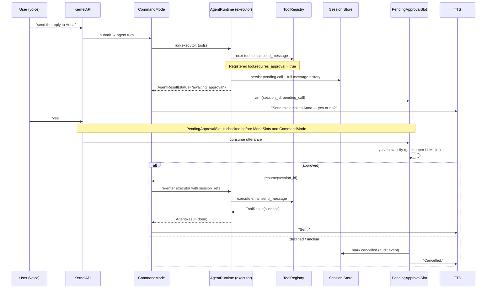

# Approval Flow — awaiting_approval as a turn boundary

The executor never blocks waiting for the user. Hitting a `requires_approval` tool ends the
run with a persisted session; the confirmation arrives as a *new* `submit()` call consumed
by `PendingApprovalSlot`, which resumes the persisted executor session on "yes".

