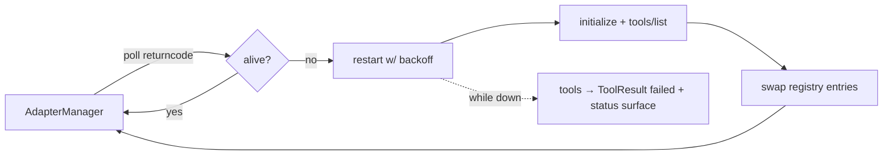

# Wayland Backends & Host Bridge

Session-type provider selection inside the gnome adapter (the clipboard already works this
way), with host-side components following the launcher-daemon pattern. Kernel and shells
are untouched — everything below the `gnome.*` tool surface.

```mermaid
flowchart TD
    K[Kernel · ToolRegistry] -->|"gnome.* tools (unchanged)"| GA[gnome adapter server]

    GA --> SEL{"XDG_SESSION_TYPE?"}

    subgraph X11 path — today
        SEL -->|x11| XI[X11 input · xdotool]
        SEL -->|x11| XW[X11 windows · wmctrl]
        SEL -->|x11| XC[clipboard · xclip]
    end

    subgraph Wayland path — new
        SEL -->|wayland| WI[Wayland input provider]
        SEL -->|wayland| WW[Wayland window provider]
        SEL -->|wayland| WC[clipboard · wl-clipboard ✓ exists]
        WI --> PORTAL["org.freedesktop.portal.RemoteDesktop<br/>(one-time consent, version-stable)"]
        WW --> DBUS["D-Bus bridge"]
    end

    subgraph Host side
        PORTAL --- XDG[xdg-desktop-portal]
        DBUS --- EXT["GNOME Shell extension<br/>list/focus/move/resize<br/>(optional — degrades gracefully)"]
        LNCH["launcher daemon ✓ exists<br/>(Unix socket pattern to copy)"]
    end

    style WI fill:#e8f4e8,stroke:#2a7
    style WW fill:#e8f4e8,stroke:#2a7
    style PORTAL fill:#e8f4e8,stroke:#2a7
    style DBUS fill:#e8f4e8,stroke:#2a7
    style EXT fill:#fdf3d8,stroke:#b90
```

Supervision (same direction, kernel side): `AdapterManager` gains a liveness loop —
restart a dead adapter with backoff, re-handshake, swap `ToolRegistry` entries; tools
report unavailable instead of hanging while the adapter is down.

