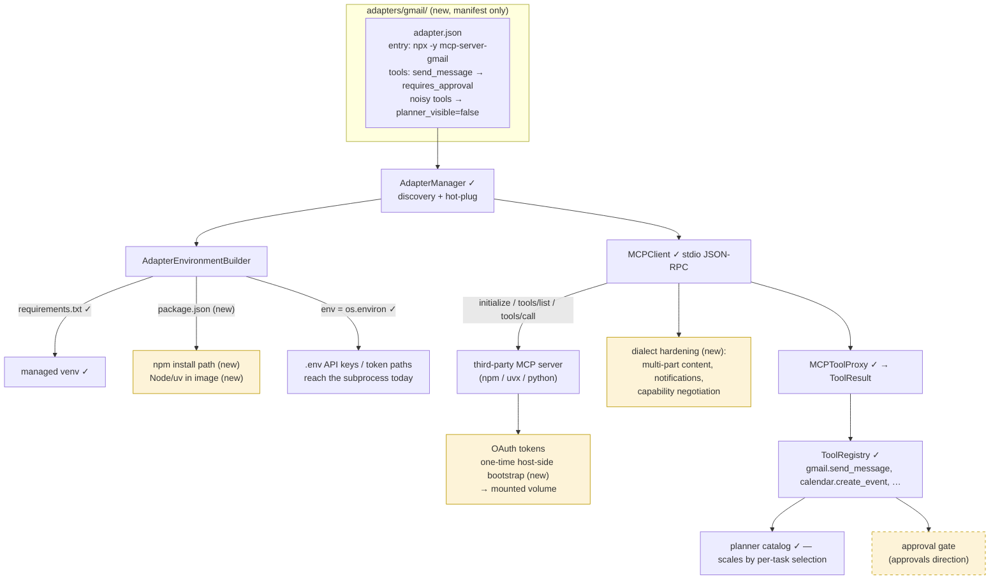

# Third-Party MCP Server Integration Path

A wrapped server is a directory with a hand-written `adapter.json` and no code. Green =
exists, yellow = new. The approval gate comes from the approvals direction.

