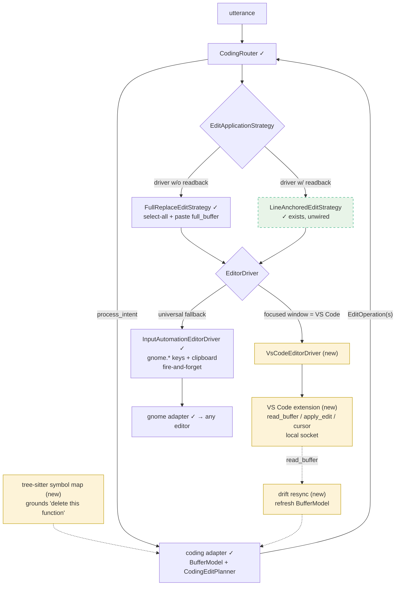

# Editor Driver Seam — from GUI automation to editor-native

`CodingRouter` and the coding adapter don't change. Growth happens below the two ABCs:
a feedback-capable driver unlocks the dormant line-anchored strategy and automatic drift
resync. Green = exists, yellow = new.

Strategy choice becomes a function of driver capability (`supports_readback`), wired in
`ToolRuntime`; driver choice a function of the focused window class. Both decisions live in
existing wiring code — no new layer.
