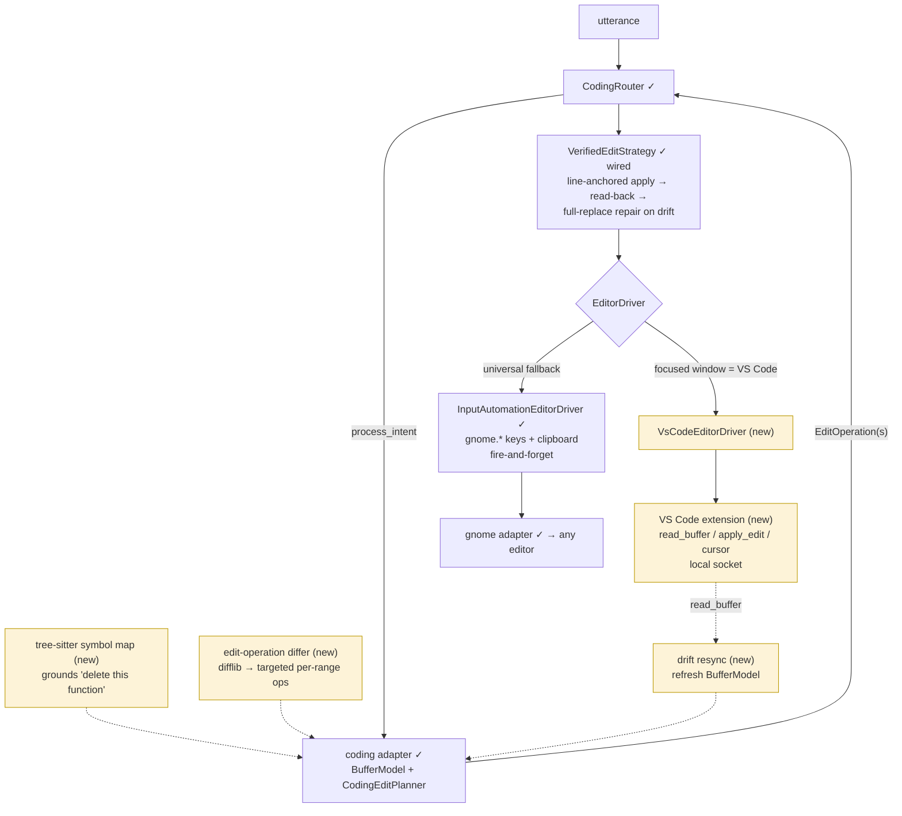

# Editor Driver Seam — from GUI automation to editor-native

`CodingRouter` doesn't change. Growth happens in the adapter (targeted operations from a
diff step) and below the `EditorDriver` ABC (a bridge driver that makes read-back and
drift resync cheap). Green = exists, yellow = new.

Driver choice happens once per session — focused window class + bridge ping
(`DriverSelector` in the wiring, `TUSK_CODING_DRIVER` override). The strategy chain is
unchanged; the bridge driver just makes its read-back verification a cheap socket call
instead of a clipboard round-trip. No new layer.
