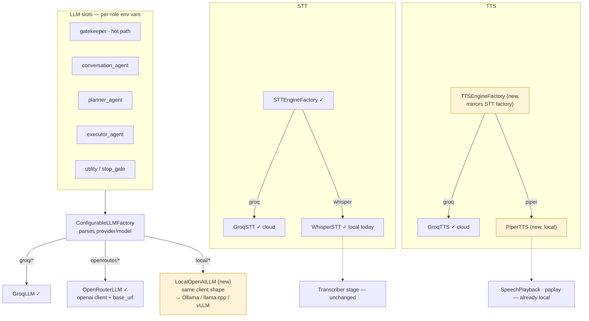

# Engine Seams — cloud vs local per slot

Every engine sits behind an existing ABC + factory. Green = exists today, yellow = new
provider class, no kernel/shell changes anywhere.

The honest intermediate profile the slot system supports today: local STT + local
gatekeeper (speech never leaves the machine), cloud agent slots (actions use cloud LLMs) —
then tighten to fully local as validated models allow.
