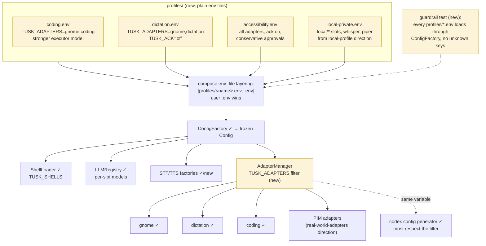

# Profile Layering — a vertical is an env preset

No new config system: a profile is an env file layered under the user's `.env` via
standard compose `env_file` ordering. The only code change is the `TUSK_ADAPTERS` filter
(yellow).

