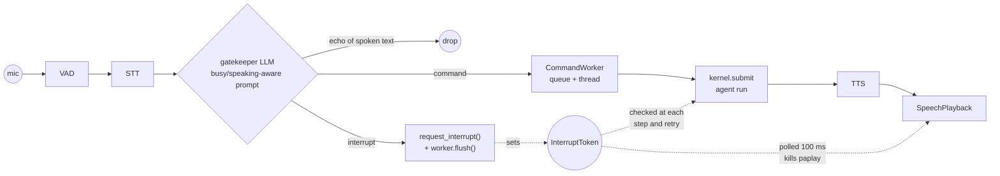
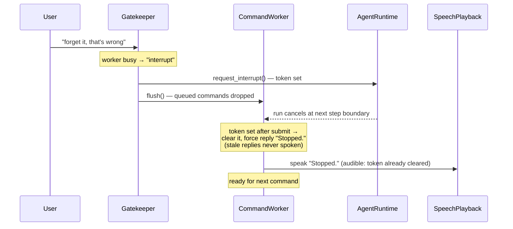

# Voice Interrupt (Immediate Semantic Stop)

Stop TUSK by voice, **in any wording**, while it runs a task or reads a reply aloud.
Interrupt is honored only while TUSK is busy — an idle "stop" is a normal command.
Cancellation is step-boundary: in-flight LLM/tool calls finish, results are discarded
(~1.5–3.5 s); playback stop is near-instant (100 ms token poll → `paplay` killed).

## Flow

While TUSK speaks in forward-all modes (dictation/coding), `PlaybackGate` wraps the mode
gate: `SpeechStopGate` (yes/no LLM) decides interrupt-or-drop, so TUSK's own voice is
never typed into the editor.

## Interrupt lifecycle

## Key files

| File | Role |
|---|---|
| `tusk/shared/interrupt/interrupt_token.py` | one shared token (Event wrapper), created in `main.py` |
| `shells/voice/command_worker.py` | runs submit + TTS + playback off the listening thread; survives submit exceptions; clears token / forces "Stopped." |
| `shells/voice/stages/command_gate_prompt.py` | busy clause (stop intent → interrupt) + speaking clause (echoes → ambient) |
| `shells/voice/stages/gatekeeper.py` | busy-aware classification; `interrupt` honored only while busy |
| `shells/voice/playback_gate.py` + `stages/speech_stop_gate.py` | interrupt-or-drop while speaking in dictation/coding |
| `shells/voice/stages/speech_playback.py` | token poll → terminate; stdin closed via `with` (no fd leak) |
| `tusk/kernel/agent/agent_runtime.py`, `tool_sequence_executor.py`, `tusk/shared/llm/llm_retry_runner.py` | token checks: per step, between sequence steps, before retries |
| `tusk/kernel/main_agent.py` | `cancelled` → "Stopped." |

## Rules worth knowing

- Echo defense is **semantic, not acoustic**: the gatekeeper prompt contains the exact
  sentence TUSK is speaking; the old `_play_muted` mic mute is gone.
- Gatekeeper/utility LLM slots get **no** token — they must work while an interrupt is pending.
- `GateDispatch("interrupt")` has `text=None`, so the pipeline handles it before the drop branch.
- Commands spoken while busy are queued in order; `flush()` drops them on interrupt.

## Testing

- Unit: `docker compose exec tusk pytest tests/` (`test_interrupt_token`, `test_command_worker`,
  `test_speech_playback`, `test_gatekeeper_interrupt`, `test_playback_gate`, `test_pipeline_interrupt`,
  `test_agent_runtime_cancellation`, `test_llm_retry_interrupt`, …)
- E2E (real Groq calls, scripted audio edges, no MCP adapters):
  `docker compose exec tusk python -m e2e.run_voice_e2e` — 5 scenarios: interrupt mid-run,
  interrupt mid-speech, echo ignored, idle stop, ready-after.

## Known limits

Coding-mode edit-driver internals not token-covered (own stop flow); CLI shell not
interruptible; no undo of executed desktop actions. Speaker bleed during playback has
an optional acoustic fix, see [mic-echo-cancellation](mic-echo-cancellation.md).

---
**Last updated**: 2026-07-04 · **Updated by**: Claude · **Exploration depth**: Deep
