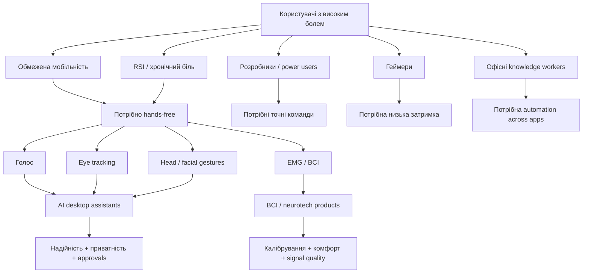
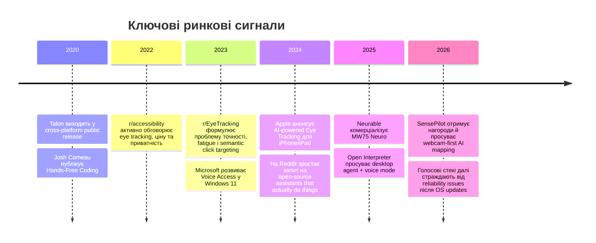

# Reddit / Market Research: Non-Traditional Computer Control (July 2026)

> Source: ChatGPT deep research, 2026-07-17 (364 searches, 36 citations).
> Conversation: https://chatgpt.com/g/g-p-6a33e1ac89b081918b3ab6d92b8d77c0/c/6a5a4c30-00a8-83eb-840f-6fe2b26c5e38
> Report language: Ukrainian. Inline ChatGPT citation tokens stripped; text otherwise verbatim.

# Глибинне дослідження Reddit і ринку нетрадиційного керування комп’ютером

## Executive summary

Ринок нетрадиційного керування комп’ютером уже має чіткий, але фрагментований попит: люди просять не просто “ще один voice assistant”, а **надійний багатомодальний шар керування**, який поєднує голос, gaze/eye tracking, міміку, head tracking, інколи EMG/BCI, і вміє працювати **поверх звичних застосунків** — Gmail, Calendar, IDE, браузера, документів, ігор, системних вікон. На Reddit це видно в повторюваних запитах із дуже схожою структурою: “мені потрібно запускати застосунки голосом”, “хочу керувати ПК без рук”, “чи є щось, що реально *робить* задачі, а не просто відповідає в чаті?”, “потрібна альтернатива клавіатурі/миші через інсульт, RSI, хронічний біль або обмежену мобільність”. Особливо сильний сигнал — не в сухих counts сабредітів, а в **якості болю** та повторюваності патерну в різних спільнотах: від r/accessibility і r/disabledgamers до r/csharp, r/WindowsHelp, r/opensource та r/ChatGPT.

Для продуктів класу **Tusk / AI-first desktop assistant** висновок такий: **попит реальний і, ймовірно, недооцінений**, але масова популярність залежить від трьох речей — **надійності**, **локальної приватності** та **контекстної багатомодальності**. У великих сабредітах люди прямо просять інструменти, які читають пошту, ставлять події в календар, запускають локальні застосунки, ведуть нотатки, роблять веб-пошук і виконують кроки через природну мову; у нішевих спільнотах люди описують конкретні бар’єри: втома очей, погана точність gaze, шум у мікрофоні, ламкість після оновлень Windows, висока ціна assistive hardware, брак VS Code/IDE-підтримки, слабка документація й нестача готових профілів. При цьому більші платформи вже валідизують напрям: Apple вивела Eye Tracking на iPhone/iPad з on-device ML, а Microsoft просуває offline Voice Access у Windows 11. Це не повна заміна AI-first асистента, але сильний ринковий сигнал, що “нетрадиційний input” уже перестав бути суто нішевим експериментом.

Найкраща коротка ставка на ринок: **не будувати “один чарівний modality”**, а будувати **AI orchestration layer для змішаного керування**. Найвищий upside мають: локальний screen-aware desktop assistant з approvals; gaze + semantic targeting; voice + semantic edit commands для IDE/knowledge work; дешевий webcam-first control; adaptive personalization для голосу/обличчя; privacy-first memory/workflow layer; і спеціалізовані пакети для accessibility, coding, gaming, back-office automation. BCI/EMG мають сильну дослідницьку та інвестиційну динаміку, але для найближчого продуктового вікна вони радше **adjacent wedge**, ніж найкоротший шлях до масового desktop adoption.

## Карта Reddit-спільнот

Нижче — найрелевантніші сабредіти, які реально дають сигнал по потребах у hands-free / AI-first / alternative input. Кількість підписників і `active_user_count` — це snapshot із `about.json` сабредітів станом на момент дослідження; “рівень активності” — моя інтерпретація цього snapshot плюс видимий тип контенту на фронт-сторінках. Усі ці спільноти малі відносно масового Reddit, але це нормально: тут цінність у **сильному user pain**, а не в sheer volume.

| Сабредіт | Підписники | Активних зараз | Рівень активності | Типові теми | Практичний сигнал для продукту | Джерела |
|---|---:|---:|---|---|---|---|
| r/accessibility | 20,046 | 5 | Середній | Digital accessibility, інклюзія, eye tracking, speech control, assistive workflows | Добре показує **реальні daily-use бар’єри**: біль, приватність, вартість, сумісність, fatigue |  |
| r/disabledgamers | 15,852 | 5 | Середній | Ігри без рук, кастомні контролери, head/facial input, practical setup | Сильний сигнал для **hands-free control, gaming profiles, cheap webcam-first alternatives** |  |
| r/neurallace | 10,260 | 5 | Середній | BCI, neural interfaces, neurotech news, careers | Корисний для **future-facing neurotech interest**, але менше про everyday desktop control |  |
| r/BCI | 10,117 | 2 | Низько-середній | Практичні bottlenecks BCI, research, commercialization | Відмінне місце для розуміння **чому BCI ще не ready for daily desktop use** |  |
| r/AssistiveTechnology | 6,066 | 0 | Низький | Assistive tools, webcam head tracking, early demos, accessibility news | Дає ранній фідбек на **нові input-моделі й MVP** |  |
| r/EyeTracking | 2,585 | 4 | Низько-середній | Tobii, eye gaze UX, точність, calibration, mainstream use-cases | Найкраще читається тема **точності, fatigue, click disambiguation, mainstream fit** |  |
| r/VoiceAttack | 840 | 1 | Низький | Voice macros, gaming automation, speech-engine issues, plugin pain | Хороший сигнал про **ламкість voice stack**, залежність від ОС і потребу в better support |  |

Ключове спостереження: ці сабредіти не виглядають як “вибуховий consumer hype”, але вони дуже добре показують **де рішення реально потрібне**. Якщо робити продукт на кшталт Tusk, то ринкове позиціонування “general AI assistant for everyone” програє позиціонуванню “AI desktop control for people with high-friction workflows”. Саме там біль достатньо сильний, щоби люди прощали криву ранню версію — якщо вона справді економить руки, очі, час або нерви.

## Що саме просять користувачі

Найсильніший патерн — люди не просто хочуть “voice control”. Вони хочуть **комбінований, контекстний, розумний control layer**, який розуміє намір, знає поточний екран, може переключатись між модальностями, і при цьому не дратує false positives, не зливає дані, не вимагає дорогого спеціалізованого заліза й не ламається після кожного оновлення ОС. Це видно і в нішевих assistive thread’ах, і в mainstream-запитах про “AI desktop assistant” у великих сабредітах.

### Репрезентативні обговорення та сигнали попиту

| Тред | Дата | Метрики | Що конкретно просили / який біль | Джерела |
|---|---|---:|---|---|
| **“Advice for choosing eye tracking software/devices?”** в r/accessibility | 2022-08-24 | 3 upvotes, 16 comments | Користувач із болем у руках хоче використовувати ноутбук/телефон **без болю**, але боїться **data harvesting** і не знає, що купувати |  |
| **“Why no one is using eye tracking for controlling their computer?”** в r/EyeTracking | 2023-10-18 | 9 upvotes, 30 comments | Пряме обговорення проблем **точності, ціни, втоми очей** і потреби в **ML disambiguation** кліків |  |
| **“Any ai voice assistant on windows?”** в r/WindowsHelp | 2023-12-22 | 2 upvotes, 5 comments | Запит на “Siri для Windows”: **launch apps, create documents, do things on my laptop**, плюс AI для розмови й допомоги |  |
| **“Anyone voice code? I had a stroke…”** в r/csharp | 2022-01-15 | 123 upvotes, 54 comments | Дуже сильний сигнал: людина після інсульту хоче **повернутись до програмування**, але існуючі voice-coding tools неповні |  |
| **“AI Desktop assistant”** в r/ChatGPT | 2025-11-28 | 1 upvote, 13 comments | Потрібен desktop AI, який **читає Gmail, додає події, шукає в інтернеті, запускає apps, веде reminders і notes** |  |
| **“Are there any open source personal assistant that can actually do things??”** в r/opensource | 2024-10-26 | comments: 29 | Запит на асистента, який **робить дії**, а не просто відповідає. У коментарях прямо звучить, що опції для **scheduling/email management** ще “limited” |  |
| **“VoiceAttack not connecting with Windows voice engine since update”** в r/VoiceAttack | 2026-06-04 | comments: 2 | Показовий біль: рішення ламається після **Windows update**, падає responsiveness, з’являються проблеми з мікрофоном |  |
| **“Control a computer with facial gestures using a webcam”** в r/disabledgamers | 2026-06-03 | 8 upvotes, 10 comments | Є інтерес до **webcam-first facial control** як дешевшої альтернативи спеціальному залізу; люди питають trial, порівнюють з іншими інструментами |  |

### Показові цитати

> «У мене хронічний біль у руках, зап’ястках і передпліччях… хочу налаштувати eye tracking, щоб знову користуватися пристроями без болю, але хвилююся, що мої дані збиратимуть». Переклад із r/accessibility, 2022-08-24, 3 upvotes / 16 comments.

> «Тривале використання очей як контролера може бути виснажливим… доводиться навмисно дивитися на об’єкти на екрані». Переклад із r/EyeTracking, 2023-10-18, 9 upvotes / 30 comments.

> «У мене був інсульт, я не можу користуватись лівою стороною тіла. Я дуже сумую за програмуванням». Переклад із r/csharp, 2022-01-15, 123 upvotes / 54 comments.

> «Josh Comeau використовує Talon Voice + Tobii і вважає, що отримує близько 50% своєї звичайної продуктивності». Переклад з коментаря в r/csharp. Це дуже важливий benchmark: рішення вже корисне, але ще далеке від “повної заміни”.

> «Мені потрібен desktop app, з яким можна взаємодіяти, і який AI робитиме: Gmail, календар, нагадування, запуск застосунків, нотатки… тобто щось на кшталт значно розумнішої Alexa/Google Home на десктопі». Переклад із r/ChatGPT, 2025-11-28, 1 upvote / 13 comments.

> «Після останнього оновлення Windows VoiceAttack став повільним і часто показує червону іконку “muted microphone”». Переклад із r/VoiceAttack, 2026-06-04. Це чистий сигнал про крихкість stack’а.

### Узагальнення запитуваних функцій і pain points

Найчастіше користувачі просять шість класів можливостей. По-перше, **системне керування**: запуск застосунків, відкриття документів, навігація між вікнами, кліки, введення тексту, гарячі клавіші. По-друге, **AI-дії в реальних інструментах**: читати пошту, ставити події в календар, вести списки, нотатки, нагадування, шукати інформацію, виконувати повторювані web/desktop workflows. По-третє, **контекстне semantic control**: не “натисни Ctrl+Shift+F”, а “видали цю функцію”, “додай інгредієнти для піци до shopping list”, “знайди останній рахунок і додай подію”. По-четверте, **cross-app continuity**: люди хочуть, щоби асистент працював поверх уже наявного стеку, а не змушував переїжджати в нову екосистему. По-п’яте, **локальність і приватність**: on-device, або щонайменше передбачуваний data boundary. По-шосте, **підлаштування під фізичні обмеження користувача**: для когось голос неможливий через thin walls, для когось gaze втомлює очі, для когось потрібна facial click, а для когось — хоча б backup mode.

Головні pain points теж повторюються дуже стабільно. Це **ціна assistive hardware**; **eye fatigue** і jitter/precision для gaze; **важке налаштування**; **слабка підтримка IDE/app-specific commands**; **обмежені semantic edit commands**; **розвал після оновлень ОС**; **відсутність людської техпідтримки**; **погана документація**; **потреба у trial before buy**; і, дуже важливо, **розрив між “chatbot” і “assistant that actually does things”**. У великих сабредітах люди прямо формулюють цей розрив; у нішевих — показують, скільки адаптацій треба, щоби хоч щось працювало в daily life.

## Попит і потенціал для AI-first desktop assistants

Якщо дивитися на ймовірний попит для Tusk-подібного продукту, то найважливіший факт такий: це не “вигадана категорія”. Вона вже проступає в трьох окремих кластерах. Перший — **accessibility-first users**: люди з інсультом, ALS/MND, обмеженою моторикою, хронічним болем, RSI, тремором або тимчасовою травмою. Другий — **hands-free productivity/developer users**: програмісти, які хочуть писати код голосом або оком; knowledge workers, які хочуть оркестрацію через природну мову. Третій — **gaming/control enthusiasts**, яким потрібні низька затримка, кастомні профілі й альтернативні input channels. Це означає, що у Tusk-like продуктів є не один TAM, а кілька wedge’ів із різною економікою прийняття.

Найсильніший доказ потенціалу — **не стільки голосування в конкретних thread’ах, скільки інтенсивність залучення там, де біль хорошо артикується**. Наприклад, історія про hands-free coding вийшла далеко за межі assistive-niche: пост на Hacker News з темою Josh Comeau “Hands-Free Coding” зібрав **608 points і 137 comments**, а сама стаття чітко описує використання Talon як спеціалізованого інструмента для розробників без рук. На Reddit суміжний запит у r/csharp про voice coding після інсульту набрав **123 upvotes і 54 comments**. Це вже не просто “маленька accessibility бульбашка”; це ознака того, що тема **емоційно резонує і з broader tech audience**, особливо коли історія пов’язана з продуктивністю, відновленням кар’єри та гідністю праці.

Водночас general-purpose AI assistant threads у великих сабредітах поки набирають скромніші vote-metrics, але демонструють **повторюваність запиту**. На r/WindowsHelp люди питають про voice-controlled AI для Windows із запуском apps і створенням документів; на r/ChatGPT — про десктопного AI, який читає Gmail, працює з Google Calendar, reminders і notes; на r/opensource — про open-source assistant, який реально виконує задачі, а не лише відповідає на питання. Така картина часто означає не “немає попиту”, а “product-market category ще не закристалізована; люди не вірять, що рішення вже існує”. Для Tusk це скоріше добра новина: **room for a credible category leader тут великий**.

Окремий сильний ринковий сигнал дають великі платформи. Apple оголосила Eye Tracking для iPhone та iPad, причому прямо підкреслила, що функція працює завдяки AI / on-device machine learning і не вимагає додаткового hardware; Microsoft просуває Voice Access у Windows 11 як offline-можливість повністю керувати ПК голосом. Це важливо не тому, що вбудовані фічі вже закривають категорію, а тому, що вони **знижують бар’єр навчання ринку**: користувачі й корпоративні покупці швидше повірять у продукт, якщо modality вже “легітимізована” Apple/Microsoft.

У BCI/нейронапрямку попит ще менш масовий, але капіталізаційний сигнал сильний. Reuters повідомляв, що Neuralink залучила $650 млн у 2025 році; Neurable у 2025 році оголосила раунд Series A на $35 млн, довівши сумарне фінансування до $65 млн, і позиціонує себе як noninvasive BCI для everyday life. Це означає, що **інвестори вірять у long-term category**, але для найближчого desktop product window найкраще виглядають не pure BCI, а **гібриди**: голос + екранний контекст + gaze/head/facial input + optional neural/biometric feedback.

Моя підсумкова оцінка популярності для Tusk-подібних продуктів така. **У accessibility / RSI / rehab / disabled gaming вертикалях — високий потенціал adoption**, бо cost of pain enormous і користувачі готові вчитися. **У developer / knowledge-worker вертикалі — середньо-високий потенціал**, якщо продукт дає measurable time savings і не ламає контроль/безпеку. **У масовому consumer desktop market — потенціал поки помірний**, бо ще не вирішені reliability, approvals, privacy expectations і “assistant can actually do things” trust gap. Але якщо продукт починає з вузьких, високоцінних сценаріїв, а потім розширюється — траєкторія виглядає дуже правдоподібною.

## Існуючі продукти та ринкова карта

Важливий висновок із ринку: **чисто AI-first direct-control продуктів ще небагато**. Значна частина ринку складається з двох типів рішень: або це **assistive-control tools**, які добре керують input modality, але слабші як “розумні агенти”; або це **desktop AI agents**, які добре працюють із файлами, браузером і автоматизацією, але ще не мають сильного accessibility/multimodal control layer. Найцікавіше місце для нового продукту — саме між цими двома світами.

### Порівняльна таблиця продуктів

| Продукт | Категорія | Платформи | Короткий опис | AI-функції | Ціна | Зрілість | Офіційні джерела |
|---|---|---|---|---|---|---|---|
| **Talon Voice** | Voice + eye + noise control | Windows, macOS, Linux/X11 | Hands-free control для coding, desktop, gaming; voice commands, eye tracking, noise input, Python scripting | Free speech engine, Whisper hybrid engine, modular voice/eye/noise stack | Базове завантаження доступне; Patreon дає early access/support | **Зрілий niche tool** |  |
| **Cephable** | AI-first accessibility / control / automation | Desktop app; Windows/Mac; також mobile access у планах/матеріалах | On-device AI для диктування, контролю, створення й автоматизації в будь-яких apps | NLU, on-device content revision/translation, agentic workflows, voice/head/facial controls | Basic — free; Professional — $25/міс. billed annually | **Growth-stage commercial** |  |
| **VoiceAttack** + **WhisperAttack** | Voice macros + AI STT companion | Windows | Voice control/macros для ігор і застосунків; WhisperAttack додає offline Whisper STT | Через companion stack можливий local AI speech recognition | VoiceAttack — $10 one-time; WhisperAttack — OSS companion | **Зрілий niche tool, але крихкий до OS changes** |  |
| **FaceCommand** | Facial-gesture control | ПК з вебкамерою | Hands-free керування комп’ютером через міміку без спеціального hardware | AI тут радше computer-vision/control layer, ніж LLM-agent | $100 one-time; 7-day free trial | **Early commercial** |  |
| **SensePilot** | Webcam-based head/facial control | Windows 10/11 | Head mouse + facial gestures для ПК і gaming, без дорогого спеціального hardware | AI мапить орієнтацію обличчя й розпізнає індивідуальні жести; є speech recognition | 30-day free trial; публічна ціна в crawl нечитабельна | **Emerging commercial** |  |
| **Wispr Flow** | AI voice productivity layer | Mac, Windows, iPhone, Android | Voice dictation і editing/command mode для продуктивності | AI dictation, command mode, team features | Pro — $15/user/mo monthly або $12/user/mo annual; є free/trial entry path | **Швидко зростаючий productivity tool** |  |
| **Open Interpreter** | AI desktop agent | Desktop app; voice mode; official desktop docs for work across apps/files | Desktop agent, який працює через apps, browser tabs, PDFs, docs, spreadsheets; є voice mode | Cross-app agentic workflows, voice mode, MCP/integrations, BYO model / local model | Free/BYO ChatGPT or API keys; Pro — $20/міс. на офіційному site snippet | **Emerging but very important category bridge** |  |
| **Neurable MW75 Neuro** | Consumer BCI / neurofeedback adjacent | Headphones + app ecosystem | EEG-enabled headphones для focus/fatigue monitoring; ще не “full desktop control”, але важливий AI-first neuro input signal | Real-time biofeedback, focus/fatigue modeling, personalized brain-break cues | MW75 Neuro — $699; LT — $499 | **Emerging consumer neurotech** |  |
| **EMOTIV BCI / Mental Commands** | BCI platform | Portable EEG hardware + Mac/Windows software ecosystem | Платформа для систем, що реагують на cognitive state і trained mental commands | Brain data analysis, trained mental commands, BCI integration | Публічна consumer pricing неочевидна; ліцензування/enterprise-style | **Зрілий BCI platform layer, не масовий consumer desktop app** |  |

### Що видно з конкурентної мапи

По суті, ринок розділений на чотири групи. **Перша** — modality-first control tools: Talon, FaceCommand, SensePilot, VoiceAttack. Вони дають control, але не завжди дають “агента”. **Друга** — AI productivity layers: Wispr, Cephable, Open Interpreter. Вони дають intelligence/automation, але не завжди глибоко закривають accessibility edge cases. **Третя** — BCI / neurotech adjacencies: Neurable, EMOTIV. Тут є AI і signal novelty, але не вистачає frictionless desktop use-case. **Четверта** — baseline platform features від Apple/Microsoft: вони не конкурують напряму як продукти, але задають очікування і commoditize basic modalities.

З цього випливає найважливіша ринкова прогалина: **майже ніхто не зібрав “серйозний desktop agent” і “серйозний alternative control layer” в один продукт, який би працював чітко, локально й передбачувано**. Cephable зараз найближче до цієї ідеї з боку accessibility/enterprise on-device AI; Open Interpreter — найближче з боку agentic desktop work; Talon — найближче з боку control-quality. Але “Tusk-class winner” імовірно виглядатиме як **Cephable × Talon × Open Interpreter**, тільки з кращим approvals/safety UX і набагато сильнішою упаковкою під конкретні workflows.

## Прогалини ринку та найкращі можливості

Головна прогалина ринку — **semantic reliability under real-world friction**. Сьогодні є або інструменти, які добре ловлять input, або інструменти, які більш-менш розуміють natural language, але значно менше рішень, які роблять обидва завдання разом. Reddit-користувачі постійно показують саме цей gap: вони не хочуть окремо voice dictation, окремо gaze mouse, окремо macro engine і окремо чатбот; вони хочуть, аби система **розуміла намір, бачила контекст, діяла поверх наявних програм і давала backup mode, коли одна modality не працює**.

### Вісім найперспективніших фіч або продукт-ідей

**Гібридний router модальностей.** Продукт повинен динамічно перемикатися між voice, gaze, head/facial gestures, keyboard backup і, в майбутньому, EMG/BCI. Це прямо випливає з того, що голос не завжди соціально зручний, gaze втомлює очі, а facial click корисний як резервний спосіб.

**Semantic gaze targeting.** Один із найкращих інсайтів із r/EyeTracking: не треба вимагати піксельної точності від очей; треба комбінувати gaze area + UI semantics + ranking ймовірних targets. Це може радикально зменшити fatigue і false clicks.

**Privacy-first local desktop assistant.** Потреба в on-device/system-local execution звучить і в accessibility, і в opensource/productivity темах. Локальна пам’ять, секрети, approvals і clear audit trail — критично важливі.

**Voice-to-action, а не voice-to-text.** Люди просять не просто диктування, а дії: створити документ, запустити app, поставити нагадування, оновити календар, знайти файл, заповнити форму. Це вирішується через action graph з approved tool use, а не через черговий STT shell.

**Semantic edit commands для IDE та knowledge work.** Команди на зразок “видали функцію”, “перейди до символу”, “заміни блок”, “створи shopping list і додай інгредієнти”, “прочитай лист і створи event”. Саме цього зараз бракує voice coding та desktop assistants.

**Cheap webcam-first accessibility stack.** FaceCommand і SensePilot чітко показують, що користувачі дуже цінують absence of special hardware. Це сильний wedge: low-cost onboarding, free trial, bring-your-own webcam/mic.

**OS-resilient automation layer.** VoiceAttack thread — ідеальний приклад, чому цей ринок фруструє: оновлення Windows ламає voice engine, зникає стабільність. Переможець у категорії повинен мати monitoring, rollback-safe execution, health checks, self-healing mappings і sensible fallbacks.

**Vertical packages замість “асистент для всіх”.** Найшвидша дорога до PMF — не широкий consumer assistant, а готові пакети під: accessibility, hands-free coding, disabled gaming, finance/admin back-office, support ops. Open Interpreter вже добре ілюструє workflow packaging by industry; Talon community — packaging by task.

### Практична рекомендація для продукту на кшталт Tusk

Якщо робити ставку прагматично, я б рекомендував таку послідовність. Спершу — **voice + screen context + deterministic actions + approvals**, бо саме цього бракує в desktop-assistant threads. Далі — **webcam-based head/facial backup mode**, бо він різко розширює доступність без дорогого hardware. Потім — **semantic gaze targeting** як premium/advanced mode для тих, у кого вже є Tobii або схожий tracker. А BCI/EMG варто підключати як **later optional input**, коли agent і control orchestration вже доведені до продуктивної якості. Така черга мінімізує hardware friction і максимізує шанс швидкого PMF.

У короткій формі: **найкращий продукт у цій категорії не буде “ще одним голосовим асистентом”**. Він буде **AI-first control fabric** для комп’ютера — надійний, приватний, мультимодальний, screen-aware і дуже конкретний у діях. Reddit і суміжний ринок показують, що саме така штука потрібна давно; просто нинішні інструменти поки закривають лише частини цього пазла.