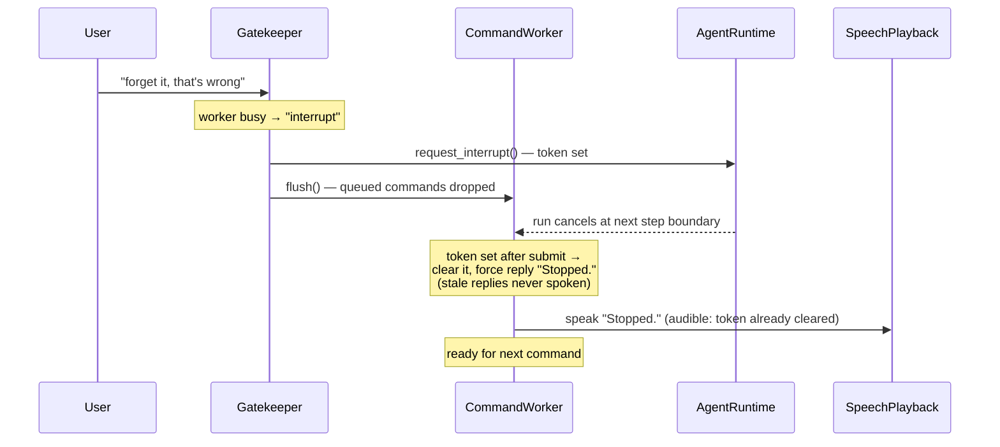

# TUSK — Technical Specification

This document describes the implemented system as it exists in code. It is a precise,
component-by-component specification derived from the actual implementation. For the
narrative view (why the parts exist and how they fit together), see
[architecture.md](architecture.md); this file is the exact-values reference.

---

## 1. System Boundaries

TUSK runs as a Python process (normally inside Docker). It interacts with:

- **Microphone** — via `sounddevice` in the voice shell (reads from the default input device)
- **Speaker** — via `paplay` (PulseAudio) for TTS playback of replies
- **LLM / STT / TTS APIs** — via HTTPS to Groq and/or OpenRouter
- **Codex CLI** *(optional)* — the `codex_exec` / `codex_mcp` agent backends run the
  `codex` binary as a subprocess instead of the built-in agent runtime
- **MCP adapters** — via stdio JSON-RPC to adapter subprocesses
- **Desktop environment** — exclusively through adapters (`adapters/gnome`), never via
  direct subprocess calls from the kernel
- **Host launcher** — a host-side Unix-socket daemon (`launcher/tusk_host_launcher.py`)
  that launches GUI applications on the host on behalf of the container (see §24)

The voice shell owns audio capture. The kernel owns orchestration. Desktop control,
dictation, and coding are fully delegated to MCP adapters.

---

## 2. Configuration Specification

**Source:** `tusk/shared/config/config.py`, `tusk/shared/config/config_factory.py`,
`tusk/shared/config/startup_options.py`.

All values are read from environment variables at startup (`Config.from_env()` →
`ConfigFactory.build()`). The `Config` object is a frozen dataclass for the lifetime of
the process.

### 2.1 Required Fields

| Env Var | Python Type | Description |
|---|---|---|
| `GROQ_API_KEY` | `str` | API key for Groq (STT + LLM + TTS) |

### 2.2 LLM Slots

Slot values use `provider/model` format, parsed by `LLMSlotConfig.parse()`.

| Env Var | Default | Description |
|---|---|---|
| `GATEKEEPER_LLM` | `groq/llama-3.1-8b-instant` | Fast model for utterance classification |
| `CONVERSATION_AGENT_LLM` | falls back to `AGENT_LLM` | Conversation profile model |
| `PLANNER_AGENT_LLM` | falls back to `PLANNER_LLM` | Planner profile model |
| `EXECUTOR_AGENT_LLM` | falls back to `AGENT_LLM` | Executor profile model |
| `DEFAULT_AGENT_LLM` | falls back to `AGENT_LLM` | Default (generic sub-agent) profile model |
| `UTILITY_LLM` | `groq/llama-3.3-70b-versatile` | Reserved utility slot |

Fallback env vars (used when the per-profile vars are absent):

| Env Var | Default | Fallback for |
|---|---|---|
| `PLANNER_LLM` | `groq/openai/gpt-oss-20b` | `PLANNER_AGENT_LLM` |
| `AGENT_LLM` | `groq/openai/gpt-oss-120b` | `CONVERSATION_AGENT_LLM`, `EXECUTOR_AGENT_LLM`, `DEFAULT_AGENT_LLM` |

There is **no kernel-side coding LLM slot**: the coding adapter owns its own model
(`CODING_AGENT_MODEL`, §2.5).

### 2.3 Optional Fields with Defaults

| Env Var | Type | Default | Valid Values / Notes |
|---|---|---|---|
| `OPENROUTER_API_KEY` | `str` | `""` | Any OpenRouter API key string |
| `STT_ENGINE` | `str` | `"groq"` | `groq`, `whisper` (lower-cased, stripped) |
| `WHISPER_MODEL_SIZE` | `str` | `"base"` | `tiny`, `base`, `small`, `medium` |
| `AUDIO_SAMPLE_RATE` | `int` | `16000` | Positive integer (Hz) |
| `AUDIO_FRAME_DURATION_MS` | `int` | `30` | `10`, `20`, or `30` (WebRTC VAD constraint) |
| `VAD_AGGRESSIVENESS` | `int` | `2` | `0`–`3` |
| `TUSK_TTS` | `bool` | on | Disabled by `off`, `0`, or `false` |
| `TUSK_ACK` | `bool` | on | Speak a brief refrain of the request before running it. Disabled by `off`, `0`, or `false` |
| `FOLLOW_UP_TIMEOUT_SECONDS` | `float` | `30` | Gatekeeper follow-up window |
| `MAX_FOLLOW_UP_TIMEOUT_SECONDS` | `float` | `120` | Parsed into `Config`; currently unused |
| `GATE_RECOVERY_WINDOW_SECONDS` | `float` | `60` | Age limit for recoverable dropped utterances |
| `GATE_RECOVERY_CANDIDATE_LIMIT` | `int` | `6` | Max recovery candidates per gate call |
| `TUSK_SHELLS` | `list[str]` | `["voice"]` | Comma-separated: `voice`, `cli`, `tray`, `emulator`. The loader always moves `tray` last (it owns the blocking GUI loop) |
| `TUSK_ADAPTER_ENV_CACHE_DIR` | `str` | `".tusk_runtime/adapters"` | Managed adapter venv cache |
| `TUSK_AGENT_SESSION_LOG_DIR` | `str` | `".tusk_runtime/agent_sessions"` | `FileStore` session event logs |
| `TUSK_TRAY_ICON_THEME` | `str` | `"light"` | `light`, `dark` |
| `TUSK_TRAY_SHOW_LAST_ACTIVITY` | `bool` | `false` | Opt-in: last command/reply line in the tray menu (the transcript may contain sensitive speech) |
| `AGENT_BACKEND` | `str` | `"tusk"` | `tusk`, `codex_exec`, `codex_mcp` (§8) |
| `AGENT_BACKEND_FALLBACK` | `str` | `""` | Only `"tusk"` has effect: wraps a codex backend with a fallback to the built-in agent |
| `CODEX_EXEC_BINARY` | `str` | `"codex"` | Codex CLI binary |
| `CODEX_EXEC_MODEL` | `str` | `""` | Passed as `--model` when set |
| `CODEX_EXEC_TIMEOUT_SECONDS` | `int` | `60` | Subprocess timeout |
| `CODEX_EXEC_WORKDIR` | `str` | `""` | Subprocess cwd when set |
| `CODEX_EXEC_SANDBOX_MODE` | `str` | `"read-only"` | Passed as `--sandbox` |
| `CODEX_EXEC_EXTRA_ARGS` | `str` | `""` | Extra CLI args, `shlex`-split |
| `CODEX_EXEC_OUTPUT_SCHEMA_PATH` | `str` | `tusk/kernel/agent/backends/codex_agent_result.schema.json` | `--output-schema` value |
| `CODEX_EXEC_LOG_RAW_EVENTS` | `bool` | `false` | Log codex stdout/stderr verbatim |

Boolean parsing accepts `true`, `1`, `yes`, `on` (case-insensitive), except `TUSK_TTS`
and `TUSK_ACK` which are on unless set to `off`/`0`/`false`.

### 2.4 Environment Read Outside `Config`

| Env Var | Read by | Default |
|---|---|---|
| `TUSK_TRANSCRIPT` | `EmulatorShell` (required when the shell runs) | — |
| `TUSK_UTTERANCE_PAUSE` | `EmulatorShell` | `3` seconds |
| `SHOW_LOGS` / `--show-logs` | `StartupOptions` | `""` — comma-separated log groups, `all`, aliases (`vad`, `stt`, `gate`, `llm`, …), `-group` to hide |
| `LLM_LOG_PREVIEW_CHARS` / `--llm-log-preview-chars` | `StartupOptions` | `120` |
| `CODING_AGENT_MODEL` | coding adapter process (`adapters/coding/server.py`) | `llama-3.3-70b-versatile` (Groq) |

### 2.5 Slot Wiring

`main.py` registers six proxied slots in `LLMRegistry`:
`gatekeeper`, `conversation_agent`, `planner_agent`, `executor_agent`, `default_agent`,
`utility`. Providers are created by `ConfigurableLLMFactory` (`tusk/providers/llm/`),
supporting `groq` → `GroqLLM` and `openrouter` → `OpenRouterLLM` (missing API key or
unknown provider raises `ValueError`). Each slot is wrapped in `LLMProxy` for retry,
wait indicator, payload logging, and runtime swap. The `gatekeeper` and `utility` slots
receive **no** `InterruptToken` — they must stay usable while an interrupt is pending.

---

## 3. Audio Capture Specification

**Source:** `shells/voice/stages/audio_capture.py`

- **Library:** `sounddevice.RawInputStream` (import guarded; missing package raises
  `RuntimeError` at construction)
- **Channels:** 1 (mono), **format** `int16`
- **Sample rate:** `config.audio_sample_rate` (default 16000 Hz)
- **Frame size:** `int(sample_rate * frame_duration_ms / 1000)` samples
- **Pause gate:** an injected `threading.Event`. While cleared, the input stream is
  closed and `stream_frames()` blocks on `wait()` — pausing genuinely stops capture,
  not just processing. The voice shell owns the gate (§20.2).
- **Output:** `Iterator[bytes]`, one frame per iteration

---

## 4. Voice Activity Detection Specification

**Source:** `shells/voice/stages/utterance_detector.py`

- **Library:** `webrtcvad.Vad` (import guarded)
- **Aggressiveness:** `config.vad_aggressiveness`
- **Input:** an injected `AudioCapture`; frame duration injected as
  `frame_duration_ms` (default 30)

### 4.1 Utterance Boundary Logic

```
Constants:
    _SILENCE_FRAMES_THRESHOLD = 20   # consecutive silent frames → end of utterance
    _MIN_VOICED_FRAMES = 5           # minimum voiced frames → valid utterance

On each audio frame:
    is_speech = vad.is_speech(frame, sample_rate)
    if is_speech:
        append frame to voiced_frames; reset silence_count
    elif voiced_frames:
        silence_count += 1
        if silence_count >= 20:
            if len(voiced_frames) >= 5:
                yield Utterance(text="", audio_frames=concat(voiced_frames),
                                duration_seconds=len(frames) * frame_duration_ms / 1000)
            else: log "dropped short utterance"
            reset voiced_frames and silence_count
```

**Output:** `Iterator[Utterance]` with `text=""`, `audio_frames` set, `confidence=1.0`
(dataclass default).

---

## 5. STT Engine Specification

**Interface:** `tusk/shared/stt/interfaces/stt_engine.py`

```python
def transcribe(self, audio_frames: bytes, sample_rate: int) -> Utterance
```

**Factory:** `tusk/providers/stt/stt_engine_factory.py` — `create("groq"|"whisper")`,
selected by `STT_ENGINE`; unknown name raises `ValueError`.

### 5.1 GroqSTT — `tusk/providers/stt/groq_stt.py`

- **Model:** `whisper-large-v3-turbo`
- **Audio format:** PCM wrapped in a WAV container via the `wave` stdlib module
- **API call:** `groq.audio.transcriptions.create(file=("audio.wav", wav_bytes), model=..., language="en")`
- **Non-speech detection:** empty text or regex `^\[.+\]$` (e.g. `[BLANK_AUDIO]`,
  `[Music]`) → `confidence=0.0`; otherwise `confidence=1.0`
- **Duration:** `len(audio_frames) / (sample_rate * 2)`

### 5.2 WhisperSTT — `tusk/providers/stt/whisper_stt.py`

- **Model loading:** `whisper.load_model(model_size)` at `__init__` time
- **PCM decoding:** `numpy.frombuffer(audio_frames, dtype=int16).astype(float32) / 32768.0`
- **Inference:** `model.transcribe(audio, fp16=False, language="en")`
- **Confidence:** `min(1, max(0, mean(avg_logprob) + 1)) * (1 - max(no_speech_prob))`
  across segments; `0.0` if no segments

> Note: `Utterance.confidence` is carried through the pipeline but no downstream stage
> currently branches on it. Hallucinated bracket-only transcripts from GroqSTT are in
> practice caught by the sanitizer/gatekeeper, not by a confidence threshold.

---

## 6. Sanitizer Specification

**Source:** `shells/voice/stages/sanitizer.py`

Applied after transcription, before the buffer. Provider-agnostic hallucination and
ghost-phrase filter. Returns `None` to drop the utterance; drops are logged with a
reason tag.

**Rejection conditions (first match wins):**

| Reason | Condition |
|---|---|
| `short-duration` | `utterance.duration_seconds < 0.4` |
| `empty` | stripped text is empty |
| `punctuation-only` | no alphanumeric characters |
| `ghost-phrase` | text lower-cased, trailing `.!?,` stripped, matches the ghost set |
| `short-word` | exactly 1 word AND word length ≤ 3 |

**Ghost phrase set:** `thank you`, `thanks`, `thanks for watching`, `thank you for
watching`, `thank you very much`, `you`, `bye`, `bye bye`, `okay`, `ok`, `oh`, `uh`,
`um`, `hmm`, `so`, `yeah`, `yes`, `no`, `right`, `sure`, `well`, `alright`, `please
subscribe`, `like and subscribe`, `see you next time`, `the end`, `good night`, `good
morning`, `good evening`, `hello`, `hey`, `hi`.

---

## 7. Command Gatekeeper Specification

**Sources:** `shells/voice/stages/gate/` (`gatekeeper.py`, `llm_client.py`,
`gatekeeper_parser.py`, `gatekeeper_support.py`, `command_gate_prompt.py`,
`recovery_gate_prompt.py`, `recent_context_formatter.py`).
**Interface:** `shells/voice/interfaces/gatekeeper.py` — a single method:

```python
def process(self, utterance, recent, candidates=None) -> GateDispatch
```

`LLMGatekeeper` is the command-mode implementation. Mode gates (§16) and the playback
gate (§30) implement the same interface and are swapped in via `GatekeeperSlot`.

### 7.1 Primary Classification Call

`build_command_gate_prompt(context, busy, speaking)` produces one prompt; one
`complete_structured` call classifies the utterance. Schema (`PRIMARY_SCHEMA`):

```json
{"classification": "command|conversation|ambient|interrupt",
 "cleaned_text": "string", "reason": "string"}
```

The base prompt instructs conservative classification (doubt → `ambient`), wake-word
stripping (`tusk`, `task`, `hey tusk`, `hey task`), and strict-JSON output. Two clauses
are appended conditionally — still a single LLM call:

| Condition | Clause | Effect |
|---|---|---|
| `worker.is_busy` | stop/cancel/abort intent **in any wording** → classify `interrupt` | semantic stop, no fixed phrases |
| `worker.current_speech_text` set | "TUSK is currently saying aloud: …" — echoes → `ambient` | echo defense without mic muting |
| within follow-up window | last 6 non-empty recent utterances, 150 chars each, `User: ` prefix | follow-ups work without a wake word |

**Follow-up window:** `LLMGatekeeper` records `_last_forwarded_at` on every forward and
includes recent context while `now - last_forwarded_at <= follow_up_window_seconds`
(default 30, from `FOLLOW_UP_TIMEOUT_SECONDS`).

### 7.2 LLM Call Chain and Parsing

`LLMClient` (per call):

1. `llm.complete_structured(prompt, text, schema_name, schema, 512)`
2. on failure: `llm.complete(prompt, text, 256)`
3. on second failure: empty result → `GateResult(False, "", 0.0)`

Parsing uses `extract_json_payload` (`tusk/shared/llm/llm_json.py`): tolerates prose
around the JSON (scans for the first decodable `{…}`), unwraps a one-element list, and
unwraps an `"arguments"` key. `classification` is mapped to the `GateClassification`
enum (unknown values → `AMBIENT`). `GateResult` (frozen dataclass,
`tusk/shared/schemas/gate_result.py`): `is_directed_at_tusk` is true for
`command`/`conversation`, `cleaned_command` = `cleaned_text`, `confidence=1.0`,
`classification`. Any parse exception → `GateResult(False, "", 0.0)`.

### 7.3 Dispatch Decision Logic

`LLMGatekeeper.process` (order matters):

1. `interrupt` **and** worker busy → `GateDispatch(INTERRUPT)`. An idle "stop" keeps
   its normal classification path.
2. `command` → `FORWARD_CURRENT` with `cleaned_text` (or raw text if empty).
3. Anything else → **recovery evaluation** (§7.4):
   - `recover` → `FORWARD_RECOVERED` with the candidate's text and id
   - `ambiguous` → `FORWARD_CLARIFICATION` with the current text
   - `none` → fallback: `conversation` **with a wake word** (`tusk`/`task` as a
     whole word) → `FORWARD_CURRENT`; everything else → `DROP`.

Every forwarded dispatch refreshes the follow-up window.

### 7.4 Recovery Call

A second gate call runs only when `recovery_worthwhile` holds: candidates exist AND
(classification ≠ `ambient` OR wake word present OR the utterance contains a reference
cue — `that`, `this`, `previous`, `last`, `earlier`, `again`, `instead`, `actually`,
`meant`, `it`, `them`, …).

Prompt: `build_recovery_gate_prompt(context, candidates)` lists candidate ids and
texts (with wake-word STT variants `task`/`tasc`/`tusc`/`dusk` normalized to `tusk` in
a `normalized:` suffix). Schema (`RECOVERY_SCHEMA`):

```json
{"action": "recover|ambiguous|none", "candidate_id": "string", "reason": "string"}
```

A `recover` decision naming an id outside the candidate list is normalized to `none`.

---

## 8. Agent Backend Specification

**Source:** `tusk/kernel/agent/backends/`

`CommandMode` talks to an `AgentBackend` (ABC: `run(AgentRequest) -> AgentResult`), not
to the agent directly. `AgentBackendFactory` selects the implementation from
`config.agent_backend`:

| `AGENT_BACKEND` | Class | Behavior |
|---|---|---|
| `tusk` (default) | `TuskAgentBackend` | Wraps the built-in `MainAgent` (§9–§12); always `handled=True` |
| `codex_exec` | `CodexExecAgentBackend` | Runs `codex exec --json --output-schema <path> [--model M] [--sandbox S] <extra> <prompt>` as a subprocess |
| `codex_mcp` | `CodexMcpAgentBackend` | Talks to a Codex MCP server (`codex_mcp/` client, call builder, response reader, result mapper) |
| anything else | — | `ValueError` at startup |

With `AGENT_BACKEND_FALLBACK=tusk`, a codex backend is wrapped in
`FallbackAgentBackend`: when the primary returns `status="failed"`, the built-in agent
runs the same request and the primary's failure is attached to the result metadata as
`codex_exec_failure`.

**Schemas** (frozen dataclasses):

- `AgentRequest(user_text, mode, session_id="", context={}, metadata={}, working_directory="", timeout_seconds=None, environment={})`
- `AgentResult(handled, reply, session_id="", metadata={}, status="", final_text="", raw_output=None)` —
  `status` defaults to `success`/`failed` from `handled`; `final_text` defaults to `reply`.

**CodexExecAgentBackend contract:** prompt built by `CodexPromptBuilder` (sections:
system context — a default desktop-control preamble instructing gnome-MCP-only actions
and one-sentence spoken replies — user command, mode, available tools, workdir, safety
policy, expected response). Subprocess: `stdin=DEVNULL`, captured text output, env =
`os.environ` + `request.environment`, cwd from request or `CODEX_EXEC_WORKDIR`, timeout
from request or `CODEX_EXEC_TIMEOUT_SECONDS`. Failure mapping: missing binary →
`failed` "missing binary for codex exec backend"; timeout → status `timeout`; non-zero
exit → `failed` with `stderr[:300]`; unparseable stdout → `failed` "Invalid JSON from
codex exec"; otherwise `status`/`reply` are read from the parsed JSON.
`BackendRunLogger` logs run start/end for every backend.

---

## 9. Conversation Agent Specification

**Sources:** `tusk/kernel/command_mode.py`, `tusk/kernel/main_agent.py`,
`tusk/kernel/agent_profiles.py`

`CommandMode.process_command(text)` builds `AgentRequest(text, "command", session_id)`,
runs the backend, stores the returned `session_id` for the next turn, and returns
`KernelResponse(handled, reply)`.

`MainAgent` (the `tusk` backend, also implementing the `Agent` ABC) runs
`AgentOrchestrator.run(AgentRunRequest(command, "conversation", session_id))`, maps
`status="cancelled"` to the reply `"Stopped."`, and appends the exchange to
`SlidingWindowHistory`.

### 9.1 System Prompt (conversation profile)

```
You are TUSK, a desktop assistant.
Answer general knowledge and non-tool conversation directly using done.
Requests to start, stop, or switch dictation, coding, or pair-programming, or to switch the model,
are actionable work, not conversation: call run_agent, never answer them with done.
For actionable work, call run_agent with the planner profile first when you need a tool plan.
After any sub-agent returns, first decide whether the user's request is already satisfied.
If the request is satisfied, call done immediately instead of delegating again.
If the planner returns status=done with selected_tool_names, usually call run_agent with the executor profile next,
passing the planner's selected_tool_names and session_id as session_refs.
If the executor or default sub-agent returns status=done, call done next and do not delegate again in the same turn.
If executor or default children fail twice in the same turn, stop and call done with a failure summary instead of delegating again.
Use done to finish with the final result.
```

### 9.2 Profiles

`build_agent_profiles` defines four `AgentProfile` entries:

| Profile | LLM slot | Static tools | Runtime tools | Max steps |
|---|---|---|---|---|
| `conversation` | `conversation_agent` | `run_agent` | — | 8 |
| `planner` | `planner_agent` | — | — | 8 |
| `executor` | `executor_agent` | — | `*` (all real tools) | 16 |
| `default` | `default_agent` | `run_agent` | — | 8 |

### 9.3 History Management

`AgentRuntime` loads prior messages from the session `Store` on each turn (§12).
Separately, `MainAgent` appends command + reply to `SlidingWindowHistory(20)` — local
cross-turn context only, not passed to the LLM runtime. On overflow the history evicts
the older half and inserts one summary message (`Previous context summary: …`, built
from the last 6 evicted messages, 120 chars each).

---

## 10. Planner Agent Specification

**Sources:** `tusk/kernel/agent_profiles.py` (`planner` profile),
`tusk/kernel/agent/planner/`

### 10.1 System Prompt

```
You are the TUSK planner agent.
Plan the task but do not execute it.
Select real runtime tool names for the executor.
Use the provided tool catalog to inspect tool schemas, required arguments, and sequence_callable flags.
Then draft payload.planned_steps as concrete ordered tool steps with exact args for the full task.
Return payload.execution_mode as normal or sequence.
After drafting planned_steps, try to promote the plan to sequence mode.
Use sequence mode when the planned steps are fully linear, deterministic, and every selected tool is marked sequence_callable.
For large text insertion tasks, prefer selecting clipboard-write and key-press tools when available,
instead of relying only on character-typing tools.
Return done with payload containing selected_tool_names, execution_mode, plan_text, and planned_steps.
```

### 10.2 Catalog Injection and Toolset

The planner's only tool is `done` (with the `PLANNER_DONE` schema: `payload` requires
`selected_tool_names`, `execution_mode`, `planned_steps`). The tool catalog is appended
to the planner's *instruction* by `AgentOrchestrator._enrich_planner` — the text
`Tool catalog: {"tools": [...]}` from `AgentToolCatalog.prompt_text()`, listing every
planner-visible tool's `name`, `description`, `input_schema`, `source`, and
`sequence_callable` flag.

### 10.3 Result Validation

After a planner child finishes with `status=done`,
`ResultValidator` (`planner/result_validator.py`) runs:

1. `StepPlanValidator` on `payload.planned_steps`: parseable plan, 1–8 steps, unique
   non-empty step ids and tool names, no synthetic tools (`done`,
   `execute_tool_sequence`, `list_available_tools`, `run_agent`), every tool known to
   the registry, args valid against each tool's schema (`SimpleSchemaValidator`).
   Any violation → the child result is replaced by `status="failed"`.
2. `selected_tool_names` is **normalized from the plan's step order** (the planner's
   own list is overwritten).
3. `execution_mode == "normal"` → `SequencePromoter.promote`: the plan is re-validated
   as a sequence (`PlanValidator`: same step rules **plus** every tool
   `sequence_callable` and the plan's tool set equal to `selected_tool_names`); if it
   passes, `execution_mode` is flipped to `sequence` and `payload.sequence_plan` is
   materialized; if not, the plan stays `normal`.
4. `execution_mode == "sequence"` → `PlanValidator` must pass, else `failed`.

---

## 11. Executor Agent Specification

**Sources:** `tusk/kernel/agent_profiles.py` (`executor` profile),
`tusk/kernel/agent/planner/runtime_tool_resolver.py`,
`tusk/kernel/agent/agent_toolset_builder.py`

### 11.1 System Prompt

```
You are the TUSK executor agent.
Execute the plan using only the runtime tools provided.
Your assistant response must always be a single tool/function call.
When the tool named execute_tool_sequence is available, call it first with empty arguments {}.
Do not rewrite or reconstruct the compiled sequence plan in tool arguments.
After execute_tool_sequence returns success, your next response must call done.
When you need to insert a large block of literal text, prefer writing it to the clipboard and pasting it
with the provided runtime clipboard-write and key-press tools,
instead of typing it character by character.
After a successful clipboard copy or write action, you may take intermediate actions before pasting.
Do not copy or write to the clipboard again until after a paste.
Use key-press tools only for shortcuts like <ctrl>c, <ctrl>l, or <ctrl>v, not for literal text or URLs.
When the task is complete, call the tool named `done`.
`done` refers to the tool/function name, not a natural-language reply.
After the final successful tool result that satisfies the request, your very next response must call `done`.
Do not write plain text such as 'done', 'now I should call done', or explanations outside a tool call.
Do not invent tool names.
```

### 11.2 Runtime Tool Resolution

`RuntimeToolResolver.resolve` (executor requests only): reads the first `session_refs`
entry that has a final result in the store, takes its payload, and fills in —
`sequence_plan` (from `sequence_plan` or `planned_steps`), `runtime_tool_names` (plan
order if a plan exists, else the request's own names, else the payload's
`selected_tool_names` filtered to real registry tools), and `execution_mode`.

### 11.3 Toolset

- **Normal mode:** `done` + `definitions_for(runtime_tool_names)` — exactly the tools
  the planner selected.
- **Sequence mode** (`execution_mode=="sequence"` and a resolved plan): `done` +
  synthetic `execute_tool_sequence` (empty-object schema). No real tools are exposed;
  the compiled plan travels on the `AgentRunRequest` and is retrieved by the
  dispatcher, never through LLM-provided arguments.

`ExecutorToolGuard`: an executor run with zero runtime tools terminates immediately
with `AgentResult(status="need_tools")`.

---

## 12. AgentRuntime Specification

**Source:** `tusk/kernel/agent/agent_runtime.py` with `runtime/` helpers
(`MessageHistoryBuilder`, `ResultFactory`, `StepRecorder`, `TurnGuards`).
Shared by all profiles.

### 12.1 Session Lifecycle

1. `session_id = request.session_id or store.create_session_id()`; unknown sessions get
   `store.start_session(session_id, profile_id, parent_session_id, parent_call_id, metadata)`
2. `MessageHistoryBuilder` loads prior conversation messages from the store and appends
   one `[session-ref] <digest>` user message per `session_refs` entry
3. The user instruction is appended to the store and to the message list
4. The step loop runs until `done`, a guard violation, interrupt, or max steps
5. `ResultFactory.persist` writes `session_finished` + the assistant reply to the store

The store is the `Store` ABC (`agent/session/store.py`); the wired implementation is
`FileStore` (`agent/session/file_store.py`), one JSONL event file per session under
`TUSK_AGENT_SESSION_LOG_DIR`.

### 12.2 Step Loop

Per step (1 … `profile.max_steps`):

1. `InterruptToken` set → `AgentResult(status="cancelled", summary="cancelled by user")`
2. `profile.llm_provider.complete_tool_call(system_prompt, messages, tools)`; any
   exception → `ModelFailureReplyBuilder` text → a synthetic
   `done(status="failed", summary=text, text=text)` call
3. `done` → finish (§12.3)
4. `TurnGuards.violation` (§13) → `failed`
5. `RepeatedToolCallGuard`: the **3rd consecutive** identical
   `(tool_name, parameters)` call → `failed` ("repeated identical tool call")
6. Otherwise the call is dispatched (§14), recorded (`StepRecorder`), appended to the
   message history, and observed by the guards

Max steps exhausted → `AgentResult(status="failed", "max steps reached")`.

### 12.3 Terminal Condition

`done` parameters (`DEFAULT_DONE` schema — `status` and `summary` required):

| Key | Description |
|---|---|
| `status` | `done`, `clarify`, `unknown`, `failed`, `need_tools` |
| `summary` | Short human-readable result |
| `text` | Full reply text (optional; `reply_text()` falls back to `summary`) |
| `payload` | Structured data (planner contract in §10) |
| `artifact_refs` | Optional list of artifact descriptors |

`MainAgent` maps `cancelled` to the spoken reply `"Stopped."` (§30).

---

## 13. Agent Guard Specification

**Sources:** `tusk/kernel/agent/guards/`, `tusk/kernel/agent/runtime/turn_guards.py`,
`tusk/kernel/tools/repeated_tool_call_guard.py`

| Guard | Scope | Rule |
|---|---|---|
| `AgentRunGuard` | orchestrator, pre-run | Unknown profile → `failed`; delegation depth ≥ 4 → `failed`; a profile already present in the lineage → `failed` ("recursive delegation detected") |
| `ExecutorToolGuard` | orchestrator, pre-run | Executor with no runtime tools → `need_tools` |
| `ConversationRunAgentGuard` | per step | After an `executor`/`default` child returns `status=done`, another `run_agent` from `conversation` is a violation |
| `ConversationFailureBudgetGuard` | per step | After 2 `executor`/`default` child results with status `failed`/`need_tools`, further delegation is a violation |
| `ExecutorClipboardGuard` | per step | After a successful clipboard write/copy: writing different text, or copying again before a paste, is a violation; a paste (`<ctrl>v` variants, `shift+insert`) resets the state |
| `RepeatedToolCallGuard` | per step | 3 consecutive identical calls → run fails |

`TurnGuards` composes the three per-step guards; violations end the run with
`AgentResult(status="failed", <message>)`.

---

## 14. Tool Registry and Dispatch Specification

**Sources:** `tusk/kernel/tools/tool_registry.py`,
`tusk/kernel/tools/registered_tool.py`,
`tusk/kernel/agent/orchestrator_tool_dispatcher.py`

### 14.1 RegisteredTool

```python
@dataclass(frozen=True)
class RegisteredTool:
    name: str
    description: str
    input_schema: dict
    execute: Callable[[dict], ToolResult]
    source: str              # "kernel" or adapter name (e.g. "gnome")
    planner_visible: bool = True
    sequence_callable: bool = False
```

`register(tool)` reads these attributes off any object (`source`, `planner_visible`,
`sequence_callable` via `getattr` with the defaults above).

### 14.2 Key Methods

| Method | Description |
|---|---|
| `register(tool)` / `unregister_source(source)` | Add one tool / drop all tools of a source (adapter unload) |
| `get(name)` | Raises `KeyError` if missing |
| `all_tools()` | Insertion order |
| `real_tools()` / `real_tool_names()` | Alphabetically sorted / name set |
| `planner_tools()` / `planner_tool_names()` | `planner_visible=True` subset |
| `sequence_tools()` / `sequence_tool_names()` | `sequence_callable=True` subset |
| `definitions_for(names)` | Native tool defs for a named subset, sorted; unknown names skipped |

Native definition format (consumed by `LLMProvider.complete_tool_call`):

```json
{"type": "function", "function": {"name": "...", "description": "...", "parameters": {...}}}
```

### 14.3 Dispatch

`OrchestratorToolDispatcher.dispatch(tool_call, run_agent, session_id, allowed, plan)`:

| Tool name | Handling |
|---|---|
| `run_agent` | Delegation via `AgentChildRunner` → recursive orchestrator run; the child result comes back as `ToolResult(data={"child_result": {...}})`, success iff child `status=="done"` |
| `list_available_tools` | `AgentToolCatalog.list_tools()` (kept dispatchable; in no profile's toolset) |
| `execute_tool_sequence` | `tool_sequence.Executor.execute_plan(session_id, request.sequence_plan, allowed)` |
| anything else | Registry lookup (unknown → `ToolResult(False, "unknown tool: …")`), argument validation via `SimpleSchemaValidator` (invalid → failure), then `tool.execute(parameters)` |

### 14.4 Sequence Execution

`tool_sequence/executor.py` re-validates the plan (`PlanValidator`), then runs steps in
order, recording `requested`/`result` events per step:

- `InterruptToken` set before a step → abort: `ToolResult(False, "sequence cancelled by user")`
- step failure → abort: `ToolResult(False, "sequence failed at <id>: <msg>")`
- completion → `ToolResult(True, "<goal> completed")`

Every outcome carries a payload
`{status, goal, completed_step_ids, failed_step_id, step_results}`.
Sequence plans are capped at **8 steps**; every tool must be `sequence_callable` and
the plan's tool set must equal the selected tool names.

---

## 15. Voice Pipeline Specification

**Source:** `shells/voice/pipeline.py`, `shells/voice/stages/`,
`shells/voice/gate_*.py`, `shells/voice/buffered_utterance.py`

### 15.1 Threading Model

`run(submit)` starts a **producer** daemon thread running capture + VAD in real time,
pushing `Utterance` objects into a `queue.Queue`. The **consumer** (the generator body)
takes utterances off the queue and runs STT + sanitizer + gatekeeper + dispatch. Speech
arriving during a long agent run is therefore captured and processed afterwards, not
lost. Producer exceptions are re-raised on the consumer side.

### 15.2 Per-Utterance Chain

```python
def _handle_utterance(utterance, submit):
    transcribed = transcriber.process(utterance)       # STT
    sanitized   = sanitizer.process(transcribed)       # None → drop
    buffered    = buffer.process(sanitized)            # BufferedUtterance
    recent      = buffer.recent(7)[:-1]                # context, excluding current
    candidates  = buffer.recoverable(limit, window)    # dropped, within age window
    return _dispatch(gatekeeper.process(buffered, recent, candidates), buffered.id, submit)
```

`limit`/`window` come from `GATE_RECOVERY_CANDIDATE_LIMIT` (6) and
`GATE_RECOVERY_WINDOW_SECONDS` (60).

### 15.3 Dispatch

`GateAction` (StrEnum): `forward_current`, `forward_recovered`,
`forward_clarification`, `interrupt`, `drop`. `GateState` (StrEnum): `pending`,
`consumed`, `dropped`, `forwarded`, `recovered`.

```
INTERRUPT                → mark(current, CONSUMED); on_interrupt()          # before the drop check: interrupt has text=None
DROP or text is None     → mark(current, DROPPED)
FORWARD_RECOVERED        → mark(recovered_id, RECOVERED); mark(current, CONSUMED); submit(text)
anything else forwarded  → mark(current, FORWARDED); submit(text)
```

`on_interrupt` is wired by `ShellLoader` to `kernel.request_interrupt()` +
`worker.flush()`. The reporter (when present) emits `REACTING` with the submitted text
before each `submit` and returns to `LISTENING` after each utterance.

### 15.4 TranscriptionBuffer

Interface `shells/voice/interfaces/transcription_buffer.py`; implementation
`shells/voice/stages/transcription_buffer.py`: a `deque(maxlen=50)` of
`BufferedUtterance(id, utterance, received_at, gate_state)` with ids `u1`, `u2`, ….
`recoverable(count, max_age)` returns the newest `count` entries in state `DROPPED`
younger than `max_age`; `mark(id, state)` updates and logs the whole buffer state.

### 15.5 Text Shells Path

`CLIShell`/`EmulatorShell` call `KernelAPI.submit(text)` directly — no STT, sanitizer,
buffer, or gatekeeper (§16.1, §20).

---

## 16. Kernel Routing and Mode Specification

**Sources:** `tusk/kernel/api.py`, `tusk/kernel/modes/`, `shell_loader.py`,
`shells/voice/gatekeeper_slot.py`, `shells/voice/stages/gate/stop_gatekeeper.py`

### 16.1 KernelAPI.submit

All commands enter through `KernelAPI.submit(text)`, serialized by a single lock
(commands are serial by design — one user voice stream). Routing order:

```
coding slot active   → coding.process_text(text)
dictation slot active → dictation.process_text(text)
otherwise            → command_mode.process_command(text)
```

`SubmitStatusReporter` wraps the route call: `REACTING` (with the text as detail) on
entry, prior status restored when the last concurrent submit finishes.

### 16.2 ModeSlot and AdapterMode

`KernelAPI` holds two `ModeSlot`s (`DICTATION`/"Dictation started.",
`CODING`/"Coding started."). A slot owns the switchable mode lifecycle:

- `attach_router(router)` — wired once at startup by `ToolRuntime`
- `set_callbacks(on_start, on_stop)` — wired by `ShellLoader` to swap the voice
  gatekeeper (§16.4)
- `start(state)` — builds an `AdapterMode(state, router, log, tag)`, fires `on_start`,
  returns the start reply
- `process_text(text)` → `router.process(state, text)`; `request_stop()` →
  `mode.stop()` → `router.stop(state)`; `stop()` — clears the mode, fires `on_stop`

`KernelAPI.start_dictation`/`stop_dictation` additionally report
`AppMode.DICTATION`/`AppMode.DEFAULT`. Coding does not set an `AppMode` (the enum has
only `default` and `dictation`).

### 16.3 ModeGate

**Source:** `tusk/kernel/modes/mode_gate.py` — one stop-classifier class for both
modes; the prompt is injected (`DICTATION_GATE_PROMPT` / `CODING_GATE_PROMPT`,
`tusk/kernel/modes/*_gate_prompt.py`). Both prompts state: the only detectable command
is a request to stop the mode; everything else is literal text/instruction.

```python
should_stop(text) -> bool
```

1. `complete_structured(prompt, text, "<mode>_gatekeeper", schema, 128)`
2. on failure: `complete(prompt, text, 128)`; on second failure → `False`
3. parse via `extract_json_payload`
4. `True` only when `directed == true` AND `metadata_stop` is a non-empty string

Schema:

```json
{"directed": bool, "cleaned_command": "string", "metadata_stop": "string | null"}
```

### 16.4 Voice-Side Mode Gating

`GatekeeperSlot` is the pipeline's gatekeeper — a swappable holder implementing the
`Gatekeeper` ABC. `ShellLoader` wires each mode's callbacks:

- **on_start:** `slot.swap(PlaybackGate(StopGatekeeper(ModeGate(...), request_stop), current_speech_text, SpeechStopGate(...)))`
- **on_stop:** `slot.swap(llm_gatekeeper)` — back to command-mode classification

`StopGatekeeper` is the forward-all gate: `should_stop` → invoke the kernel's
`request_stop` callback and `DROP` the utterance (the stop segment never reaches the
adapter); otherwise `FORWARD_CURRENT` with the raw text. `PlaybackGate` restricts
everything to interrupt-or-drop while TUSK's own speech is playing (§30.4).

---

## 17. Dictation Specification

### 17.1 StartDictationTool — `tusk/kernel/tools/start_dictation_tool.py`

`name="start_dictation"`, `source="kernel"`, planner-visible, empty input schema.

1. `ToolRegistry.get("dictation.start_dictation").execute({})`; `KeyError` →
   `ToolResult(False, "dictation adapter is not available")`
2. Build `DictationState("dictation", data["session_id"], adapter_manager.primary_desktop_source())`
3. `controller.start_dictation(state)` (→ `ModeSlot.start`, reply "Dictation started.")

### 17.2 DictationRouter — `tusk/kernel/modes/dictation_router.py`

**process(state, text):**
1. `{adapter}.process_segment` with `{"session_id", "text"}`; failure or no data →
   `KernelResponse(False, message)`
2. Log the active window via `{desktop_source}.get_active_window` when that tool exists
3. Apply the edit via the desktop source: `operation=="insert"` → `type_text`;
   `"replace"` → `replace_recent_text` with `{"text", "replace_chars": str(n)}`;
   anything else → no-op

**stop(state):** `{adapter}.stop_dictation`, then `controller.stop_dictation()`
(clears the slot, restores the command gatekeeper) → "Dictation stopped.".

### 17.3 DictationServer — `adapters/dictation/server.py`

MCP stdio server (`MCPStdioServer`); sessions in `DictationSessionStore` with
`prune_stale()` on every `start_dictation`.

| Tool | Input | Output | Manifest flags |
|---|---|---|---|
| `start_dictation` | — | `{"session_id": "<uuid>"}` in `data` | `planner_visible: false` |
| `process_segment` | `session_id`, `text` | `{"operation": "insert", "text": ..., "replace_chars": 0, "should_stop": false}` | *(default)* |
| `stop_dictation` | `session_id` | confirmation | `planner_visible: false` |

**Segment logic:** segments are inserted verbatim (STT output only). A space is
prepended unless it's the session's first segment, the text is empty, or it starts
with one of `,.!?:;)]}`. Unknown `session_id` → error ("not found or expired").

> `DictationRefiner` (`adapters/dictation/dictation_refiner.py`) exists but is not
> wired: small LLMs interpreted instruction-like phrases ("tell me a joke") as commands
> rather than literal text. LLM proofreading will return once a reliable approach exists.

Stop detection happens at the voice-pipeline level via `ModeGate` + `StopGatekeeper`
(§16.3–16.4) — a stop segment never reaches `KernelAPI`.

---

## 18. Adapter Specification

### 18.1 Adapter Manifest Schema (`adapter.json`)

| Field | Type | Required | Description |
|---|---|---|---|
| `name` | `str` | yes | Adapter name; prefixed onto all tool names (`gnome.type_text`) |
| `version` | `str` | yes* | Used as the managed-venv cache key (`<cache>/<name>/<version>`) |
| `description` | `str` | no | Informational |
| `transport` | `str` | yes | `"stdio"` only — anything else is skipped |
| `entry` | `str` | yes | Launch command, `shlex`-split |
| `provides_context` | `bool` | no | First adapter with `true` becomes the primary desktop source |
| `tools` | `object` | no | Per-tool flags: `{"<tool>": {"planner_visible": bool, "sequence_callable": bool}}` |

*required only when a `requirements.txt` triggers the managed-venv path.

Shipped adapters: `gnome` (provides context; all window/keyboard/mouse/clipboard tools
`sequence_callable: true`), `dictation`, `coding` (lifecycle tools
`planner_visible: false`).

### 18.2 AdapterManager — `tusk/kernel/adapter_manager.py`

- `start_all()`: every directory under `adapters/`, sorted, → `start_adapter`
- `start_adapter(dir)`: parse manifest (absent → skip; non-stdio → skip), connect,
  `list_tools()`, register each tool as an `MCPToolProxy` with the manifest's per-tool
  flags, record the context adapter
- **Connect strategy:** first try the shared environment —
  `AdapterEnvironmentBuilder.base_env()` (a copy of `os.environ` with the repo root
  prepended to `PYTHONPATH`, so adapters can import `tusk.shared`). On any failure,
  retry with a **managed venv**: if the adapter has `requirements.txt`, create/reuse
  `<cache_dir>/<name>/<version>` (`python -m venv` + `pip install -r` once), prepend
  its `bin` to `PATH`, set `VIRTUAL_ENV`
- `stop_adapter(name)`: client shutdown + `unregister_source(name)`
- `start_watcher()`: a `watchdog` observer on `adapters/` — a newly created directory
  hot-plugs via `start_adapter`. Without `watchdog` installed, hot-plug is disabled
  (logged)
- `primary_desktop_source()`: the context adapter, defaulting to `"gnome"`

### 18.3 MCPClient — `tusk/shared/mcp/mcp_client.py`

Synchronous stdio JSON-RPC 2.0 client.

- `connect_stdio(command, cwd, env=None)` — spawns the subprocess, sends `initialize`
  with `{"protocolVersion": "2024-11-05", "capabilities": {}}`
- `list_tools()` — `tools/list` → `list[MCPToolSchema]`
- `call_tool(name, arguments)` — `tools/call` → `MCPToolResult` (content, `isError`,
  `data`)
- `shutdown()` — terminates the subprocess

```json
→ {"jsonrpc": "2.0", "id": N, "method": "tools/call", "params": {"name": "...", "arguments": {...}}}
← {"jsonrpc": "2.0", "id": N, "result": {"content": [{"type": "text", "text": "..."}], "isError": false, "data": {...}}}
```

The adapter side runs `MCPStdioServer` (`tusk/shared/mcp/mcp_stdio_server.py`).

### 18.4 MCPToolProxy — `tusk/shared/mcp/mcp_tool_proxy.py`

Bridges `MCPToolSchema` → the `RegisteredTool` attribute contract:
`name = "{adapter}.{tool}"`, `source = adapter`, `planner_visible`/`sequence_callable`
from the manifest. `execute(parameters)` calls `MCPClient.call_tool`; a transport
exception becomes `ToolResult(False, "tool execution failed: …")`; adapter-side errors
map `isError` → `success=False`.

---

## 19. Coding Specification

Coding mode is the pair-coding sibling of dictation (§17): spoken intent becomes editor
edits applied through an `EditorDriver` + `EditApplicationStrategy`. TUSK never reads
or writes files on disk — only the focused editor buffer via input automation.

### 19.1 StartCodingTool — `tusk/kernel/tools/start_coding_tool.py`

`name="start_coding"`, planner-visible. `execute()`:

1. Already active → `ToolResult(True, "Already in pair-coding mode.")`
2. `driver.read_buffer()` — one select-all/copy/clipboard-read round-trip (§19.4)
3. `coding.start_coding_session` with `{"initial_buffer": buffer}`; `KeyError` →
   `ToolResult(False, "coding adapter is not available")`
4. `CodingState("coding", session_id, primary_desktop_source)` →
   `controller.start_coding(state)` (reply "Coding started.")

### 19.2 CodingRouter — `tusk/kernel/modes/coding_router.py`

**process(state, text):** `coding.process_intent` with `{"session_id", "intent"}`;
each entry of `data.operations` is converted to a typed
`EditOperation(kind, target_start, target_end, new_text, full_buffer)` and applied via
`strategy.apply(op, driver)`. Apply-time errors (`RuntimeError`, `KeyError`,
`TypeError`, `AttributeError`) → `KernelResponse(False, "I couldn't apply that edit.")`.

**stop(state):** `coding.stop_coding_session`, then `controller.stop_coding()` →
"Coding stopped.".

### 19.3 CodingServer — `adapters/coding/server.py`

MCP stdio server holding `session_id → buffer text` (the authoritative buffer). The
edit planner is `CodingEditPlanner` with its **own LLM**, created in the adapter
process from `CODING_AGENT_MODEL` (default `llama-3.3-70b-versatile`, Groq).

| Tool | Input | Output |
|---|---|---|
| `start_coding_session` | `initial_buffer` | `{"session_id": "<uuid>"}` |
| `process_intent` | `session_id`, `intent` | `{"operations": [<one replace op>], "should_stop": false}` |
| `stop_coding_session` | `session_id` | confirmation |

**Intent logic:** `CodingEditPlanner.plan(intent, buffer)` sends the buffer with
numbered lines (`N| line`) plus the instruction, and asks for the **complete updated
buffer** as strict JSON `{"buffer": "..."}` (structured output, 4096 max tokens;
defensive stripping of any echoed `N| ` prefixes). An unparseable reply → failure
("couldn't plan that edit"), session buffer unchanged. On success the stored buffer is
replaced and a single operation is returned:

```json
{"kind": "replace", "target_start": 1, "target_end": <old line count>,
 "new_text": <new buffer>, "full_buffer": <new buffer>}
```

### 19.4 EditorDriver — `tusk/kernel/interfaces/editor_driver.py`

One implementation is wired: **`InputAutomationEditorDriver`**
(`tusk/kernel/modes/input_automation_editor_driver.py`), editor-agnostic automation
over the desktop adapter's tools (DI: `tool_registry`, `desktop_source`):

- `read_buffer()` → inside `ClipboardGuard`: `<ctrl>a`, `<ctrl>c`, settle sleep,
  `read_clipboard`
- `paste(text)` → inside `ClipboardGuard`: `write_clipboard`, `<ctrl>v`, settle sleep
- `replace_buffer(text)` → `<ctrl>a` + `paste(text)`
- `goto_line(n)` → `<ctrl>g`, `type_text(str(n))`, `Return`;
  `select_range(sel)` → `goto_line` + `Home` + shift+Down/shift+End
- `type_text`, `press_keys` → direct pass-through
- any failed tool call raises `RuntimeError`

`_CLIPBOARD_SETTLE_SECONDS = 0.2` — xdotool returns before the target app consumes a
copy/paste keystroke, so the clipboard must settle before reading or restoring it.

**Clipboard preservation:** `ClipboardGuard` (`tusk/kernel/clipboard_guard.py`) is a
context manager that snapshots the user's clipboard on entry and restores it on exit,
so coding mode never destroys clipboard contents the user was holding.

### 19.5 EditApplicationStrategy — `tusk/kernel/interfaces/edit_application_strategy.py`

One strategy is implemented and wired: **`FullReplaceEditStrategy`**
(`tusk/kernel/modes/edit_strategies/full_replace_edit_strategy.py`) —
`driver.replace_buffer(edit.full_buffer)`, i.e. select-all + paste the authoritative
buffer. It is drift-proof for a fire-and-forget input-automation driver: the editor
always ends up exactly matching the adapter's model. (Line-anchored/raw-key/fallback
strategies and a VS Code driver existed as design contracts in an earlier iteration
and were removed from the code; see §28.)

### 19.6 Buffer Ownership

- The editor buffer is read **exactly once** at session start, seeding the adapter's
  stored buffer.
- The adapter is authoritative; every `process_intent` replaces its stored buffer, and
  the router repaints the editor with the same `full_buffer` — model and editor stay in
  lockstep because all changes flow through TUSK.
- **Limitation:** manual edits mid-session are invisible (no feedback channel) and are
  overwritten by the next TUSK edit's full-buffer repaint.

Wiring: `ToolRuntime.register_tools` (`tusk/kernel/tools/tool_runtime.py`) builds the
driver + strategy, attaches `DictationRouter`/`CodingRouter` to the kernel's mode
slots, and registers `SwitchModelTool`, `StartDictationTool`, `StartCodingTool`.

---

## 20. Shell Specification

### 20.1 Shell Registry and Threading

**Source:** `shell_loader.py`, interface `tusk/kernel/interfaces/shell.py`
(`start(api)`, `stop()`).

Shells are a static registry — no dynamic discovery:

```python
_SHELL_CLASSES = {"cli": CLIShell, "emulator": EmulatorShell, "tray": TrayShell, "voice": VoiceShell}
```

An unknown name in `TUSK_SHELLS` raises `ValueError`. `tray` is always reordered to
the **end** of the list (GTK main loop must own the main thread). Every shell but the
last runs in a daemon thread; the last blocks the main thread. Each shell's `start`
receives `kernel.submit`.

`ShellLoader` also builds the voice stack: STT engine via `STTEngineFactory`,
`CommandWorker` (with `GroqTTS` when `TUSK_TTS` is on, `SpeechPlayback`, the interrupt
token, and the `TUSK_ACK` flag), the busy/speaking-aware `LLMGatekeeper` inside a
`GatekeeperSlot`, and the mode gate wiring of §16.4.

### 20.2 VoiceShell — `shells/voice/voice_shell.py`

```python
def start(self, submit):
    if self._worker is not None:
        self._worker.start()
    target = self._worker.enqueue if self._worker is not None else submit
    for result in self._pipeline.run(target):
        ...log reply...
```

With a `CommandWorker` injected (normal wiring), the forward target is
`worker.enqueue`, so the listening loop never blocks on execution or playback. The
shell owns the pause gate: `pause()` clears it (capture stops, `PAUSED` reported),
`resume()` sets it (`LISTENING`). The tray drives these methods directly — the voice
shell *is* the pipeline control object (duck-typed; there is no separate control ABC).

### 20.3 CLIShell — `shells/cli/cli_shell.py`

```python
while True:
    text = input("tusk> ")
    if text.strip().lower() in {"exit", "quit"}: return
    result = submit(text)
    if result.reply: print(result.reply)
```

### 20.4 EmulatorShell — `shells/emulator/emulator_shell.py`

Replays a scripted transcript into `kernel.submit`, standing in for the whole voice
front end (STT + gatekeeper). Reads `TUSK_TRANSCRIPT` (path; blank lines and
`#`-comments skipped) and sleeps `TUSK_UTTERANCE_PAUSE` (default 3 s) between
utterances; prints each utterance and reply. Everything downstream — agent, adapters,
editor automation — runs for real. Example transcripts live in `demos/`.

---

## 21. LLM Provider Specification

**Interface:** `tusk/shared/llm/interfaces/llm_provider.py` — `label` property plus
`complete(system, user, max_tokens=256)`, `complete_messages(system, messages)`,
`complete_tool_call(system, messages, tools) -> ToolCall`,
`complete_structured(system, user, schema_name, schema, max_tokens=256)`.

### 21.1 LLMProxy — `tusk/shared/llm/llm_proxy.py`

Every registered slot is an `LLMProxy`. Per call: an `LLMREQUEST` log line (slot,
provider, kind), a wait indicator (`show_wait`/`clear_wait`) unless the provider logs
its own payloads, `LLMRetryRunner` around the operation, and response payload logging
(`LLMPayloadLogger`, preview length from `LLM_LOG_PREVIEW_CHARS`). `swap(provider)`
replaces the inner provider atomically — consumers hold the proxy, never the provider.

### 21.2 Retry — `llm_retry_runner.py`, `llm_retry_policy.py`

```
attempts = 3, delay = 0.5 * attempt seconds (linear backoff)

Retry when:  ConnectionError / TimeoutError; HTTP status 429 or >= 500
             (from exc.status_code or exc.response.status_code); or the message
             contains one of: 429/500/502/503/504, "api fail", "connection",
             "rate limit", "service unavailable", "temporarily unavailable",
             "timeout", "timed out"
Never retry: "invalid_request_error", "tool_use_failed",
             HTTP status 400/401/403/404/422
Interrupt:   a set InterruptToken abandons pending retries immediately
             (gatekeeper/utility slots have no token — §2.5)
```

### 21.3 GroqLLM — `tusk/providers/llm/groq_llm.py`

- **Client:** `groq.Groq(api_key, timeout=30.0)`; `max_tokens` 1024 for
  messages/tool calls, 256 default for `complete`
- **complete_tool_call:** `tool_choice="required"`; on error, first
  `ToolUseFailedRecovery` tries to salvage the tool call embedded in a
  `tool_use_failed` error payload (`failed_generation` → `ToolCall`, with a
  best-effort regex path for a malformed `done`); otherwise, if the error indicates
  the model didn't call a tool, retry once with `tool_choice="auto"`
- **complete_structured:** `response_format={"type": "json_schema", strict}` for
  `openai/gpt-oss-20b` / `openai/gpt-oss-120b`; `{"type": "json_object"}` for all
  other models
- **label:** `groq/<model>`

### 21.4 OpenRouterLLM — `tusk/providers/llm/open_router_llm.py`

- **Client:** `openai.OpenAI(base_url="https://openrouter.ai/api/v1", timeout=15.0)`
  with headers `HTTP-Referer: https://github.com/vovka/tusk`, `X-Title: TUSK`
- **complete_structured:** falls back to plain `complete` (no schema enforcement)
- Same `tool_choice` required→recovery→auto chain as Groq
- **label:** `openrouter/<model>`

### 21.5 LLMRegistry — `tusk/shared/llm/llm_registry.py`

Named slots → proxies. `swap(slot, provider, model)` builds a new provider via the
factory and swaps it into the existing proxy (used by the `switch_model` kernel tool,
which also refreshes the tray's model list). `model_labels()` feeds the tray menu.

---

## 22. TTS and Speech Playback Specification

**Interface:** `tusk/shared/tts/interfaces/tts_engine.py` — `synthesize(text) -> bytes`
(WAV).

### 22.1 GroqTTS — `tusk/providers/tts/groq_tts.py`

- **Model:** `canopylabs/orpheus-v1-english`, voice `daniel`, `response_format="wav"`
- Orpheus caps input at **200 chars**: `TextChunker` splits the reply, each chunk is
  synthesized separately, and `WavConcatenator` merges the clips into one WAV
- Enabled by `TUSK_TTS` (on by default); when off, replies are logged but not spoken

### 22.2 CommandWorker — `shells/voice/command_worker.py`

Daemon thread + `queue.Queue[tuple[str, str]]` (command text + acknowledgment refrain)
between the pipeline and the kernel:

| Member | Behavior |
|---|---|
| `enqueue(text, refrain="")` | returns immediately; commands run sequentially in order |
| acknowledgment | when `TUSK_ACK` is on and the refrain is non-empty, it is logged and spoken (via the same TTS path as replies) before `submit` runs — silent when TTS is off |
| `flush()` | drops queued (not yet started) commands |
| `is_busy` | true while executing or the queue is non-empty — enables the gatekeeper busy clause |
| `current_speech_text` | the reply text while it is being spoken, else `None` — enables the echo clause and the playback gate |
| token handling | cleared at job start; if set after `submit` returns → cleared again and the reply forced to `"Stopped."` (stale replies are never spoken) |
| errors | submit/TTS exceptions logged under `ERROR`; the worker thread never dies |

### 22.3 SpeechPlayback — `shells/voice/stages/speech_playback.py`

`paplay` subprocess fed WAV bytes from a daemon writer thread. The waiter polls every
**100 ms**: a set `InterruptToken` → `terminate()`; a hard **30 s cap** → `kill()` (a
wedged audio daemon cannot hang the worker). A closed-stdin `OSError` in the feeder is
swallowed.

---

## 23. Status Reporting and Tray UI Specification

### 23.1 Status Propagation

Producers depend only on the `StatusReporter` ABC and never know a tray exists:

```
producer → StatusReporter.set_status/set_mode/set_models/set_mic_device
         → StatusReporterHub  (dedupes unchanged values, builds StatusSnapshot)
         → StatusSink.publish(snapshot)
              → NullStatusSink  (no-op; wired when no tray is loaded)
              → TrayStatusSink  (marshals onto the GUI thread, updates icon/tooltip/menu)
```

`StatusReporterHub._emit` catches every sink exception (a broken sink never reaches a
producer). `attach_sink` (called when the tray starts) immediately re-emits the current
snapshot.

Emit points: the voice pipeline (`LISTENING` idle / `REACTING` around forwards),
`SubmitStatusReporter` around every `KernelAPI.submit`, `KernelAPI`
`start_dictation`/`stop_dictation` (`set_mode`), `main.py` `set_models` at startup, and
the `switch_model` tool after a swap.

### 23.2 Status and Mode States

| `AppStatus` | Trigger | Icon name |
|---|---|---|
| `STARTING` | process up, pipeline not yet listening | `neutral` |
| `LISTENING` | mic active, awaiting speech | `active` |
| `REACTING` | a command is being processed | `busy` |
| `PAUSED` | capture suspended by the user | `muted` |
| `ERROR` | degraded | `error` |
| `STOPPED` | shutting down | (no icon) |

`AppMode`: `DEFAULT`, `DICTATION`. There is no coding mode value; a coding session does
not change the reported mode. Icons resolve to
`shells/tray/icons/{theme}/{name}.png` (`StatusIconResolver`, theme from
`TUSK_TRAY_ICON_THEME`). Tooltip: `TUSK — {status}`, or `TUSK — error: {detail}`.
`idle` is deliberately not a distinct status — always-listening collapses idle into
`LISTENING` to avoid icon flicker between utterances.

### 23.3 TrayShell — `shells/tray/`

- **Backend:** `AppIndicatorTrayBackend` = `pystray` + `Pillow` behind the
  `TrayBackend` ABC (`run/stop/set_icon/set_tooltip/set_menu`). Import/`RuntimeError`
  during construction → the shell runs headless (no icon) and just blocks on the
  shutdown event; the rest of TUSK is unaffected.
- **Thread marshaling:** `TrayStatusSink.publish` enqueues rendering via
  `GLib.idle_add` (direct call when `gi` is unavailable); render exceptions are caught.
  A GUI-loop crash tears the backend down and degrades to headless — daemon shells
  keep running; the process exits when the shutdown callback fires.
- **Menu diffing:** the menu is rebuilt only when its content changes (rebuilds
  collapse open submenus); the volatile LISTENING↔REACTING flip lives in the icon and
  tooltip, not the menu.

### 23.4 Menu

Built by `TrayMenuBuilder` from a `StatusSnapshot` + injected `TrayMenuActions`:

| Item | Enabled | Action |
|---|---|---|
| `Mode: <mode>` | info line | — |
| `Last: <detail>` | info line | only when `TUSK_TRAY_SHOW_LAST_ACTIVITY=true` |
| `Mic: <device>` | info line | — |
| `Models` ▸ | submenu | one info child per slot: `<slot>: <provider>/<model>` |
| `Pause` / `Resume` | enabled | voice shell `pause()`/`resume()`; label flips on `PAUSED` |
| `Open logs` | enabled | opens `TUSK_AGENT_SESSION_LOG_DIR` (`xdg-open`/`open`/`startfile`) |
| `Restart` | enabled | `os.execv(sys.executable, [sys.executable, *sys.argv])` |
| `Exit` | enabled | sets the shutdown event + stops the backend |

### 23.5 Host Prerequisites

StatusNotifierItem over D-Bus (forwarded into the container). GNOME on Wayland needs
the "AppIndicator and KStatusNotifierItem Support" shell extension — a host
prerequisite TUSK cannot satisfy from inside Docker. PyGObject comes from the distro
(`python3-gi` + `PYTHONPATH=/usr/lib/python3/dist-packages` in the image);
`PYSTRAY_BACKEND=appindicator` pins the pystray backend.

---

## 24. Host Launcher Specification

**Source:** `launcher/tusk_host_launcher.py` — runs **on the host** as the host user.

- Listens on the Unix socket `/tmp/tusk/launch.sock` (the path is shared with the
  container via a volume)
- Protocol: one text line per connection = a launch command; the launcher
  `shlex`-splits it and `Popen`s it detached, replying `ok\n` or an error line
- **Snap env scrubbing:** before launching, it strips Snap-injected variables
  (`LD_LIBRARY_PATH`, `LD_PRELOAD`, `GTK_PATH`, `GDK_PIXBUF_MODULE_FILE`,
  `GSETTINGS_SCHEMA_DIR`, `XDG_DATA_HOME`, …) that would otherwise make a host GTK app
  load `/snap` libraries built against a different glibc and crash with a
  `GLIBC_PRIVATE` symbol error

The gnome adapter's `launch_application` sends its commands through this socket, so GUI
apps start on the host desktop rather than inside the container.

---

## 25. Data Flow Invariants

1. **All inter-component data is immutable.** Every schema type
   (`tusk/shared/schemas/`) is a frozen dataclass; enums are `StrEnum`/`Enum`.

2. **Text is always present before the gatekeeper.** `UtteranceDetector` yields
   `text=""`; the pipeline fills `text` via `STTEngine.transcribe()` before any gate
   or mode handler runs.

3. **Dependencies point at `tusk/shared`.** The kernel depends on
   `tusk.shared` interfaces and schemas; concrete providers (`tusk/providers/`) and
   shells are injected from `main.py` / `shell_loader.py` / `tusk/kernel/startup.py`.
   The kernel never imports a shell; shells reach the kernel only through
   `KernelAPI.submit` and the wiring callbacks.

4. **Adapters are isolated processes.** The kernel has no Python import dependency on
   any adapter module; all adapter interaction is MCP over stdio. Adapters may import
   `tusk.shared` (schemas, the MCP server loop) — never `tusk.kernel`.

5. **An active mode bypasses the agent.** While a `ModeSlot` is active,
   `KernelAPI.submit` routes to the mode router; the conversation agent never sees
   dictation/coding segments. Mode stop is decided in the voice pipeline (`ModeGate`);
   the stop utterance itself is dropped, not forwarded.

6. **Tools are the only place platform-specific execution logic lives.**
   `VoicePipeline`, `MainAgent`, and `CommandMode` contain no platform-specific code.

7. **In coding mode, the editor buffer is read exactly once at session start.** After
   that the adapter's stored buffer is authoritative; every editor mutation is a
   repaint of that buffer. TUSK never touches files on disk.

8. **`EditOperation` crosses the adapter→router boundary as a typed object.**
   `CodingRouter` converts the JSON payload into `EditOperation` instances before any
   strategy runs.

9. **Commands are serial.** `KernelAPI.submit` holds a single lock; the voice shell
   additionally serializes through the one `CommandWorker` thread.

---

## 26. Error Handling Contracts

| Component | Failure | Behaviour |
|---|---|---|
| `AudioCapture` | `sounddevice` missing / `PortAudioError` | `RuntimeError` at build / propagates — voice shell unusable |
| `GroqSTT` / `WhisperSTT` | any | propagates to the pipeline consumer thread |
| `Sanitizer` | rejection | returns `None`; utterance dropped, reason logged |
| `LLMClient` (gatekeeper) | structured call fails | falls back to plain `complete` |
| `LLMClient` (gatekeeper) | both calls fail / parse error | `GateResult(False, "", 0.0)` → utterance takes the recovery/drop path |
| `ModeGate` | both calls fail / parse error | `should_stop() == False` → treated as literal mode text |
| `AgentRuntime` | LLM exception | `ModelFailureReplyBuilder` message → synthetic `done(status="failed")` |
| `AgentRuntime` | max steps (8/16) / guard violation / 3× repeated call | `AgentResult(status="failed")` |
| `AgentRuntime` | `InterruptToken` set | `AgentResult(status="cancelled")` at the next step boundary |
| `ModelFailureReplyBuilder` | rate limit / json_validate_failed / tool_use_failed / empty completion / other | canned user-facing reply per class |
| `ResultValidator` / `StepPlanValidator` / `PlanValidator` | invalid planner output | child result replaced by `status="failed"` with the violation message |
| `tool_sequence.Executor` | step failure / interrupt | aborts remaining steps; partial payload with `completed_step_ids`, `failed_step_id` |
| `OrchestratorToolDispatcher` | unknown tool / invalid args | `ToolResult(False, ...)` back to the LLM |
| `MCPToolProxy` | transport error / adapter `isError` | `ToolResult(False, message)` |
| `AdapterManager` | shared-env connect fails | retried once with the managed venv |
| `AdapterManager` | `watchdog` missing | hot-plug disabled, logged |
| `CodingRouter` | apply error | `KernelResponse(False, "I couldn't apply that edit.")`; adapter buffer already updated (next edit repaints) |
| `InputAutomationEditorDriver` | failed desktop tool call | `RuntimeError` (caught by `CodingRouter`) |
| `CommandWorker` | exception from `submit`/TTS | logged under `ERROR`; the worker thread keeps processing |
| `SpeechPlayback` | interrupt / 30 s cap / feeder `OSError` | `terminate()` / `kill()` / swallowed |
| `FallbackAgentBackend` | primary `status="failed"` | fallback runs; primary failure attached as metadata |
| `CodexExecAgentBackend` | missing binary / timeout / non-zero exit / bad JSON | `failed` / `timeout` / `failed` (stderr excerpt) / `failed` |
| `LLMRetryRunner` | retryable / non-retryable | up to 3 attempts with linear backoff / re-raised immediately |
| `StatusReporterHub` | sink raises | caught and logged; never reaches the producer |
| `TrayShell` | backend import fails / GUI loop crashes | headless no-op; daemon shells keep running; process exits on the shutdown callback |

---

## 27. Latency Budget

Target end-to-end latency from end of speech to action start: ≤ 1.5 seconds.

| Stage | Implementation | Expected Latency |
|---|---|---|
| VAD boundary detection | WebRTC VAD | negligible (real-time) + 600 ms silence window (20 × 30 ms frames) |
| STT transcription | GroqSTT (whisper-large-v3-turbo) | ~200–500 ms (network + cloud) |
| Sanitizer | string ops | < 1 ms |
| Gatekeeper LLM call | llama-3.1-8b-instant | ~100–300 ms |
| Gate recovery call | same model, only when worthwhile (§7.4) | +~100–300 ms |
| Conversation agent LLM call | gpt-oss-120b | ~300–600 ms |
| Planner LLM call | gpt-oss-20b, structured | ~200–500 ms |
| Executor LLM call | gpt-oss-120b | ~300–600 ms per step (one step total in sequence mode) |
| MCP tool execution | stdio JSON-RPC | ~10–50 ms |
| TTS synthesis | GroqTTS, per ≤200-char chunk | ~300–800 ms (off the listening path — worker thread) |
| Status notification | hub + sink | < 1 ms; tray redraw is GLib-idle, off-thread |

**Typical command path (no replan):** STT + gatekeeper + conversation + planner +
executor ≈ 1.1–2.5 s. Replanning adds one planner + executor round.

**Dictation mode:** ModeGate call (~100–300 ms) + adapter segment call + `type_text`
insert (~10–30 ms). No LLM refinement runs (§17.3).

**Coding mode:** ModeGate call + one whole-buffer edit-planning LLM call
(~400–900+ ms — dominant; carries the numbered buffer and returns the full new buffer,
up to 4096 tokens) + full-replace paste (~20–60 ms, scales with buffer size, plus
2 × 0.2 s clipboard-settle sleeps). Buffer read is a one-time cost at session start.

**Voice interrupt** (§30):

| Path | Mechanism | Stop latency after utterance end |
|---|---|---|
| Idle | no busy clause; normal single gatekeeper call | n/a |
| During speech playback | gate/stop-gate classifies → token set → 100 ms playback poll → `terminate()` | ~0.4–1.0 s |
| During agent run | token checked at step boundaries; the in-flight LLM/tool call finishes first | ~1.5–3.5 s (bounded by the in-flight call) |
| Speaker bleed while TUSK talks | extra VAD segments → extra STT + gate calls, classified `ambient`/dropped | cost only, no misfires; optional PipeWire `module-echo-cancel` env-level fix, see [mic-echo-cancellation](features/mic-echo-cancellation.md) |

---

## 28. Removed Runtime Behavior

The active runtime no longer contains:

- `find_tools` / `describe_tool` / `run_tool` broker tools, described-tool tracking,
  learned top-tool injection, and persistent tool-usage ranking
- Automatic desktop-context injection into agent prompts
- `list_available_tools` in any profile's toolset (still dispatchable; replaced by the
  catalog text injected into the planner instruction)
- `tusk/kernel/tool_call_parser.py` — deleted; tool calls are native
  (`complete_tool_call`) with `ToolUseFailedRecovery` as the salvage path
- `shell.json` discovery via `importlib` — replaced by the static `_SHELL_CLASSES`
  registry in `shell_loader.py`
- Hard-coded stop-phrase matching, and the separate `DictationGate`/`CodingGate` +
  per-mode voice gatekeepers — unified into `ModeGate` + `StopGatekeeper` +
  `GatekeeperSlot` swapping (§16)
- Separate dictation/coding kernel mode classes — unified into `ModeSlot` +
  `AdapterMode`
- `VSCodeEditorDriver`, `LineAnchoredEditStrategy`, `RawKeyEditStrategy`,
  `FallbackEditStrategy`, and the `TUSK_CODING_EDITOR_DRIVER` /
  `TUSK_CODING_EDIT_STRATEGY` selection vars — the input-automation driver +
  full-replace strategy are the implementation (§19.4–19.5)
- The kernel-side `CODING_AGENT_LLM` slot — the coding adapter owns its model via
  `CODING_AGENT_MODEL` in its own process (§19.3)
- A `PipelineControl` ABC — the tray drives the voice shell's `pause()`/`resume()`
  directly

---

## 29. Coding — Out of Scope

- **Multi-file editing** — a single focused buffer only; cross-file refactors are
  unaddressed.
- **Manual-edit conflict detection** — manual edits mid-session are not detected;
  they are silently overwritten by the next full-buffer repaint.
- **Syntax / language awareness** — the edit planner is language-agnostic; no
  parser/LSP integration.
- **Undo integration** — TUSK edits are not grouped in the editor's undo history
  (each repaint is one select-all + paste).
- **Feedback-capable editor drivers** — reading the buffer back to verify or diff
  (e.g. a VS Code extension driver) is not implemented; input automation is
  fire-and-forget.
- **Token-scale buffers** — the whole buffer travels through every edit-planning call
  (4096-token reply cap); very large files are out of scope.

---

## 30. Voice Interrupt Specification

Semantic stop, in any wording, while TUSK executes a task or reads a reply aloud.
Feature doc with flow diagram:
[`docs/features/voice-interrupt.md`](features/voice-interrupt.md).

### 30.1 Interrupt Lifecycle



### 30.2 InterruptToken — `tusk/shared/interrupt/interrupt_token.py`

`threading.Event` wrapper: `interrupt()`, `is_interrupted`, `clear()`. One instance is
created in `main.py` and injected everywhere. Checkpoints:

| Component | Check |
|---|---|
| `AgentRuntime._loop` | top of each step → `AgentResult(status="cancelled")` |
| `tool_sequence.Executor` | before each sequence step → abort with partial result |
| `LLMRetryRunner` | before each retry → abandon backoff (agent slots only; gatekeeper/utility have no token) |
| `SpeechPlayback` | 100 ms poll → `terminate()` the `paplay` process |
| `CommandWorker` | after `submit` returns → reply forced to `"Stopped."` |

Cancellation is cooperative and step-boundary: in-flight LLM/tool calls finish and
their results are discarded; already-executed desktop actions are not rolled back.

### 30.3 Trigger Paths

- **Command mode:** the busy clause of the single gatekeeper call (§7.1) classifies a
  stop intent as `interrupt`; the pipeline dispatch calls `on_interrupt` →
  `kernel.request_interrupt()` + `worker.flush()`. Idle `interrupt` classifications
  are ignored (the busy check in `LLMGatekeeper`).
- **Any mode, while TUSK speaks:** `PlaybackGate` (§30.4).

### 30.4 PlaybackGate — `shells/voice/playback_gate.py`

Wraps the forward-all mode gates while `worker.current_speech_text` is set: every
utterance heard during playback goes to `SpeechStopGate`
(`shells/voice/stages/gate/speech_stop_gate.py`) — a yes/no structured classification
(`{"stop": bool, "reason": str}`, 128 max tokens, gatekeeper slot) with the spoken
sentence as context and an explicit echo rule ("utterances that repeat fragments of
TUSK's own sentence are its own voice: not a stop request"). `stop=true` →
`GateDispatch(INTERRUPT)`; anything else → `DROP`. Nothing is ever forwarded, so TUSK's
own voice is never typed into the editor. Command mode needs no wrapper — the
busy/speaking-aware prompt covers it in the same single gatekeeper call.

### 30.5 Out of Scope

Hard-killing in-flight HTTP calls; CLI shell interruption; undo of executed desktop
actions. Acoustic echo cancellation is available as an optional host-level PipeWire
config, see [mic-echo-cancellation](features/mic-echo-cancellation.md).
